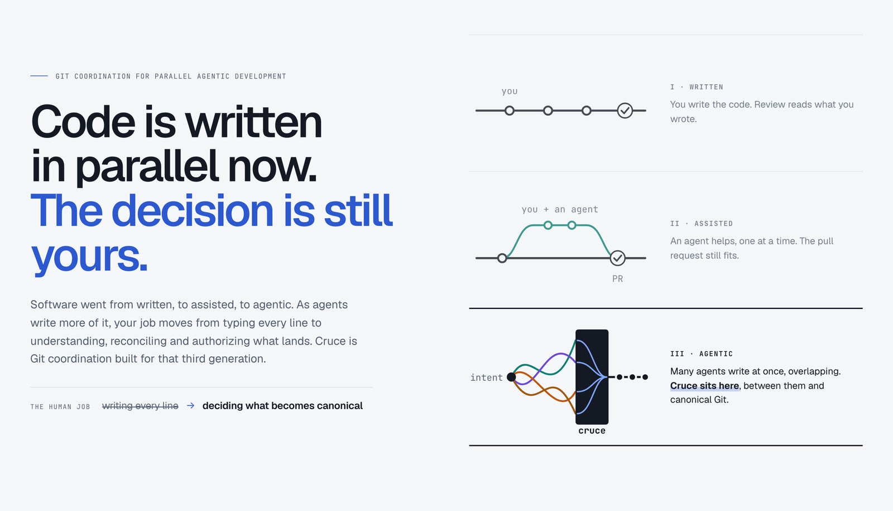
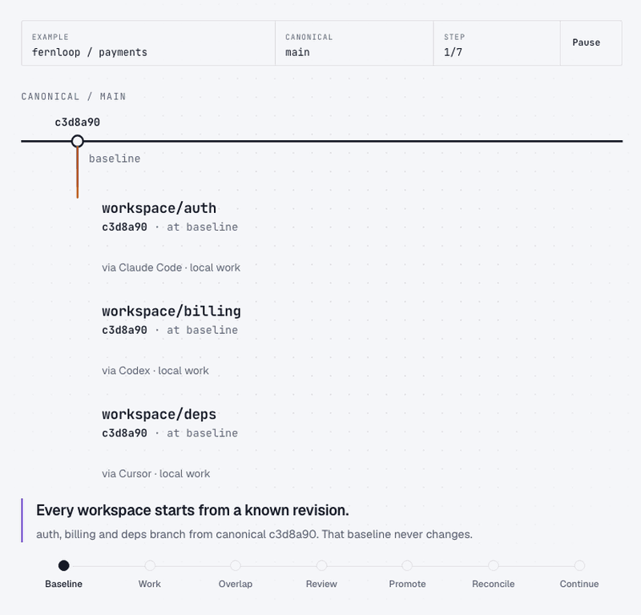
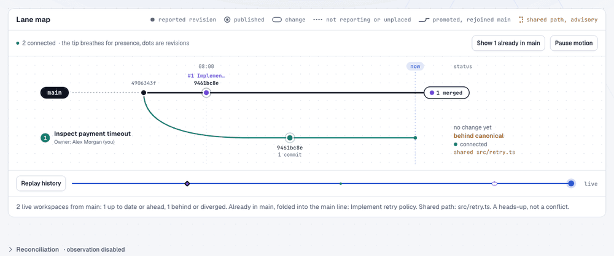
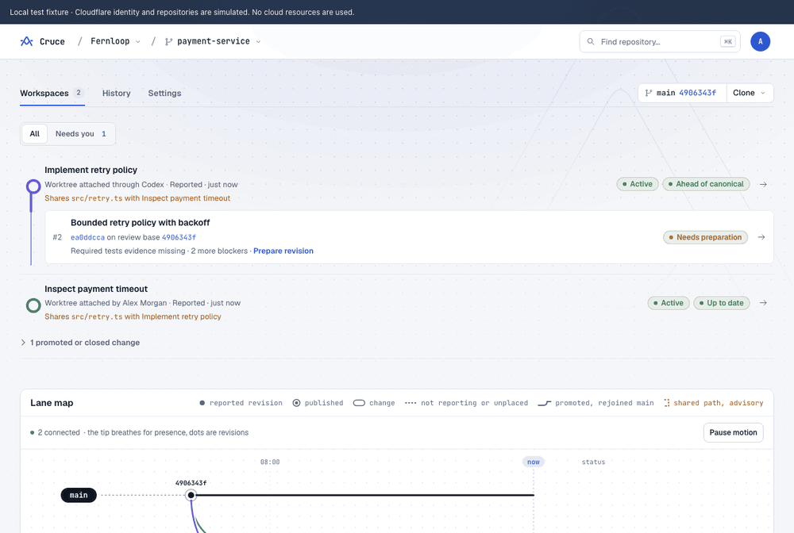

  <picture>
    <source media="(prefers-color-scheme: dark)" srcset="public/brand/wordmark-white.svg">
    
  </picture>

<h3 align="center">Git coordination for parallel agentic development.</h3>

  Runs no agents · Replaces no Git · Lands nothing without a human

  <a href="docs/product.md">Product</a> ·
  <a href="docs/domain-model.md">Concepts</a> ·
  <a href="docs/native-setup.md">Set up</a> ·
  <a href="docs/mcp.md">Agent integration</a> ·
  <a href="docs/local-demo.md">Console walkthrough</a> ·
  <a href="docs/README.md">All docs</a>

  

## Why Cruce exists

Cruce began as a figment of my imagination: a picture of how developers will work once software reaches its third generation. Code was first written by hand, then with one assistant at a time. Next, individual contributors work hand in hand with many AI agents that write, commit and push in parallel, across tools and machines. And not alone: several people, each with their own set of agents, share one repository and build it together, while the people stay in charge of what lands.

In that picture, the human job moves from writing every line to understanding, reconciling and authorizing. The developer sets the intent, reviews exact revisions, answers and resolves the agents' work, and decides what becomes canonical. Cruce is my attempt to build the ground that way of working stands on: plain Git underneath, any agent on top, and a durable record in between of where every piece of work began, how it crossed others and who approved it.

## Many paths. One history.

  
   Seven steps, from the public homepage

1. **Baseline.** Every workspace starts from a known canonical revision, and that baseline never changes.
2. **Work.** Each tool commits locally and pushes to its own workspace fork. Nobody waits on anybody.
3. **Overlap.** Shared paths show up early, as advisory context, never as a conflict verdict.
4. **Review.** A human approves one exact revision, not a branch that can move underneath it.
5. **Promote.** Canonical advances with a non-forced Git update to exactly what was reviewed.
6. **Reconcile.** Work left behind merges the new canonical with plain Git, verifies and asks for fresh review.
7. **Continue.** One promotion at a time; everyone else keeps working.

## What you get

### Every workstream on one lane map

  
   The console's lane map, replaying a promotion

The repository's **Workspaces** tab lists each workspace once, with its open changes nested under it, and draws them as lanes off `main`:

- **Where each piece of work began.** Baselines are immutable, so "3 behind canonical" means something exact.
- **Who is attached, and where.** A workspace belongs to its owner, not to the session that started it. Close the laptop, switch from Claude Code to Codex, pick it up tomorrow on another machine: the baseline, pushed revisions and history are still there. Presence comes from 30-second heartbeats, and disconnecting never releases or cleans anything up.
- **Where paths cross.** Two workspaces touching `src/retry.ts` are flagged on both rows as a heads-up, not a blocker.
- **What already landed.** Promoted work rejoins main, and **Replay history** plays the recorded events back.

### A whole team, each with their own agents

Cruce is built for more than one person's agents. In a shared namespace, teammates join as Owner, Maintainer, Developer or Viewer, and repository grants (Read, Write, Maintain) narrow what each can do. Everyone works in the same repository at the same time, each with whichever agents they prefer:

- **Every workspace has one human owner.** Alex's Codex and Sam's Claude Code push only to their own person's workspaces. No agent writes into someone else's work, and nobody pushes to canonical directly.
- **Agents act as their person, never more.** A connection can do only what its user's role, repository grants and approved repositories allow, rechecked on every request.
- **Everyone sees the same picture.** The lane map names each workspace's owner, and a path that Alex's and Sam's work both touch shows on both rows long before review.
- **Review crosses people and agents.** Sam leaves a concern on Alex's change, Alex's agent answers it, and a human with Maintain resolves it and approves the exact revision. That is the loop below.
- **The record says who did what.** Every revision, note, approval and promotion names its human and the connection it came through.

### Review with your agent, on the exact revision

  
   Sam's concern, answered by Alex's agent, resolved by a human

Review is a loop between the people who decide and the agents that write, held in one durable place instead of a chat transcript:

1. **You or a teammate leave a note on a line.** A *concern* blocks promotion; a *comment* never does. Each note names the exact revision under review.
2. **Your agent picks it up.** The next time it checks in, it learns a note is waiting and reads exactly what was asked, on which line and revision. Cruce never messages, wakes or schedules the agent; it only keeps the note where the agent will find it.
3. **The agent fixes and answers.** It changes the code with Git, proposes the new revision and replies on the note, pointing at the revision that addresses it.
4. **You check, then resolve.** Only an authenticated human can resolve a concern, and they give a reason. Agents can add notes and reply, but never resolve.
5. **Nothing slips through a republish.** Unresolved concerns follow the change to its newest revision until a human resolves them.

Every change opens with one next step and a compact checklist (on main, concerns, tests, approval, promote). Its files read as one page: likely review targets first, tests and docs folded, notes beside their lines.

### What you approve is what lands

Review, evidence, approval and promotion each name **one exact revision**. Canonical advances only after an authenticated human approves that revision, every concern is resolved and a non-forced Git update validates against the approved base. If `main` moved first, the workspace merges it with plain Git, verifies and gets fresh review. Fetching or acknowledging proves nothing. Publication proves which source was retained for review, not that it is correct.

## What Cruce is not

One developer running a few agents on one machine is already well served by Git worktrees and local agent tools; Cruce doesn't compete there. Its value grows with agents × developers × machines × concurrent workstreams × duration.

Cruce is **not** an agent runtime, agent scheduler, conversation manager, multi-agent messaging bus, IDE, Git replacement, GitHub/GitLab replacement, CI/CD system, cloud development environment or agent vendor platform. It never launches, pauses, messages or schedules agents, and never stores prompts or conversations. Git stays Git: there is no `cruce push`, and clone, commit, merge and push work as they always have. Any agent or script takes part through [MCP](docs/mcp.md) or the API, and orchestrators can sit above it the same way. See [product boundaries](docs/product.md#non-goals-and-product-boundaries).

## Status

Cruce is early, experimental software. Expect interfaces to change.

## License

Cruce is open source under the [Apache License 2.0](LICENSE).
