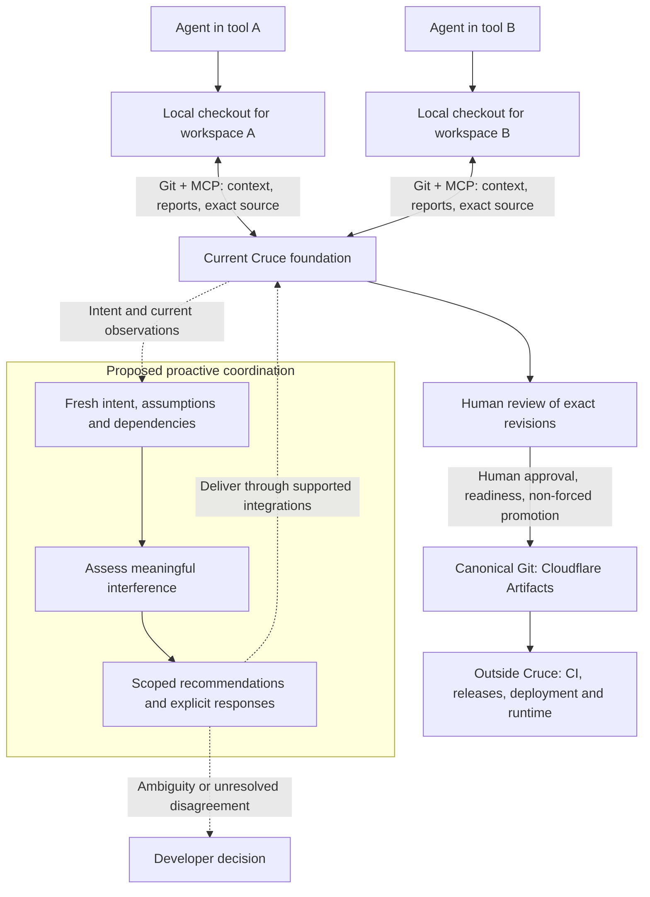

# Cruce

Cruce aims to be air traffic control for multiple coding agents from different vendors working on one repository: proactively coordinate work to reduce avoidable conflicts, duplicated effort and routine human intervention. Agents keep their own tools and isolated checkouts. The current Git-native foundation provides shared observations, exact revisions, review and human-controlled convergence into canonical source.

Proactive intent/dependency tracking, coordination decisions, acknowledgements and opt-in controls through supported integrations are proposed in the [roadmap](ROADMAP.md), not implemented capabilities. The [product thesis](docs/product-thesis.md) explains the intended workflow, limits and hypothesis to validate.

**Cruce starts where individual-agent isolation ends.** An agent can already manage several of its own tasks with Git worktrees. Independent tools can still duplicate an outcome, change incompatible assumptions or miss a dependency. The goal is to surface these interactions while work is underway and keep independent work moving, then reconcile results under review. Two edits to the same file need not interfere; edits to different files can.

Codex, Claude Code, Cursor, Gemini CLI and internal or future agents belong in this model. That is a product boundary, not a claim of tested interoperability with every client. The current bridge writes configuration for Codex, Claude Code and Cursor; other clients need a compatible adapter. See [MCP and agent participation](docs/mcp.md).

The implemented foundation and proposed coordination layer are separate below. Dashed links describe proposed interactions, not available controls.



Worktrees isolate work. Cruce coordinates workers. Cruce does not launch agents, host an editor or require scheduling clearance before local edits. Current overlap is advisory; it does not prove a semantic conflict or guarantee compatibility. Future targeted pause/resume controls require opt-in and demonstrated integration support; Cruce cannot reliably stop arbitrary agents.

## Git stays Git

> If Git already has a primitive for something, Cruce should use Git instead of inventing another one.

Keep using `git clone`, `git fetch`, `git pull`, `git push`, `git commit`, `git branch`, `git diff` and `git log`. Cruce adds participation, authorization, shared observations and revision-bound decisions. It does not add a replacement Git command language.

The ownership model is **Namespace → Repository → Workspace**. A namespace owns access and budgets. Every repository has an authoritative canonical Git repository backed by Cloudflare Artifacts. Each writer workspace owns one reusable direct fork of canonical and records an actor, task and immutable starting commit. An agent may participate in many workspaces; the workspace owns its fork, not the vendor. A worktree or clone is its local execution context, not its durable identity. Existing checkout attachment preserves remotes and never silently uploads history.

Normal pushes go to the writer's fork. Publication retains an exact pushed revision as a Cruce source artifact, distinct from the Cloudflare Artifacts provider. Evidence records revision-linked claims/results separately. Publication proves which source was retained, not that it is correct; human-approved, controller-gated promotion advances canonical source. Cruce’s responsibility ends when isolated concurrent work is safely reviewed and reconciled into the canonical Git repository. CI, build/release orchestration, deployment, environment management, rollback and runtime operation belong to external systems. See the [architecture](docs/architecture.md) for the complete flow and its trust boundaries.

## Try the local console

Use Git, Node 22.18+ and pnpm (CI uses Node 24 and pnpm 12.4.2):

```sh
pnpm install --frozen-lockfile
pnpm dev:fixture
```

Open the printed loopback URL. The fixed-clock fixture uses the real console and controllers with deterministic Git source; identity and provider behavior are simulated. It does not connect to live namespaces or consume cloud resources.

Follow the [local console walkthrough](docs/local-demo.md) for screenshots and a guided tour of the sample workspaces, review, published revisions and evidence views.

To use Cruce with real repositories, follow [Git and bridge setup](docs/native-setup.md). Hosted repositories require a namespace's explicitly connected Cloudflare account and consume resources. Cloud hosting does not imply cloud execution of agents.

## Status

Cruce is early, experimental software, and its name remains provisional. The current foundation has local controller, Git, bridge and browser coverage. The native Git gateway and current namespace model have **not been verified in the configured live Worker**; earlier provider checks covered an older implementation. [Verification](docs/local-verification.md) records the evidence and limits.

The proposed first pilot uses one developer, one repository, Codex and Claude Code, subject to demonstrated integration support. It must show reduced routine intervention, duplicated effort and integration rework against ordinary worktrees and Git review, within predeclared limits on delay, reporting effort, cost and quality. The [roadmap](ROADMAP.md#how-we-choose-what-to-build) includes failure and simplification criteria; product value and cross-tool context consumption remain unproven.

Cruce is not a Git/Git-worktree replacement, a Claude Code worktree manager, a GitHub/GitLab clone, a remote IDE, a cloud coding environment, an agent runtime, a general agent orchestrator or a CI/CD replacement. Its scope is coordination of concurrent repository work. See [product boundaries](docs/product-thesis.md).

## Documentation map

| I want to… | Read |
| --- | --- |
| Understand the problem, audience and scope | [Product thesis](docs/product-thesis.md) |
| Explore the development console with screenshots | [Local console walkthrough](docs/local-demo.md) |
| Make or review an architectural decision | [Principles and guardrails](docs/principles.md) |
| Understand ownership, components and source convergence | [Architecture](docs/architecture.md) |
| Connect a checkout and participate | [Git and bridge setup](docs/native-setup.md) |
| Integrate an agent or change the tool surface | [MCP and agent participation](docs/mcp.md) |
| Develop and verify a contribution | [Contributing](CONTRIBUTING.md), [verification](docs/local-verification.md) |
| Configure hosted resources | [Cloudflare setup](docs/cloudflare-setup.md), [test environment](docs/test-environment.md) |
| Explore future ideas | [Future direction and ideas](ROADMAP.md) |
| Work as a coding agent in this repository | [AGENTS.md](AGENTS.md) |
| Inspect change history or release procedures | [Changelog](CHANGELOG.md), [releases](docs/releases.md) |

Principles state the constraints; architecture describes the current design; the roadmap contains future candidates; verification records evidence; the changelog summarizes changes. Git history preserves implementation history. A historical success or future plan is not evidence of a current capability.
