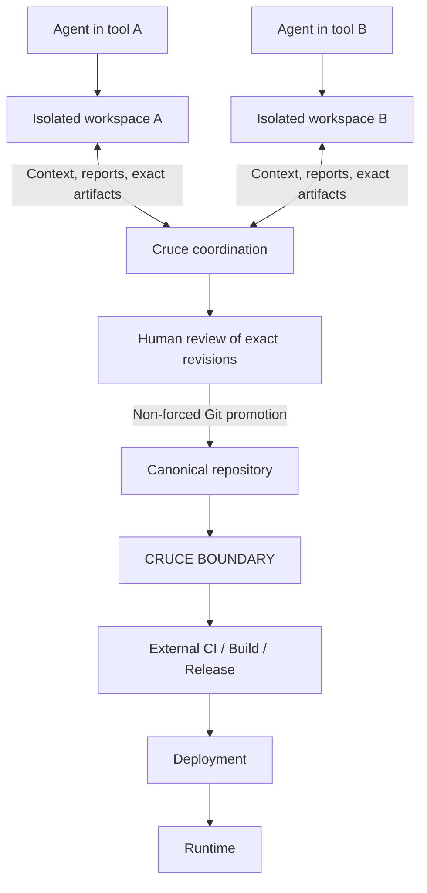

# Cruce

Cruce is a Git-native platform for coordinating multiple heterogeneous AI coding agents working concurrently on the same repository. Agents work in their own tools and isolated checkouts; Cruce gives connected participants shared context about work in progress, exact revisions, review and human-controlled convergence into canonical source.

**Cruce starts where individual-agent isolation ends.** An agent can already manage several of its own tasks with Git worktrees. Cruce addresses the next problem: independent agents and tools working on the same codebase need to remain isolated, learn about one another's work and reconcile their results.

Codex, Claude Code, Cursor, Gemini CLI and internal or future agents belong in this model. That is a product boundary, not a claim of tested interoperability with every client. The current bridge writes configuration for Codex, Claude Code and Cursor; other clients need a compatible adapter. See [MCP and agent participation](docs/mcp.md).



Worktrees isolate work. Cruce coordinates workers. Cruce does not launch agents, host an editor or require scheduling clearance before local edits. Overlap is advisory; it does not prove a semantic conflict or guarantee compatibility.

## Git stays Git

> If Git already has a primitive for something, Cruce should use Git instead of inventing another one.

Keep using `git clone`, `git fetch`, `git pull`, `git push`, `git commit`, `git branch`, `git diff` and `git log`. Cruce adds participation, authorization, shared observations and revision-bound decisions. It does not add a replacement Git command language.

The ownership model is **Namespace → Repository → Workspace**. A namespace owns access and budgets. Every repository has canonical Cloudflare Artifacts storage. Each writer workspace owns one reusable fork and records an actor, task and immutable starting commit; a worktree or clone holds its local files. Existing checkout attachment preserves remotes and never silently uploads history.

Normal pushes go to the writer's fork. Publication retains an exact pushed revision as a source artifact; human-reviewed promotion advances canonical source. Cruce’s responsibility ends when isolated concurrent work is safely reviewed and reconciled into the canonical Git repository. CI, build/release orchestration, deployment, environment management, rollback and runtime operation belong to external systems. See the [architecture](docs/architecture.md) for the complete flow and its trust boundaries.

## Try the local console

Use Git, Node 22.18+ and pnpm (CI uses Node 24 and pnpm 12.4.2):

```sh
pnpm install --frozen-lockfile
pnpm dev:fixture
```

Open the printed loopback URL. The fixed-clock fixture uses the real console and controllers with deterministic Git source; identity and provider behavior are simulated. It does not connect to live namespaces or consume cloud resources.

Follow the [local console walkthrough](docs/local-demo.md) for screenshots and a guided tour of the sample workspaces, review and artifact views.

To use Cruce with real repositories, follow [Git and bridge setup](docs/native-setup.md). Hosted repositories require a namespace's explicitly connected Cloudflare account and consume resources. Cloud hosting does not imply cloud execution of agents.

## Status

Cruce is early, experimental software, and its name remains provisional. The current foundation has local controller, Git, bridge and browser coverage. The native Git gateway and current namespace model have **not been verified in the configured live Worker**; earlier provider checks covered an older implementation. A heterogeneous-agent workflow pilot remains open. [Verification](docs/local-verification.md) records the evidence and limits.

Cruce is not a Git/Git-worktree replacement, a Claude Code worktree manager, a GitHub/GitLab clone, a remote IDE, a cloud coding environment, an agent runtime, a general agent orchestrator or a CI/CD replacement. Its scope is coordination of concurrent repository work. See [product boundaries](docs/product-thesis.md).

## Documentation map

| I want to… | Read |
| --- | --- |
| Understand the problem, audience and scope | [Product thesis](docs/product-thesis.md) |
| Explore the development console with screenshots | [Local console walkthrough](docs/local-demo.md) |
| Make or review an architectural decision | [Principles and guardrails](docs/principles.md) |
| Understand ownership, components and source convergence | [Architecture](docs/architecture.md) |
| Connect a checkout and participate | [Git and bridge setup](docs/native-setup.md) |
| Integrate an agent or change the tool surface | [MCP and agent participation](docs/mcp.md) |
| Develop and verify a contribution | [Contributing](CONTRIBUTING.md), [verification](docs/local-verification.md) |
| Configure hosted resources | [Cloudflare setup](docs/cloudflare-setup.md), [test environment](docs/test-environment.md) |
| Explore future ideas | [Future direction and ideas](ROADMAP.md) |
| Work as a coding agent in this repository | [AGENTS.md](AGENTS.md) |
| Inspect change history or release procedures | [Changelog](CHANGELOG.md), [releases](docs/releases.md) |

Principles state the constraints; architecture describes the current design; the roadmap contains future candidates; verification records evidence; the changelog summarizes changes. Git history preserves implementation history. A historical success or future plan is not evidence of a current capability.
