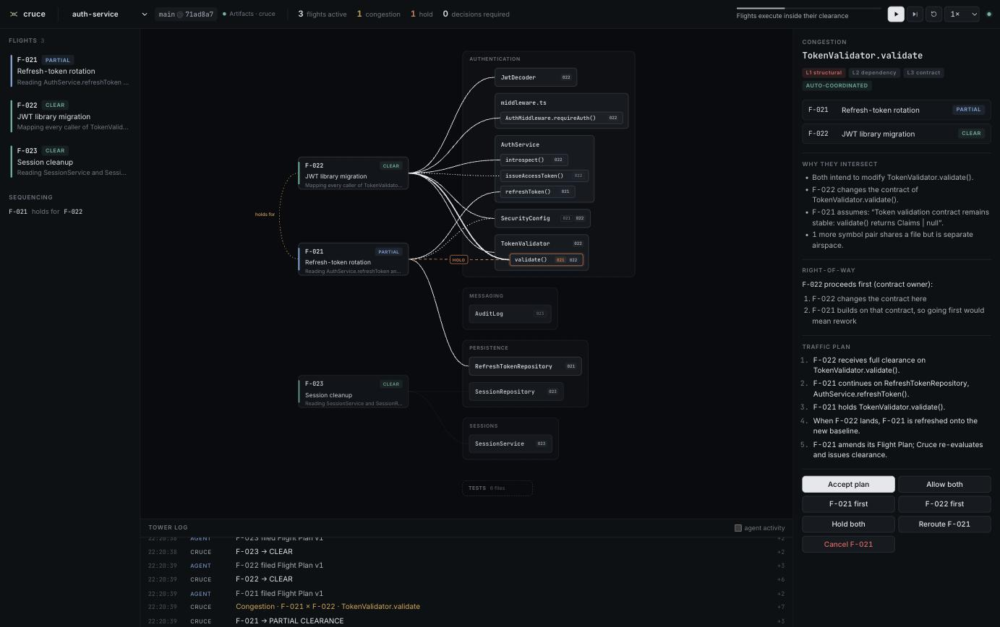

# Cruce

**Active traffic control for autonomous coding agents.**

Worktrees isolate agents. Cruce coordinates their future work.

When one developer delegates several tasks to several coding agents, isolation is the easy part:
every agent gets its own repository. What nobody does is look *ahead*: Flight A is about to change
`TokenValidator.validate`'s contract, Flight B is about to build on the old one, and Flight C is
nowhere near either. Cruce reads each agent's **Flight Plan**, finds where routes intersect **before
any code collides**, decides who goes first, lets everyone else keep working on the parts that are
safe (**partial clearance**), and — when a Flight lands — tells the affected Flights exactly which of
their assumptions just went stale so they re-plan instead of re-working.

> *Git coordinates code. Cruce coordinates the agents changing it.*
> Artifacts gives every agent its own safe repository. Cruce decides how all of those agents should move together.

**Live:** https://cruce.acltabontabon.workers.dev (press ▶ — the demo runs on real Cloudflare Artifacts)



---

## What it does

| | |
|---|---|
| **One Artifacts repo per Flight** | Every agent task gets an isolated fork of the canonical repository (`auth-service--f021`): own history, refs, tokens, lifecycle. |
| **Flight Plans** | After read-only discovery, an agent files what it will *read*, *write*, and whose *contract* it will change. Plans are living documents: amendments re-run traffic analysis. |
| **Deterministic traffic control** | A conflict matrix over a structural index (module → file → symbol), a dependency graph with Tarjan cycle (deadlock) detection, explainable right-of-way rules, and clearance **leases**. No model is asked anything an algorithm can answer. |
| **Partial clearance** | Only the contested airspace is held. F-021 keeps building `RefreshTokenRepository` while `TokenValidator.validate` waits for F-022. |
| **Publish gate** | Artifacts tokens are repo-scoped, so agents never hold a write credential. Cruce rebuilds the agent's commit, maps the *real* diff onto symbols, and only if it is inside clearance pushes it with a 60-second token that is revoked immediately. |
| **Landing re-evaluates traffic** | Landing merges into canonical for real (three-way merge, Git notes with the coordination context). Every Flight whose route intersects what changed is marked **stale**, refreshed onto the new baseline, and asked to amend its plan. |
| **Exception-driven** | Independent work is cleared automatically. Humans see "3 Flights · 1 congestion · 0 decisions required" and can override any decision (allow both, X first, hold, reroute, cancel) — every decision explains itself. |

## Run it

### Demo mode (no credentials needed to watch; deterministic)

The hosted demo: https://cruce.acltabontabon.workers.dev → **▶ Play** (or **⏭** to step).

Locally, without any Cloudflare account (local Git backend in Durable Object storage):

```sh
pnpm install
cp .dev.vars.example .dev.vars
pnpm exec cf dev --mode offline        # http://localhost:5173
```

Locally against real Artifacts (namespace `cruce-dev`):

```sh
pnpm exec cf auth login
pnpm exec cf dev
```

The demo replays one story with three scripted agents — JWT migration (F-022), refresh-token
rotation (F-021), session cleanup (F-023) — but every decision comes from the controller, every
diff passes the real publish gate, and every landing is a real merge. Commit ids are reproducible.

### Live mode (real coding agents)

Two runtimes speak the same agent protocol:

- **External runner** — Claude Code on your machine, coordinated by Cruce:
  ```sh
  export CRUCE_ADMIN_TOKEN=…   # the controller token (see docs/cloudflare-setup.md)
  node runner/cruce-runner.ts --url https://cruce.acltabontabon.workers.dev --project live \
    --title "Session cleanup" --description "End idle sessions automatically"
  ```
  Launch several in parallel to watch real agents coordinate.
- **Cloudflare Sandbox** — one container per Flight running Claude Code, orchestrated by a Workflow.
  Needs Docker (to build the image) and `ANTHROPIC_API_KEY`: `CRUCE_SANDBOX=on pnpm exec cf deploy …`.

Details: [docs/demo.md](docs/demo.md) · [docs/cloudflare-setup.md](docs/cloudflare-setup.md)

### Verify that it really happened

```sh
tools/verify-repo.sh auth-service cruce     # mints a READ token with cf, clones with plain git,
                                            # prints history + Cruce notes, runs the repo's tests
```

## Docs

- [Product thesis](docs/product-thesis.md) — why coordination is the bottleneck of the agent era
- [Architecture](docs/architecture.md) — Workers, Durable Objects, Workflows, Sandboxes, Artifacts
- [Controller model](docs/controller-model.md) — conflict matrix, levels, right-of-way, partial clearance, leases
- [Artifacts model](docs/artifacts-model.md) — canonical repo, Flight forks, tokens, notes, events, landing
- [Demo](docs/demo.md) — the story and how to drive it
- [Cloudflare setup](docs/cloudflare-setup.md) — resources, secrets, deploy
- [AGENTS.md](AGENTS.md) — rules for coding agents working on Cruce itself

## Development

```sh
pnpm test            # controller, Git, and full-demo end-to-end tests (vitest)
pnpm typecheck       # Worker, UI, and test programs
pnpm lint            # biome
bash demo/scripts/verify-scenario.sh   # replay the demo story with plain git + node --test
```

"Cruce" (Spanish: *crossing*, *intersection*) is a working name. Apache-2.0.
