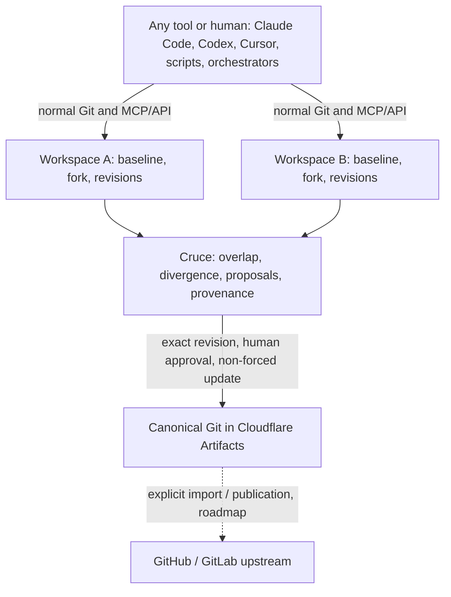

# Cruce

**Git coordination for parallel agentic development.**

Cruce is the durable coordination plane for Git work produced by many independent actors: Claude Code, Codex, Cursor, other agents, scripts, orchestrators and human developers. It lets them work in parallel without Git itself becoming the coordination problem.

Agents, sessions, terminals, worktrees and machines are transient, and agent vendors are interchangeable. The work is not. Cruce gives each stream of work a durable **workspace** with an exact baseline, its own Git fork, pushed and published revisions, and provenance. It shows how concurrent workspaces relate (overlap, divergence, staleness) and carries exact revisions through review and human approval into canonical Git.

> Cruce coordinates durable concurrent Git work; other systems execute the work.



## What Cruce is not

One developer running a few agents on one machine is already well served by Git worktrees and local agent tools; Cruce does not compete there. Its value grows with agents × developers × machines × concurrent workstreams × duration.

Cruce is **not** an agent runtime, agent scheduler, conversation manager, multi-agent messaging bus, IDE, Git replacement, GitHub/GitLab replacement, CI/CD system, cloud development environment or agent vendor platform. Orchestrators and relays can sit above it and use it through MCP or the API. See [product boundaries](docs/product.md#non-goals-and-product-boundaries).

## Git stays Git

Keep using `git clone`, `fetch`, `pull`, `push`, `commit`, `branch`, `merge`, `diff` and `log`. The hierarchy is **Namespace → Repository → Workspace**. Every repository has a canonical Git repository in Cloudflare Artifacts. Each writer workspace owns one reusable direct fork of it and an immutable baseline. A workspace is owned by a user, not by an agent session. Its local worktree or checkout is a replaceable execution attachment, so the same workspace can be continued in another session, tool or machine. Attaching a checkout never rewrites existing remotes such as `origin` and never uploads history implicitly.

Writers push to their fork. Publication retains an exact pushed revision for review; it proves which source was retained, not that it is correct. Canonical advances only through an authenticated human approval of an exact revision and a non-forced Git update against the approved base. See the [domain model](docs/domain-model.md).

## Try the local console

Use Git, Node 22.18+ and pnpm (CI uses Node 24 and pnpm 12.4.2):

```sh
pnpm install --frozen-lockfile
pnpm dev:fixture
```

Open the printed loopback URL. The fixed-clock fixture uses the real console and controllers with deterministic Git source; identity and provider behavior are simulated, and it consumes no cloud resources. The [local console walkthrough](docs/local-demo.md) has screenshots. To use real repositories, follow [Git and bridge setup](docs/native-setup.md). Hosted storage is configured once by the installation administrator; developers and agents do not need Cloudflare accounts. See [installation setup](docs/cloudflare-setup.md#installation-configuration). Cloud hosting of Git does not mean cloud execution of agents.

## Status

Cruce is early, experimental software, and its name is provisional. The current alpha is **0.1.0-alpha.3**; interfaces may change. Local checks cover controllers, native Git, bridge recovery and console journeys. Earlier deployed checks demonstrated two coding tools, cross-connection continuation and human-approved promotion on one machine. The current storage binding and recovery changes still require hosted acceptance. See [verification](docs/local-verification.md), the [architecture audit](docs/architecture.md#implementation-audit) and [releases](docs/releases.md) for evidence and limits.

## Documentation map

| I want to… | Read |
| --- | --- |
| Understand what Cruce is, why, and what it will not do | [Product](docs/product.md) |
| Learn the concepts: workspace, baseline, revisions, lifecycle, authority | [Domain model](docs/domain-model.md) |
| Make or review a design decision | [Principles and guardrails](docs/principles.md), [decision records](docs/decisions/README.md) |
| Understand the implementation, its gaps and Cloudflare fit | [Architecture and audit](docs/architecture.md) |
| See what comes next | [Roadmap](ROADMAP.md) |
| Connect a checkout and participate | [Git and bridge setup](docs/native-setup.md) |
| Integrate an agent, orchestrator or script | [MCP participation](docs/mcp.md) |
| Explore the console | [Local console walkthrough](docs/local-demo.md), [design guide](docs/design.md) |
| Develop and verify a contribution | [Contributing](CONTRIBUTING.md), [verification](docs/local-verification.md) |
| Configure hosted resources | [Cloudflare setup](docs/cloudflare-setup.md), [test environment](docs/test-environment.md) |
| Work as a coding agent in this repository | [AGENTS.md](AGENTS.md) |
| Inspect change history or release procedures | [Changelog](CHANGELOG.md), [releases](docs/releases.md) |

Each kind of information has one home: product and boundaries in the product document, concepts in the domain model, constraints in the principles, the current design in the architecture, future candidates in the roadmap, evidence in verification and changes in the changelog. A historical success or a future plan is not evidence of a current capability.
