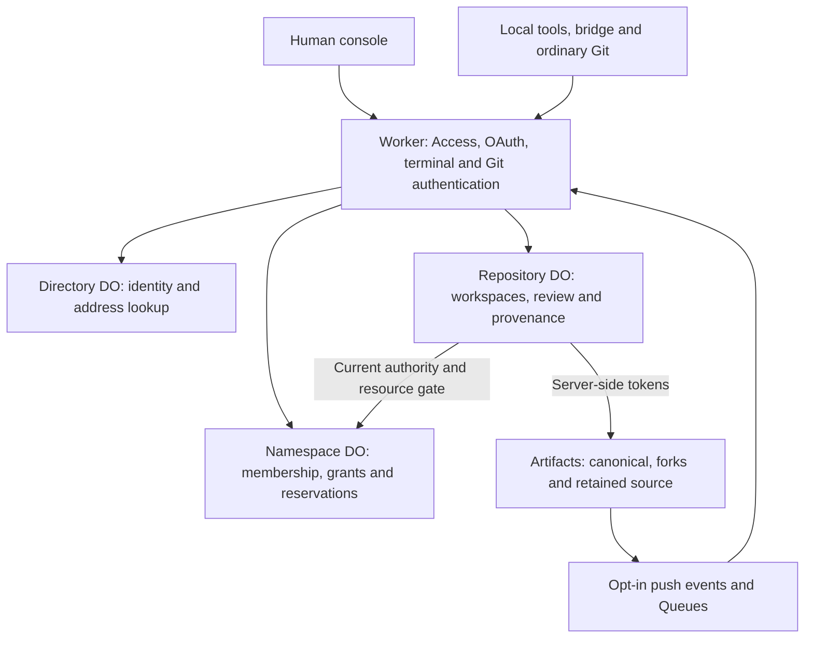

# Architecture

[Documentation](README.md) · [Domain model](domain-model.md) · [Principles](principles.md) · [Verification](local-verification.md)

Cruce stores durable coordination state and exact-revision decisions. Participants run Git and their tools locally. This guide describes implemented mechanisms; [verification](local-verification.md) records what has passed, and [the roadmap](../ROADMAP.md) holds future work.

## Domain mapping

[Shared contracts](../src/shared/platform.ts) define the schemas; the [domain model](domain-model.md) defines their meaning.

| Concept | Contract |
| --- | --- |
| Namespace and resource authority | `Namespace`, `NamespaceState`, `Authority` |
| Repository and accepted canonical revision | `Repository`, `RepositoryState.canonical`, `sourceHead` |
| User-owned workspace and immutable baseline | `Workspace.ownerId`, `baseRevision`, `fork`, `state` |
| Replaceable local execution | `Workspace.execution` (`ExecutionAttachment`) |
| Participant reports | `headRevision`, `changes`, `commits`, `lastReportAt` |
| Published source / stored evidence | `Artifact` (`source` / `evidence`), `Verification` |
| Change, review and line notes | `Proposal`, `Review`, `ReviewNote` |
| Promotion and provenance | `Promotion`, `ActivityEvent`, `get_lineage` |

### Console

Home lists repositories by attention. Repository tabs are **Workspaces**, **History** and **Settings**. Workspaces appear once, with open changes nested beneath them. Counted filters appear when they narrow the list; a quiet line names problems rows cannot show. Changes open with one controller-derived next step and a checklist ending in Promote. Exact-revision diffs show review targets first and fold supporting files. History holds promotions, retained source, evidence and activity.

[Attention](../src/core/attention.ts) and readiness are read-only controller projections. The UI renders eligible actions; it does not decide authority or parse blocker prose. Scoped header search/dropdowns, shared-namespace Members/Teams and the separate avatar menu follow [the design guide](design.md).

### Repository retirement

[Lifecycle decisions](../src/core/repository-lifecycle.ts) distinguish archive from deletion. Archive waits for finished work and preserves source/history; archived repositories reject writes and can be restored. Permanent deletion is a console namespace Owner decision confirmed by exact repository name. It ends live workspaces and closes open changes, but waits for unsettled promotions/resource operations. Archive and deletion also require disabled observation and completed subscription cleanup.

[The runtime](../src/worker/repository-lifecycle.ts) freezes before effects, journals retries under current authority/policy and recorded provider IDs, removes up to four storage identities per attempt, canonical last. Confirmed absence precedes namespace settlement, bounded record/cache purge and tombstones. Names/capacity can be reused with new IDs; old IDs cannot return. Local checkouts and upstreams are untouched. See [ADR 0010](decisions/0010-repository-archive-and-permanent-deletion.md).

### Namespace deletion

Only a console Owner may delete a shared namespace, confirmed by exact handle. [The runtime](../src/worker/namespace-deletion.ts) freezes the namespace and starts/resumes up to four repository deletions per attempt through each repository's own lifecycle. Directory retirement frees the handle and retains an ID tombstone after all repositories are gone. Personal namespaces cannot use this path ([ADR 0012](decisions/0012-namespace-permanent-deletion.md)).

Unavailable but restorable storage blocks deletion. Legacy connected-account storage may be explicitly forgotten with separate owner acknowledgment: provider calls are skipped and a left-behind inventory is retained ([ADR 0013](decisions/0013-forgetting-unreachable-legacy-storage.md)).

### Workspace map presentation

[The lane model](../src/ui/lanes.ts) uses recorded workspace, report, publication, review and promotion timestamps. Replay shows retained history, not a reconstruction of missing events. Connection pulses and finite revision highlights represent observed state changes. Detached/settled work folds explicitly; the map pages twelve lanes with totals, keyboard scrolling, pause and reduced-motion controls.

### Workspace durability

Presence expiry never detaches, ends or cleans up work. Detachment preserves the fork and history. Only pushed commits travel to another checkout; unpushed files stay local. Ending work releases its server checkout reservation without accepting source. Local lock release remains a bridge action.

## Components and trust boundaries

| Boundary | Responsibility |
| --- | --- |
| [Core](../src/core) | Pure deterministic decisions with injected time and IDs |
| [Directory](../src/worker/directory.ts) | User identity and namespace addresses; stable object name `namespace-directory` |
| [Namespace runtime](../src/worker/namespace-runtime.ts) | Membership, grants, storage identity and atomic reservations across repositories |
| [Repository runtime](../src/worker/repository-runtime.ts) / [Control Tower](../src/worker/control-tower.ts) | Serialized commands/Git I/O, state, journals and recovery |
| [SQL store](../src/worker/store.ts) / [Git filesystem](../src/worker/git/sql-fs.ts) | Indexed coordination records and derived source cache |
| [Shared catalog](../src/shared/tools.ts) | One MCP catalog: scopes, mutations, resource actions and cost |
| [Runner](../runner) | OAuth, local locks, worktrees, Git credentials, reports and continuation |
| [Console](../src/ui) | Controller-derived visibility and decisions |

The installation configures one Artifacts binding. Namespaces inherit it; their stable IDs prefix physical repository names. First resource use pins the account/physical namespace. A later mismatch fails closed. No automatic rebinding, silent source migration or second canonical authority exists.

### Safe errors and operation diagnostics

[Public errors](../src/core/public-errors.ts) use a status/message allowlist; unknown provider/internal text becomes generic. Validation omits raw values. [Diagnostics](../src/worker/diagnostics.ts) allow known operations/phases, status, latency and typed SHA-256 correlation digests. They exclude credentials, source, request URLs, provider bodies and OAuth payloads. Digests permit guessed-ID confirmation by log readers; they are not encryption. See [F5 evidence](local-verification.md#diagnosable-operations-and-safe-errors-f5).

### Coordination read boundary

Coordination reads resolve established identity and current namespace authority, then inspect recorded metadata/cache. They never log in a user, create schema, save metadata, reserve resources, repair source or contact Artifacts—even on cold/empty objects. Missing source is unavailable.

Explicit sign-in initializes identity/personal namespace. Shared-namespace creation initializes its state; repository setup or setup retry initializes repository state. Interrupted registration is readable as an unsaved empty snapshot with setup readiness. Explicit `inspect_source`/`recover_source` are resource operations; ordinary Git and authentication certificate refresh are separate I/O boundaries. [Read-purity tests](../test/worker/read-purity.test.ts) exercise the actual SQL and routing adapters locally.

## Identity and authorization

Access verifies browser identity. OAuth connections and paired terminals retain issuer/subject/email, not the approving Access JWT. Agent grants have their own refresh lifetime (30 days by default); terminal authorization lasts 30 minutes. Access sign-out does not revoke OAuth connections.

Every request/retry intersects current membership, repository grants, connection repository approval and scopes. Consent defaults to all accessible repositories; a chosen list narrows it. Labels are provenance, not identity. Owner-only workspace actions stay owner-only even for maintainers. Canonical approval, attestation, concern resolution and promotion require authenticated console human authority. Archive/delete require the namespace Owner. [Authority rules](domain-model.md#authority-model) are normative.

## Git and workspace lifecycle

The owner starts a workspace at an immutable exact baseline. Attachment provisions one reusable direct fork and reserves one execution context. [The bridge](../runner/execution.ts) creates an owned worktree or attaches a human checkout, uses persistent writer locks and adds a unique workspace remote/branch push destination without rewriting existing remotes. Detach permits replacement; continuation starts from the pushed fork head.

Git uses normal clone/fetch/commit/push over the authenticated gateway. Writers reach their own unfinished forks; canonical receive-pack is reserved for promotion. Provider repository tokens live server-side, expire after 60 seconds and are revoked after use. The gateway buffers bounded transfers and serializes them with repository commands.

### Durable provider identity

[The identity journal](../src/worker/provider-identity.ts) binds canonical, fork and retention provider IDs before subsequent source effects. Checks cover IDs and direct-fork parent identity; a matching name/URL never proves identity. Unknown creation outcomes, missing IDs and recreated repositories fail closed for administrator reconciliation. The original reservation/operation remains available for retry after restoration.

## Concurrency and reconciliation

Reports name the attached execution. Heartbeats run every 30 seconds; presence becomes disconnected after 90 seconds. Report freshness uses `lastReportAt` independently. Advisory overlap compares reported paths from present writers, including both rename endpoints, deletions and binary files. It does not establish conflicts or compatibility.

Cached all-parent Git ancestry compares the latest publication with accepted canonical, or an explicitly labelled immutable baseline before publication. Missing objects produce unknown/unavailable state without fetching. Reported heads, observed fork refs, publications and accepted canonical remain distinct.

When canonical moves, the participant explicitly fetches, merges, verifies, pushes, publishes and proposes a new revision before fresh review. A publication must descend from its baseline and previous publication. `integratedRevision` records the latest publication's review base; fetching alone never advances it. See [the participation protocol](mcp.md#participation-protocol).

## Publication, review and retention

Publication fetches the named pushed ref, verifies its requested revision and ancestry/protected paths, pins the review base and retains source under a unique ref in separate storage. Retained refs are not agent-writable remotes. Retention is an application/access invariant; it does not prove correctness.

The publication journal records original actor/time, fingerprint, exact base/revision and storage identity before retention I/O. Attempted writes reconcile the exact retained tip. Artifact/activity/receipt save atomically before settlement; receipt replay repairs settlement without another write and never regresses newer workspace state.

Changes bind one artifact/base/revision. Superseding a change requires fresh review and carries its unresolved notes. Concerns block until human reasoned resolution; agent replies may cite published source but never resolve. Readiness requires current base, exact human-maintainer approval and policy-required trusted passing evidence without unresolved failures. Agent evidence stays `reported`; human attestation stays `human_attested`. Cruce runs no checks.

Promotion journals exact inputs and reservation before I/O, rechecks authority/identities/source, guards the advertised approved old/new pair and performs a non-forced Git update under the remote ref lock. Prepared/attempted/confirmed phases separate intent from effect. An attempted update is never pushed again: retry independently inspects remote refs and accepts only its exact candidate. Uncertain outcomes block other promotions. Completed provenance/state/receipt save atomically before namespace settlement. No Git/metadata transaction is claimed.

Fork cleanup requires an ended workspace and a fresh complete proof that every fork ref is retained. Unretained commits, annotated tags, non-commit refs or incomplete inventory block deletion. Recorded cleanup can resume under current authority, policy and identity; confirmed deletion preserves publications/provenance. Local worktree cleanup additionally requires bridge ownership, clean files and a retained head.

## Resources and the canonical Git boundary

Namespace reservations gate cloud operations atomically across repositories. Retries reuse exact identity/input and reservation; uncertain outcomes remain reserved. Resource policy decides eligibility, not a daily operation budget. Reservations do not meter every provider request or dollar cost. Repository policy may only narrow namespace policy.

Cruce ends at reviewed canonical Git. Builds, deployments, CI/CD, environments, runtimes and agent scheduling remain external. See [installation setup](cloudflare-setup.md) and [operations](operations.md).

## Storage and recovery

### State authority and the Git cache

Directory owns identity/addresses; Namespace owns membership/grants/registration/reservations; Repository owns workspace/review/provenance and accepted `sourceHead`; Artifacts owns remote Git/source retention; OAuth KV owns grants. Display copies and snapshots never become authorization authorities. Observed canonical does not accept source or complete promotion.

The bounded SQLite Git cache is derived and replaceable. Ordinary coordination/source reads never fetch. Explicit recovery uses recorded retained source; source, approvals and reservations survive cache eviction.

### Bounded coordination state and retention recovery

[ADR 0005](decisions/0005-bounded-state-and-authorized-cleanup-recovery.md) records this supported envelope, as amended by [ADR 0009](decisions/0009-replaceable-observations-and-archived-finished-work.md). The [limits contract](../src/shared/limits.ts) is executable. The current repository/namespace JSON state remains finite; lifetime histories and receipts no longer inflate it. `records` uses its primary-key index for exact lookup and cursor ranges. A transactionally maintained byte/record counter avoids scanning retained history for every admission. Byte counts include UTF-8 keys and JSON values, excluding SQLite page/index overhead and the separate Git cache.

| Bound | Supported limit |
| --- | --- |
| One coordination record | 1 MiB, below the platform's SQL row ceiling |
| Hot repository/namespace state | 768 KiB; new repository work is admitted below 640 KiB, reserving room for pending outcomes and existing workspace updates |
| Indexed coordination retention, per DO | 128 MiB / 200,000 records; new operations leave 2 MiB / 100 records for recovery |
| Namespace discovery, people lookup and layout conversion | 128 candidate namespaces per user / 1,000 requested user IDs / 4,096 converted index records per explicit sign-in; candidates are never membership authority |
| Namespace state | 64 repositories, 1,000 members, 100 teams, 1,000 invitations; byte bound also applies |
| Repository live metadata | 256 workspaces, 1,024 artifacts, 512 proposals, 2,048 verifications, 512 promotions in hot state; finished work moves to archive bundles and stops counting. The 16 newest complete promotions stay hot. Byte bound may be reached first |
| Observation records | One replaceable heartbeat and one report record per workspace, each with one reply record; `changes_reported` at most once per workspace per 15 minutes |
| Archive pages | 20 bundles per `get_archive` page, newest first |
| Activity/reservation pages and recent activity window | 100 records; cursor queries use one lookahead; complete history remains retained |
| Control-plane Git advertisements / retention inventory | 128 KiB before parsing; 256 exact refs, at most 256 UTF-8 bytes per ref name; oversized/incomplete inventory blocks cleanup |
| Cleanup recovery | Four due intents per alarm; retry delay 30 seconds through one hour; authorization/policy/identity/retention/capacity blockers stop attempts |
| Gateway / JSON command input | 32 MiB per Git request/response; 2 MiB per JSON request; streaming counters include chunked bodies and reject declared oversize before reading |

Receipts preserve exact input/result identity. Heartbeats and reports instead keep one replaceable observation and reply per workspace/tool: only the latest key replays; older keys become new observations under current authority. Activity and reservations remain indexed/pageable. Capacity exhaustion refuses new work without pruning retained records or source.

`get_retention` reads recorded blockers/status. Explicit `inspect_retention` consumes `source.read` and checks current fork identity and its complete ref inventory. Cleanup checks again before persisting `deleting`; writes to that fork are then refused. Incomplete inventories never prove retention.

Cleanup journals command, actor/continuation proof and fingerprint before provider I/O. Alarms process up to four submitted intents under current authority/policy, the original reservation and recorded IDs. Confirmation/provenance/receipt save before settlement; retry after lost settlement does not delete again. Expired/revoked/changed approval blocks recovery without releasing uncertainty. An eligible owner connection or maintainer of ended work may resume the recorded command; earlier drivers' reservations settle with it ([ADR 0015](decisions/0015-resuming-a-recorded-fork-deletion.md)). No bearer token or Access JWT enters the journal/status.

An ended workspace with no fork moves to an immutable archive bundle once its changes/publications/promotions can settle. Indexes keep old IDs and revisions readable. Archive writes share the finishing transaction, preserve referenced evidence and never consume recovery headroom. Mutations are refused except replay of the finishing operation. Explicit writes own schema/index conversion; reads remain pure.

`pnpm verify:limits` measures a ten-workspace 30-second reporting workload and archival/paging of 1,000 finished workspaces. [F6 evidence](local-verification.md#bounded-state-and-authorized-retention-recovery-f6) records its scope; local byte/query behavior does not prove hosted capacity or delivery.

### Bounded source inspection and recovery

Explicit `inspect_source`/`recover_source` require Read authority, `cruce:read` for agents, exact input/idempotency identity and a `source.read` reservation. Current scope/policy applies on retries; source responses are not receipt content. The console discloses cost before each operation ([ADR 0004](decisions/0004-bounded-source-inspection-and-cache.md)).

Identity-checked provider commit/tree/file APIs list paths or read one file at an exact revision. Evidence names its own storage revision/ref/path. History displays first-parent commits with truncation; authorization checks all parents. These views do not populate Git objects. Diff inspection may explicitly recover bounded source.

| Bound | Limit / behavior |
| --- | --- |
| Inspection | 1,024 counted source/metadata calls; 5,000 tree entries; 256,000 bytes per inline file; 1,000,000 bytes per metadata/output response |
| Provider history | First 30 commits, with one lookahead to report truncation; first-parent only |
| Git I/O and export | 32 MiB per request/response or exported pack |
| Complete source graph | 20,000 unique objects, including every parent/tree/blob; 64 MiB expanded wrapped bytes; SHA-1 object checksums verified |
| SQLite Git cache | 64 MiB paths + data and 20,000 rows during writes; whole-generation eviction above 48 MiB or at 10,000 rows at explicit mutation boundaries |
| Decoded Git objects | Cleared at mutation boundaries; coordination reads never persist cache access timestamps or trigger eviction |

Binary/non-UTF-8 and oversized provider files return an unavailable reason. Listing/call/response limits fail explicitly rather than returning a seemingly complete partial tree. Inline diff statistics become incomplete when content inspection reaches its byte budget. Bounds constrain supported operations and retained data; they do not measure peak Git decompression memory or SQLite page overhead. Larger source is handled with external ordinary Git or individual provider file reads.

Recovery first validates recorded provider identity and the exact retained ref, then fetches into clean staging without old negotiation refs/shallow markers. Complete all-parent traversal and checksum validation precede pack import. Missing/corrupt local data is replaceable; incomplete remote graphs, moved refs and replaced storage fail closed. Cache refs, shallow state, packs and indexes are evicted together. Repository metadata, provider IDs, approvals, reservations and remote retention are untouched. Recovery needs retained source/canonical storage, not the workspace fork.

Attachment and publication recover necessary baseline/previous/canonical source within their existing reservation; cleanup can prove retained ancestry through native object APIs without importing packs. Promotion restores its exact retained candidate before validating ancestry and performing the approved update. An attempted promotion retry only reconciles the remote outcome, even after cache loss. Initial/evidence authors and timestamps are journalled for exact commit reconstruction if a cache disappears before retention. Publication saves its exact result before reservation settlement ([ADR 0006](decisions/0006-qualified-approval-and-publication-recovery.md)). [F4 verification](local-verification.md#bounded-source-inspection-and-cache-recovery-f4) records local coverage and the hosted retained-source recovery result. Other hosted fault cases remain unverified.

### Bridge delivery of coordination state

The stdio bridge appends fresh caller-authorized coordination context to tool responses. `Cruce:` names owned workspaces behind canonical and notes awaiting their owner. Attached work is addressed within the user's task; other work waits for explicit continuation. Identical detail becomes an unchanged notice; the coordination resource retains full detail. Failures report unavailable context without cached authority or changing an already-completed mutation.

`repository_coordination` supports local MCP read/subscribe/update notifications, with cache-only polling every 30 seconds while subscribed. `cruce hint` supplies the same lead on Claude Code's user prompt hook. `cruce watch --coordination` emits changed-state JSON lines without presence/reports. Client hosts own context consumption and continuation. Hosted MCP does not provide this bridge's background subscriptions. See [MCP delivery](mcp.md#live-bridge-coordination-updates).

### Explicit local reconciliation preview

Bridge-only `preview_reconciliation` / `cruce preview` reads current authority and compares committed local HEAD with accepted canonical using native `git merge-tree` in disposable storage. Global/system configuration, hooks and replacement objects are disabled. Missing objects require explicit Git fetch. Results name exact commits; they exclude working files and never change checkout/index/refs or grant correctness, evidence or approval. See [preview semantics](mcp.md#explicit-local-git-merge-preview).

### Event observation and repository reconciliation

A human maintainer explicitly enables observation with recurring-cost disclosure. Artifacts push subscriptions send signals through private installation Queues/Directory routing. The Repository runtime serializes identity-checked ref inspection with other commands; events never establish order, ancestry, publication or acceptance.

Durable subscription/receipt journals and bounded inventories support four-target batches and 15-minute reconciliation under current authority and `observation.read` reservations. Rewinds/deletions remain observations. Backfill recovers current refs and available ancestry, not missing intermediate pushes. Missing credentials/subscriptions, policy denial or incomplete results show degraded health. [ADR 0007](decisions/0007-observed-refs-and-reconciliation.md) and [hosted acceptance](local-verification.md#coordination-observation-and-reconciliation-c1c3) define the boundary.

## Current limitations

- Forge import/upstream publication is not implemented. Creating a repository starts new history; attaching a checkout does not import it.
- Remote Git and metadata are separate. External movement can obscure interrupted effects; uncertainty stays reserved.
- Identity checks are not atomic with name-addressed Git I/O. In-flight revocation and hosted identity-restoration faults need acceptance.
- Capacity is bounded. Local measurements do not prove Worker peak memory/CPU or provider throughput; there is no general provider retry/backoff layer.
- Participation is cooperative. Notifications/configuration do not prove a client acts; physical cross-machine continuation is unverified.
- Hosted current-binding promotion fault recovery and event push/gap recovery remain pending. Earlier two-tool promotion used connected-account storage.

UI snapshots poll every 15 seconds; bridge reports/subscribed coordination run every 30 seconds. DO alarms recover submitted cleanup/retirement and enabled observation. Queues carry observation signals. There are no WebSocket, D1, Workflow or Analytics Engine bindings, and no expiry-based cleanup.
