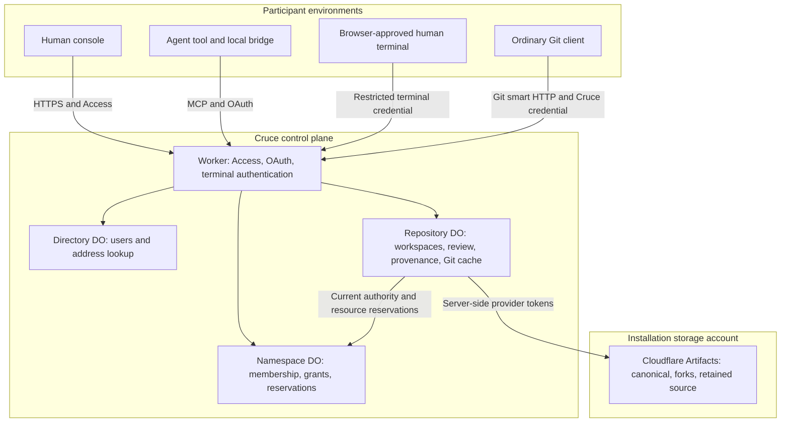
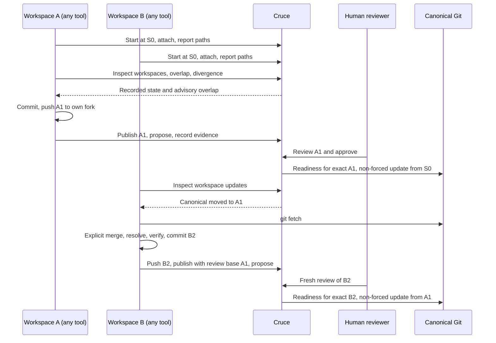
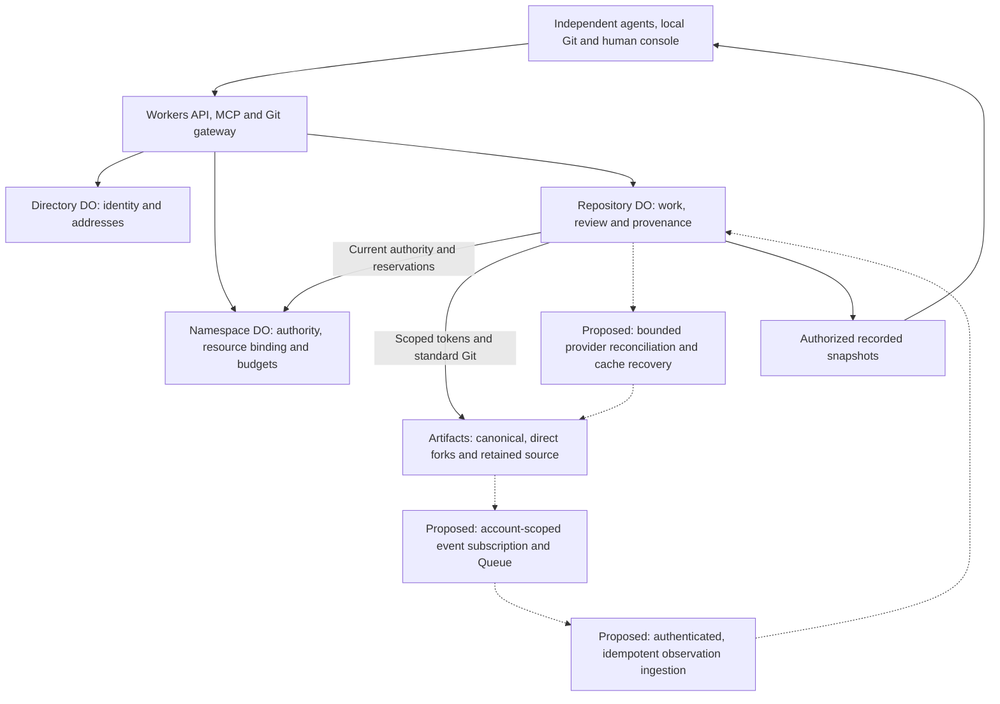

# Architecture

[Documentation map](../README.md#documentation-map) · [Product](product.md) · [Domain model](domain-model.md) · [Principles](principles.md) · [Verification status](local-verification.md)

This describes how the current implementation realizes the [domain model](domain-model.md). It does not establish live verification. Cruce maintains durable workspace state, exact-revision decisions and provenance for Git work produced by independently running humans and agents. Their execution stays outside the control plane. Remaining correctness gaps are listed in the [implementation audit](#implementation-audit); future work is in the [roadmap](../ROADMAP.md).

## Domain mapping

The [domain model](domain-model.md) owns the concepts. This table maps them to contracts in [src/shared/platform.ts](../src/shared/platform.ts).

| Concept | Contract | Notes |
| --- | --- | --- |
| Namespace | `Namespace`, `NamespaceState` | Membership, teams, invitations, repositories, resource policy, reservations |
| Repository / canonical | `Repository`, `RepositoryState.canonical`, `sourceHead` | `sourceHead` is the canonical revision Cruce recorded through provisioning or promotion |
| Actor | `Actor` | Humans: user ID. Agents: `agent-<connectionId>`; `name` is a client label |
| Workspace | `Workspace` | `ownerId` (user), `createdBy` (actor provenance), `title`, `description`, `baseRevision`, `fork`, `state` |
| Execution attachment | `Workspace.execution` (`ExecutionAttachment`) | Local `ExecutionContext` plus `attachedBy`, `attachedAt`; at most one |
| Reported state | `headRevision`, `changes`, `commits`, `lastActivity` | From the attached execution only |
| Published revision / evidence | `Artifact` (`kind: "source"` / `"evidence"`), `Verification` | Product language: published revision, evidence |
| Proposal (change) | `Proposal`, `Review` | Product language: change. MCP: `*_proposal` |
| Promotion | `Promotion` | Journalled prepared → attempted → confirmed |
| Provenance | `ActivityEvent`, `get_lineage` | Actor recorded on every event |

Canonical does not mean a local clone, the Git object cache, a workspace fork, retained source storage or an external remote. Publication retains source without advancing canonical; promotion advances canonical.

### Console

The console has four repository tabs: **Changes**, **Workspaces**, **History** and **Settings**, under a header and an attention bar that names what needs a person. A change opens as a review checklist rendered from the controller's structured readiness (`Readiness.checks`: current base, required evidence, concerns, approval), so the console never parses reason strings or decides authority itself. **History** holds canonical promotions, published revisions, stored evidence and activity; records open with provenance, lineage and an exact-revision source browser. Source records remain `Artifact` with `kind: "source"` in contracts. Retired `overview`, `code`, `work` and `artifacts` links resolve to the new tabs with history replacement. Namespace summaries carry attention counts (`RepositorySummary.attention`) for Home and namespace lists. The [design guide](design.md) owns status language and screen behaviour.

The header reflects the active scope. Home is global. Scoped namespace/repository names open anchored dropdowns. A namespace opens as one overview: repositories by attention and recent activity, with People and Teams (shared namespaces only) and today's operations beside them; settings are a separate page. The avatar menu shows identity and sign-out. Repository search is an inline header field across authorized namespaces, and Command/Ctrl K focuses it. Listing is read-only, tolerates partial failures, retries, and aborts dismissed requests so late responses cannot replace newer results.

### Workspace durability

```text
Agent session ends / process exits ≠ workspace loss or loss of ownership
Heartbeat expiry                   ≠ detachment, loss of checkout ownership or cleanup
Detach                             ≠ loss of fork, revisions or provenance
Worktree removal                   ≠ erasure of pushed or published work
Workspace completion               ≠ source acceptance or cleanup
```

## Components and trust boundaries



The installation configures the control plane and an Artifacts Workers binding in its Cloudflare account once. Application namespaces inherit that binding and own permissions, budgets and a durable account/physical-namespace identity recorded on first resource reservation. The binding host prefixes physical repository names with stable application namespace IDs. Reads inspect recorded state and configuration without provider calls or writes. Existing connected-account state blocks resource access until an explicit administrator transition; no source is moved or rebound ([ADR 0003](decisions/0003-deployment-managed-storage.md)).

All authenticated entry points use the stable Directory object named `namespace-directory`. The retired development model's `directory` object is left untouched, with no compatibility reader or migration. Future deployments must preserve the current object name and its stable IDs.

| Implementation boundary | Responsibility |
| --- | --- |
| [src/core/ownership.ts](../src/core/ownership.ts) | Pure Directory/Namespace decisions: identity, membership, grants and reservations |
| [src/core/platform.ts](../src/core/platform.ts), [capabilities.ts](../src/core/capabilities.ts) | Pure repository decisions: workspace ownership and attachment, presence, overlap, divergence, review readiness |
| [src/worker](../src/worker) | Authentication, Durable Object persistence, Git/provider I/O |
| [src/worker/git](../src/worker/git) | Git object cache in SQLite and exact source inspection/transport; not a competing canonical remote |
| [src/shared/tools.ts](../src/shared/tools.ts), [src/shared/platform.ts](../src/shared/platform.ts) | Single MCP catalog and shared contracts |
| [runner](../runner) | OAuth, local Git observation, checkout locks, worktree isolation and continuation, Git credential helper |
| [src/ui](../src/ui) | Console rendering of controller-derived decisions |
| [test/browser](../test/browser) | Separate fixed-clock console fixture with simulated identity and provider behavior |

Core controllers receive state, time and IDs; adapters persist results and perform external work. The Directory DO serializes identity and address decisions. The Namespace DO serializes shared budgets across repositories. Each Repository DO ("Control Tower" in code) owns its workspaces, changes and artifacts.

## Identity and authorization

Access verifies issuer, subject, audience, signature and expiry. First login idempotently creates a user, a human actor identity and a personal namespace. Authentication is separate from namespace membership. Shared invitations are expiring links bound to a verified email.

The public document and static assets render a logged-out homepage or the authenticated console. `GET /auth/session` returns only a no-store authentication boolean after unsealing the Cruce cookie and revalidating its Access JWT and bound identity. It provisions nothing. Login reuses Access to issue the sealed cookie. Logout expires it and redirects to the fixed same-origin `/cdn-cgi/access/logout`, a full Access sign-out across the team's applications. Invalid sessions are signed out; certificate-service outages remain retryable. Before explicit sign-in, same-origin repository or invitation destinations are kept in tab-local storage and restored afterwards. Hosted exposure requires the reviewed [public-homepage Access configuration](../tools/access-public-homepage.json).

Personal namespaces have one owner. In shared namespaces, Owner and Maintainer have repository Maintain authority. Developer and Viewer access comes from direct or team grants, capped at Write and Read. Agent authority intersects the user's current membership, repository grants, OAuth-approved repositories and capability scopes, and is re-evaluated on every request and retry before saved results are returned. Browser-approved human terminal credentials are bound to one workspace and cannot exercise console promotion authority. The [domain model](domain-model.md#authority-model) lists who may perform each operation.

Workspace authority belongs to the **owner** (`Workspace.ownerId`), not to the connection that created the workspace. `RepositoryController.owned` checks the owner and the lifecycle; scopes are checked separately by `authorizeMachine`. This lets a workspace started by one tool be continued by another tool, a new connection or the owner's console session ([ADR 0002](decisions/0002-workspace-ownership-and-execution-attachment.md)).

## Git and workspace lifecycle

`start_workspace` registers a workspace at an exact baseline (`preparing`). `attach_workspace` records the execution attachment. For the first attachment it checks known source and provisions a direct canonical fork through the namespace gate. Artifacts forks inherit refs at fork time and have no exact-commit selector, so Cruce pins the baseline in metadata and a `cruce-base` fork ref, and the local bridge creates the checkout at that exact commit. There is no extra baseline repository. See the [Artifacts fork API](https://developers.cloudflare.com/artifacts/api/rest-api/).

Agent writers must attach a Cruce-owned worktree or isolated clone; humans may attach existing checkouts. A server reservation prevents another active workspace from claiming the same checkout, and the bridge holds a persistent local writer lock. `heartbeat` and `report_change` must name the attached execution context. The MCP bridge or `cruce watch` reports every 30 seconds. After 90 seconds without activity the workspace is *displayed* as disconnected while its attachment and reservation remain.

```text
preparing ──attach──▶ active ──detach──▶ detached ──attach elsewhere──▶ active
     │                  │                   │
     └──────────── end ─┴──────── end ──────┴──▶ completed | cancelled
```

`detach_workspace` explicitly releases the attachment and reservation and keeps the fork, baseline, revisions and provenance. Attaching a different execution while one is attached is rejected. To continue elsewhere, `cruce resume --workspace ID` creates a Cruce-owned worktree at the baseline, configures the fork remote and fast-forwards to the workspace branch's pushed head. Unpushed work stays on the machine that has it. Ending participation releases the lock and attachment without merging, deleting source or cleaning up. A failed first attachment stays `preparing` and can be retried.

The Git gateway serves ordinary smart HTTP at `/mcp/git/<namespace-id>/<repository-id>/<canonical-or-workspace-id>.git` (`info/refs`, `git-upload-pack`, `git-receive-pack`). Canonical is read-only through this path. Fork writes require the workspace owner, an unended workspace, a ready fork, and for agents the `workspace:write` and `revision:publish` scopes. See [setup](native-setup.md) for credentials and transfer limits.

Cloudflare credentials stay server-side. Creation and fork tokens are revoked after use, and Git operations use 60-second scoped tokens revoked after use. The gateway validates destinations, rejects redirects and does not forward client cookies or authorization to Artifacts. Push retries replay the Git protocol against current refs; a cached success never substitutes for a remote ref check.

## Concurrency and reconciliation

This sequence shows the implemented protocol and each participant's responsibilities. Cruce does not deliver notifications to agents or control their execution.



Revision references are kept distinct:

- `Workspace.baseRevision` is the immutable baseline (S0).
- `Workspace.integratedRevision` is the review base of the latest publication. A fetch alone never advances it.
- `Artifact.baseRevision` pins that publication's review base (A1 for B2). Later publications cannot change it.

A new publication must descend from the baseline and from the previous publication. Merge upstream explicitly; rebasing away published history fails the ancestry check.

`inspect_overlap` compares paths reported by present writers, including both rename endpoints, deletions and binary files. `get_workspace_updates` compares accepted canonical source with the workspace's publication baseline using available cached objects; missing objects produce an *unavailable* comparison, never a provider fetch during a read. Overlap freshness currently uses workspace activity, which a heartbeat refreshes without new reports ([roadmap C3](../ROADMAP.md#coordination-intelligence)). Disconnected writers are excluded from active overlap. Neither a heartbeat nor an empty overlap result proves complete knowledge of concurrent work.

Workspace `title` and `description` are free text. Cruce records no structured intent, dependency or acknowledgement protocol and will not add one ([ADR 0001](decisions/0001-product-boundary-reset.md)). A pushed revision is observed only when publication reads the fork; event-based observation is [roadmap C1](../ROADMAP.md#coordination-intelligence).

## Publication, review and retention

Publication fetches the named pushed fork ref and verifies it equals the requested commit. It checks ancestry and protected-path policy, pins the review base, and retains the exact source under a unique ref in a separate per-repository Artifacts repository. Workspace forks remain mutable. Retained refs and Cruce records are not exposed as agent-writable remotes. Immutability is an application and storage-access invariant, not a property of Git refs.

Every artifact identifies namespace, repository, workspace, producing actor, source revision, SHA-256 content hash, storage and trust. Evidence content is stored separately from source. **Publication proves which source was retained, not that it is correct.**

| Knowledge or state | What it establishes |
| --- | --- |
| Reported (`reported`) | A participant supplied a claim; a reported test pass or local head is not independently verified |
| Human-attested (`human_attested`) | An authorized human attests an outcome; Cruce did not run the check |
| Retained | Exact source remains stored and reachable; this implies neither approval nor correctness |
| Published | A publication identifies retained source for review |
| Approved | An authenticated human approved the exact revision; readiness and explicit promotion are still required |
| Accepted / canonical | Source in canonical history through provisioning or a completed promotion |

Changes bind an artifact, base and head. Controller readiness requires a current base, human approval of the exact revision, reasoned resolution of concerns, and policy-required trusted passing evidence without unresolved failures. Promotion persists its exact inputs, operation identity and namespace reservation before Git I/O. It checks full source availability and canonical provider identity, and rechecks current human authority. The installed `isomorphic-git` pre-push hook compares the advertised old revision and the candidate with the approved pair, and the non-forced receive-pack update compares the same old OID under the remote ref lock. A moved base fails closed and requires reconciliation and a new proposal with fresh review. The review base is never rewritten.

The promotion journal moves through prepared, attempted and confirmed phases. An attempted operation is never pushed again. A retry under the original identity independently reads remote refs, and only the exact candidate reconciles its effect. A definitive Git rejection fails the operation. Lost responses remain uncertain until reconciled and block other promotions. Completed provenance, proposal state, accepted source and the receipt are saved atomically in the Repository DO before namespace settlement. A retry repairs interrupted settlement without provider I/O. This is explicit reconciliation, not a cross-system transaction. Agents can publish, review, disagree, supply evidence and request promotion, but cannot supply human authority.

Repository creation registers the repository, then provisions canonical storage through the namespace gate. The Repository DO records the provisioning command before any provider call. If provisioning fails, the repository remains registered without canonical storage, and its reservation stays charged as uncertain. The snapshot's controller-derived `canonicalSetup` tells the console to explain this, and offers authenticated human maintainers `retry_repository_setup`. That replays the recorded command with its original operation identity, so it reuses the reservation and the provider's idempotent `ensure` instead of creating a second repository or charge. Repositories registered before this intent was recorded fall back to the stable key `provision-<repository-id>`. Once canonical exists, the retry is refused.

Hosted fork cleanup requires an ended workspace. The runtime checks every fork ref against retained canonical and artifact history; unretained commits, annotated tags and non-commit refs block deletion. Deletion intent is persisted, and asynchronous provider absence is reconciled on retry. Workspace records, artifacts and lineage survive. Local cleanup separately requires Cruce ownership, clean files and a published or retained-baseline head.

## Resources and the canonical Git boundary

Namespace reservations serialize operation budgets across repositories. Mutation IDs and exact input fingerprints prevent accidental identity reuse. Unknown provider outcomes keep their reservation until reconciled. Coordination reads do not provision or fetch provider source, but initialization wrappers still write metadata ([roadmap F3](../ROADMAP.md#foundation)). Explicit Git reads contact the provider and have provider costs; the reservation model is a policy limit, not a meter of every request.

Cruce's responsibility ends at reviewed reconciliation into canonical Git. No deployment environments, preview or rollback refs, build observers or runtime checks belong to repository state. Downstream provenance for CI/release systems is [roadmap E4](../ROADMAP.md#ecosystem). See [Cloudflare setup](cloudflare-setup.md) for provider configuration and limits.

## Implementation audit

Audit date: **2026-10-06**, against committed baseline `e57ee33498f06c29937522214d18f449bb7bde24`, updated for the exact-base promotion correction (F1) and the [product boundary reset](decisions/0001-product-boundary-reset.md), which changed workspace ownership and attachment and removed observer workspaces, `report_ref` and `get_context`. The reset's product-level keep/change/remove/defer analysis lives in [ADR 0001](decisions/0001-product-boundary-reset.md#keep--change--remove--defer-phase-6). This section tracks implementation evidence and correctness gaps. [Verification](local-verification.md#architecture-audit-validation) records checks; earlier local, provider and deployed results keep their original scope.

**IMPLEMENTED** means a traced code path exists, not that production behavior or product value is proved. **PARTIAL** means a useful mechanism exists but the named capability has a concrete gap. **NOT IMPLEMENTED** means the inspected contracts/routes/configuration contain no implementation. **CONTRADICTS TARGET** identifies a specific broken invariant. **UNCLEAR / NEEDS INVESTIGATION** identifies a guarantee that code, tests or provider documentation do not establish. Priorities refer to [roadmap item IDs](../ROADMAP.md), not deadlines. “Keep” means preserve an existing capability rather than invent a roadmap task.

### Capability gap table

| Capability | State | Evidence | Gap | Cloudflare leverage | Priority |
| --- | --- | --- | --- | --- | --- |
| Canonical creation | IMPLEMENTED | [Runtime][runtime] `provision_repository`; [router][router] repository POST; [provider][provider] `ensure` | New README baseline, not import; deployed provisioning evidence is narrower than full convergence | Artifacts create and normal Git | Keep; D2 validation |
| Namespace/repository identity mapping | PARTIAL | [Ownership][ownership] IDs; [router][router] stable storage names; [types][types] `canonical`/`fork.id` | Account binding and provider checks incomplete; findings below | Artifacts IDs + Namespace DO | F2 |
| Direct reusable writer forks | IMPLEMENTED | [Runtime][runtime] `attach_workspace` calls `host.fork(canonical, ...)`; [runtime tests][runtime-tests] direct/distinct fork cases | Recovery of an existing named fork trusts description rather than verified parent identity | Artifacts fork | Keep; F2 hardening |
| Exact immutable starting revision | IMPLEMENTED | [Controller][controller] `start_workspace`; [runtime][runtime] baseline ref; [execution][execution] `createExecution`; [core tests][core-tests] | Fork API selects refs, not a historical commit; Cruce pins base separately | Git commit IDs and fork base ref | Keep |
| Latest pushed revision | PARTIAL | [Runtime][runtime] `gitRequest`/`publish_revision`; [types][types] `headRevision` | Pushes do not update an observed fork head; reports are claims and publication reads the fork later. The unverified `report_ref` store was removed | Artifacts push events and ref inspection | C1 |
| Standard Git protocol | IMPLEMENTED | [Router][router] Git route; [provider][provider] `gitRequest`; [runtime tests][runtime-tests] native clone/push/fetch | Gateway buffers transfers and serializes them with commands; 32 MiB bound | Artifacts smart HTTP | Keep; F6 |
| Scoped read/write Git tokens | IMPLEMENTED | [Provider][provider] `withToken`, `gitRequest`; [provider tests][provider-tests] | Agent writes confined to owned active fork; installation binding authority remains server-side | Repo-scoped tokens | Keep |
| Token TTL/revocation | IMPLEMENTED | [Provider][provider] `ttl: 60`, `finally` revoke, creation-token reconciliation; [provider tests][provider-tests] | Revocation failure makes outcome uncertain; later single-writer verification separately exercised provider-token and OAuth-grant revocation, not in-flight cancellation | Artifacts token lifecycle | Keep; D2 validation |
| Workers binding | IMPLEMENTED, locally tested | [Config][config]; [provider][provider] `ArtifactsBindingHost` | Hosted binding publication/promotion remains unverified; REST is retained only for the explicit provider-test harness | Deployment binding | Keep; hosted validation |
| File/object/history inspection | PARTIAL | [Runtime][runtime] `get_source`, `get_history`, `get_diff`; [GitWorkspace][git] | Persistent local object inspection; no native provider file/history API use | REST/binding exact-source reads | F4 |
| Event subscriptions and ingestion | NOT IMPLEMENTED | [Config][config] empty triggers; [Worker][worker] fetch handler; [catalog][catalog] | No queue consumer, observed push lifecycle or subscription provisioning | Artifacts events + Queues | C1 |
| Event ordering, deduplication, recovery | NOT IMPLEMENTED | Same configuration and handlers | No inbox/checkpoint/backfill/DLQ path; provider event-ID guarantees unresolved | Queues + DO observation state | C1 |
| Import | NOT IMPLEMENTED | [Provider][provider] interface; [router][router] create route; [catalog][catalog] | No existing public/private repository onboarding | Artifacts public HTTPS import; private transport needs validation | E1 |
| Provider limits and errors | PARTIAL | [Provider][provider] `cloudflare`, `boundedBody`; [GitWorkspace][git] `exportPack`; [runner Git][local-git] | No general retry/backoff strategy; raw provider error messages can cross MCP; full reachable-pack hashing adds cost | Native errors/limits, Logs | F4/F5/F6 |
| Workers API/auth/MCP boundary | IMPLEMENTED | [Worker][worker], [router][router], [auth][auth], [MCP][mcp], [catalog][catalog]; [route tests][route-tests] | Single authorized test-writer flow is recorded in verification; second writer, membership/in-flight revocation and real coding tools remain pending | Access, OAuth, Workers | D2 validation |
| Directory and Namespace authority | IMPLEMENTED | [Directory][directory], [Namespace][namespace], [ownership][ownership]; [core tests][core-tests] | Cross-object copies of display metadata need refresh discipline; no second membership authority | SQLite DOs | Keep |
| Repository coordination serialization | IMPLEMENTED | [ControlTower][tower] keyed by repo ID; [runtime][runtime] `Serial.run`; [store][store] | One in-memory queue per instance, including Git I/O; not a transaction with remote Git; durable pending promotion intent prevents a second update during recovery | Repository DO | Keep; F6 |
| Metadata ownership | IMPLEMENTED | [Types][types], [store][store], [namespace][namespace], [runtime][runtime] | Growing whole-state JSON collections/receipts; no query projections | DO SQLite | Keep; F6 |
| D1 | NOT IMPLEMENTED | [Config][config], storage adapters | No demonstrated query need justifies adding another authority | D1 only as future rebuildable index | Do not add now |
| WebSockets and alarms | NOT IMPLEMENTED | [ControlTower][tower], [Worker][worker], [config][config] | UI polls; deletion retries require caller; presence is derived, not alarm-driven | Hibernating sockets / DO alarms | F3/F6 |
| Workflows | NOT IMPLEMENTED | [Config][config], [runtime][runtime] synchronous operation branches | Some phases persist retry markers; no autonomous multi-step runner | Infrastructure choice if a concrete operation needs it | Not a product item |
| Queues/retry/DLQ | NOT IMPLEMENTED | [Config][config], [Worker][worker] | Needed if using documented Artifacts event delivery; not a promotion authority | Queues | C1 |
| Operational logs/traces | PARTIAL | [Config][config] `observability.enabled`; [Worker][worker] `failure`; [MCP][mcp] catch | No explicit domain correlation/spans or consistent public-error redaction; enabled config is not evidence of effective production tracing | Workers Logs/Traces | F5 |
| Product analytics | NOT IMPLEMENTED | [Config][config], domain activity records | Activity history is not an outcome-measurement pipeline | — | Not planned |
| Workspace versus execution context | IMPLEMENTED | [Types][types] `ownerId`, `ExecutionAttachment`; [controller][controller] `owned`, `attach_workspace`, `detach_workspace`; [execution][execution] `continueExecution`; [core tests][core-tests], [runner tests][runner-tests] | Owner-held workspace survives sessions; one replaceable attachment; reports bound to it. Fork pushes are not tied to the current attachment; hand-off between users is not supported | DO state + local Git | Keep; M2 |
| Writer locks, reservations, lifecycle | IMPLEMENTED | [Execution][execution] persistent lock; [controller][controller] checkout reservation, TTL, detach, end; [runner tests][runner-tests] | Trusted cooperative clients report execution metadata; the server cannot inspect local filesystems | Repository state; local exclusive files | Keep |
| Activity/path overlap | PARTIAL | [Controller][controller] `live`, `overlaps`; [execution][execution] `observeChanges`; [core tests][core-tests] | Renames and binary paths supported; disconnected writers excluded; report freshness shares the heartbeat clock | Existing DO | C3 |
| Intent, dependency and acknowledgement protocol | REMOVED FROM SCOPE | [ADR 0001](decisions/0001-product-boundary-reset.md) | Messaging and acknowledgement belong to agent frameworks; Cruce exposes recorded state | — | Not planned |
| Symbols/modules/dependency surfaces | NOT IMPLEMENTED | Babel structural index and `get_context` removed by [ADR 0001](decisions/0001-product-boundary-reset.md) | Path overlap only; relationship hints wait for measured misses | Bounded source inspection | C4 (later) |
| Canonical movement/stale base | PARTIAL | [Controller][controller] `workspaceUpdates`/`readiness`; [runtime][runtime] `get_workspace_updates`; [runtime tests][runtime-tests] | Works for recorded accepted source; arbitrary remote movement not reconciled; missing objects stay unavailable | Artifacts observations + DO | C1 |
| Candidate and ancestry validation | IMPLEMENTED | [Runtime][runtime] publication merge-base checks; [GitWorkspace][git]; [convergence test][convergence-test] | Preserves starting/previous published ancestry; no structured multi-workspace reconciliation-input record beyond Git ancestry/provenance | Standard Git | Keep; R2 |
| Exact review/approval/evidence | IMPLEMENTED | [Controller][controller] `review_proposal`, `readiness`, `record_verification`; [core tests][core-tests] | Approval is a stored historical human decision; revoked approval-author policy is not separately defined; current promoter must be authorized | Existing DO | Keep; document policy before change |
| Non-forced promotion / exact candidate | IMPLEMENTED | [Runtime][runtime] `promote`; [GitWorkspace][git] `onPrePush`; [runtime tests][runtime-tests] native ref races/restart | Exact advertised old/new plus remote ref comparison; hosted validation pending | Git receive-pack | Keep; D2 validation |
| Expected-base race exclusion | IMPLEMENTED | Installed `onPrePush` validates exact old/new; native Git race tests at advertisement and update | Locally verified; new hosted/provider fault checks pending | Expected-old validation + Git atomic ref update | F1 done; D2 validation |
| Publication and promotion recovery | PARTIAL | [Runtime][runtime] promotion journal and receipts; [runtime tests][runtime-tests] response/persistence/settlement failures | Promotion reconciles exact remote outcomes without re-pushing; transient history remains uncertain; publication settlement still precedes receipt save | DO operation state | F1 done; R3; D2 validation |
| Provider identity on every operation | CONTRADICTS TARGET | [Provider][provider] gateway/delete compare IDs; [runtime][runtime] promotion compares canonical ID; publication still only looks up names | Canonical/fork IDs not checked consistently; retained artifact storage omits provider ID | Stable Artifacts ID binding | F2 |
| Installation storage identity | IMPLEMENTED, locally tested | [Namespace][namespace] `reserve`; [provider][provider] `ResourceBoundary.bind` | Pinned account/physical namespace rejects configuration changes and legacy source rebinding; explicit transition remains administrator work | Durable binding identity | Keep; F2 repository-ID hardening |
| Per-request authority | IMPLEMENTED | [Auth][auth], [ownership][ownership] `authority`, [runtime][runtime] receipt checks; [identity tests][identity-tests], [runtime tests][runtime-tests] | Checks are at request/reservation boundaries, not continuous cancellation; mid-flight revocation needs explicit tests/policy | Access/OAuth + Namespace DO | Keep; M1 |
| Secret isolation | PARTIAL | [Sealing][sealing], [provider][provider], [credential helper][credential]; [provider tests][provider-tests] | No intentional provider-token output; raw exception text is not a proven redaction boundary; key rotation unspecified | Worker secret + AES-GCM + scoped tokens | F5 |
| GitHub installation/selection/fetch/publish/PR/webhooks | NOT IMPLEMENTED | [Types][types], [router][router], [catalog][catalog], [config][config] | No provider mapping or private credential flow; Cruce's release workflow is unrelated infrastructure | Artifacts import; GitHub App; optional Workflows | E1 |
| Retention, explicit fork deletion | IMPLEMENTED | [Runtime][runtime] cleanup ref checks/deletion marker; [execution][execution] dirty/ownership checks; [runtime tests][runtime-tests] | Retained repos and provenance survive; no general repository deletion API; out-of-band provider writers can race a ref scan | Artifacts retained refs | Keep; F6 |
| Cache loss/restart recovery | PARTIAL | [SqlFs][sqlfs] persistent cache; [runtime][runtime] `known`/reads | Normal DO persistence exists; no integrated cold-cache rehydration/eviction/recovery test | Artifacts remains recoverable source authority | F4 |
| Read-only coordination contract | CONTRADICTS TARGET | [Router][router] calls Directory login; [tower][tower] `open` calls [runtime][runtime] `initialize` | Reads avoid provider source fetch but still persist directory/repository metadata | Separate initialization from established reads | F3 |
| UI and client interoperability | PARTIAL | [UI][ui], [change UI][change-ui], [client setup][client-setup], [browser tests][browser-tests] | Server readiness and exact evidence rendered; configuration writers do not prove real client context consumption | Existing Worker/DO snapshot | D2/E5 |
| Event delivery feasibility | UNCLEAR / NEEDS INVESTIGATION | [Config][config] operator account; [Namespace][namespace] pinned storage identity; provider docs below | No documented Cruce-tested path for installation event subscriptions | REST, queue pull/relay or supported binding | C1 feasibility |

### State authority and the Git cache

| State | Authority | Derived/cached representations |
| --- | --- | --- |
| Commits, trees, blobs and remote refs | Artifacts repositories | Repository DO `gitfs`; local worktrees/clones |
| User/namespace IDs and mutable address directory | Directory DO | Namespace metadata and authorized UI projections |
| Membership, repository registration/grants, resource binding and reservations | Namespace DO | Repository descriptor refreshed for commands; pinned storage identity passed internally |
| Workspace identity/base, reports, artifacts, proposals, reviews, evidence records, promotions | Repository DO | UI snapshots and lineage views |
| Accepted revision recorded by Cruce | Repository DO `sourceHead`, justified by initial provisioning/completed promotion | Not proof of the current remote ref after out-of-band writes; observed canonical state is a missing separate concern |
| OAuth/pairing state | OAuth provider/KV | Client credentials scoped to Cruce, not Artifacts |
| Source and evidence retention | Artifacts retained repositories plus repository-DO provenance | Cache is not the sole retention copy |

There is no D1/DO dual authority and no external Git canonical implemented. Namespace/repository display metadata is copied, but authorization re-reads Namespace state. The single Directory DO and namespace enumeration may become scaling bottlenecks; that is a measured indexing question, not a reason to duplicate membership into D1 now.

`ControlTower` constructs one `GitWorkspace(new SqlFs(...), "/repository.git")`. Fetches reuse a persisted bare object store; there is no temporary Worker clone for each metadata request and no remote shell/sandbox. The cache supports source/diff/history reads, merge-base checks, retention pushes, evidence commits and full-pack hashing/export. Ordinary source reads do not contact Artifacts.

The cache is derived source data, not a competing canonical remote, but its size, lifetime and recovery are insufficiently bounded. `SqlFs.removeTree` is not a production eviction/recovery policy. Missing objects cannot automatically be repaired by a coordination read. The target is explicit identity-checked rehydration and bounded inspection; bulk source history should not be treated as required durable coordination state. Do not delete the cache before replacing the real ancestry/retention functions it serves. Public pack export uses standard Git objects, but its convenience endpoint still needs a demonstrated consumer before expansion.

### Architecture contradictions and correctness gaps

1. **Expected-base promotion race corrected locally (F1).** The pre-push hook pins the advertised old/new pair and native receive-pack rejects movement before the locked update, including an ancestor or the candidate. The durable operation journal reconciles interruptions without replaying attempted pushes. See [verification](local-verification.md#exact-base-promotion-verification); these tests do not establish new hosted/provider or deployed behavior.
2. **Provider identity enforcement is incomplete.** Gateway, delete and promotion paths compare IDs, but publication fetch still uses `info(name)` without comparing the stored fork ID. Retained storage records contain names/refs/revisions without a provider repository ID. A name recreated by an account administrator must not inherit the old identity. Retry adoption via matching description also cannot prove direct-fork parentage. Account/namespace/ID checks must cover every source and retention operation.
3. **Installation identity is pinned.** The namespace account connection/disconnection routes are removed. First resource use records the deployment account and physical Artifacts namespace. Later mismatch or legacy connected-account state fails closed before provider access. This does not close all repository-ID validation gaps.
4. **Remote success and metadata completion are separate.** Promotion now persists prepared/attempted/confirmed intent and completed provenance/receipt before settlement. Explicit retries reconcile the exact remote candidate or refuse changed/unavailable outcomes; uncertainty stays charged rather than adopting unrelated history. Publication still settles before saving its final receipt. Neither flow can reconstruct transient remote history after external movement or claim a Git/metadata transaction. General autonomous recovery and publication fault coverage remain separate work.
5. **“Coordination reads do not mutate” is too strong as a current implementation claim.** Pure controller inspection and provider-free reads exist, but HTTP/MCP routing calls `Directory.login`, which writes, and `ControlTower.open` initializes/saves repository metadata even for reads. Preserve the normative rule and correct these wrappers; do not hide the discrepancy behind read-only tool annotations.
6. **Presence can overstate observation freshness.** Overlap timestamps use workspace activity, which a heartbeat refreshes without new changes. The bridge usually follows heartbeat with a report, but that report can fail and direct MCP clients need not report. No overlap is not evidence of no in-flight work, especially for disconnected writers.
7. **The control plane has a source-cache dependency without a complete recovery contract.** Persisting Git blobs in DO SQLite is deliberate implementation reuse, but exceeds a metadata-only target and lacks a bounded lifecycle. Native provider reads can replace some work, not merge ancestry, remote-update correctness or the retained-source policy wholesale.

No forced canonical update, mutable starting-base setter, second GitHub canonical, agent launcher, repository CI/CD execution or deployment domain was found in the inspected current surface. The installation binding supplies runtime storage authority; normal Git receives narrow 60-second tokens. The REST test harness uses separately authorized test credentials. Error redaction, mid-flight revocation, token-cleanup failure, remote ref changes during cleanup and cold-cache recovery remain areas needing stronger failure evidence. These limitations do not erase the narrower successful provider checks.

### Artifacts capabilities and account boundaries

Primary docs reviewed on 2026-10-06: [Artifacts index](https://developers.cloudflare.com/artifacts/llms.txt), [cf index](https://developers.cloudflare.com/cf/llms.txt), [REST](https://developers.cloudflare.com/artifacts/api/rest-api/) and [Workers binding](https://developers.cloudflare.com/artifacts/api/workers-binding/). Artifacts supplies lifecycle operations, forks, scoped tokens and direct commit/tree/blob/file/history inspection. Binding `get()` returns a disposable capability; `log()` follows first-parent history. These APIs can simplify exact-source inspection, but cannot be substituted blindly for full merge ancestry.

Cruce now uses the deployment Artifacts binding for production source resources. Its physical namespace is installation configuration; stable application namespace IDs prefix repository names. Namespace policy gates still precede provider calls. The REST host is used only by the separately authorized real-provider verification harness. Configuration remains `cf`/`cloudflare.config.ts`; provider examples using Wrangler do not change that convention.

[Native import documentation](https://developers.cloudflare.com/artifacts/guides/import-repositories/) specifies public HTTPS repositories and warns that import may still be in progress after the response. Private native import is not established by that guide. A future private GitHub path should validate installation-scoped Git transport and record stable external identity, without putting tokens into persistent remotes. [GitHub App installation authentication](https://docs.github.com/en/apps/creating-github-apps/authenticating-with-a-github-app/authenticating-as-a-github-app-installation) documents HTTP Git access using an installation token and Contents permission. No such flow exists in Cruce today.

### Event-driven observation target

[Artifacts events](https://developers.cloudflare.com/artifacts/guides/event-subscriptions/) currently document account lifecycle events `repo.created`, `repo.deleted`, `repo.forked`, `repo.imported`, and repository events `pushed`, `cloned`, `fetched`, `token.created`, `token.revoked`. Push examples include ref/before/after, bounded commit data and truncation indicators; metadata includes account, subscription, schema version and timestamp. The example does not establish a stable unique domain-event ID, total ordering, replay cursor or end-to-end delivery latency. Push payload examples identify repository name/namespace rather than a repository ID, so authenticated subscription registration and provider identity validation matter.

The documented delivery mechanism is [event subscriptions into Queues](https://developers.cloudflare.com/queues/event-subscriptions/), not an assumed direct webhook to Cruce. Queues provides [at-least-once delivery](https://developers.cloudflare.com/queues/reference/delivery-guarantees/) and [does not guarantee order](https://developers.cloudflare.com/queues/reference/how-queues-works/). Queue durability does not prove that every upstream provider event will arrive or that an event contains the complete Git history.

**Proposed ingestion contract:** Subscribe to relevant push/lifecycle signals; ingest through an authenticated boundary mapped to the installation storage account and registered provider repository. Validate schema, record a durable processing identity, and reconcile exact current refs before changing observed state. A subscription ID is not an event ID; a queue message ID alone may not deduplicate provider re-emissions. Deduplicate transport delivery and make domain observation application idempotent independently. Do not infer actor identity from commit authors or activity from clone/fetch as if it were code incorporation.

Keep observed remote state separate from human-accepted provenance. Delayed events cannot regress a newer observation or bless external canonical movement. Handle deleted/rewound refs and unknown versions explicitly. Fetch missing facts when payloads are truncated. A bounded reconciliation/backfill operation repairs gaps and reconnects, with freshness/degraded status visible to clients. A current-ref scan can recover current state, but cannot promise reconstruction of every transient or deleted ref without retained evidence. Reconciliation is explicit resource work; context reads remain on recorded state.

Configure bounded retries and a [dead-letter queue](https://developers.cloudflare.com/queues/configuration/dead-letter-queues/) with inspect/replay ownership before adoption. Queue delivery, subscription permissions, cost attribution, event identity and provider replay guarantees remain feasibility work. Additional event permissions must be explicitly configured by the installation administrator. No event or queue consumer may approve/promote source or start an agent.

Current UI polling reads snapshots every 15 seconds; bridge heartbeats/local reports run every 30 seconds. This is not evidence of a repeated provider Git poll to remove. Events fill missing pushed-state observation, while UI notification is a separate delivery question. Hibernating WebSockets can distribute authorized version changes if latency/fan-out measurements justify them; they do not ensure an agent reads or acts. [Cloudflare WebSocket guidance](https://developers.cloudflare.com/durable-objects/best-practices/websockets/) supports the mechanism, not Cruce client compatibility.

### Cloudflare capability fit

| Responsibility | Current solution | Cloudflare option | Decision | Rationale |
| --- | --- | --- | --- | --- |
| Git storage and retained source | Canonical, source and evidence Artifacts repos | Artifacts | KEEP CURRENT | Exact Git source remains outside authoritative coordination metadata |
| Writer isolation | Direct workspace fork plus local worktree | Artifacts forks | KEEP CURRENT | Hosted durability and local writer isolation solve different problems |
| Git credentials | Installation binding; scoped short-lived repo tokens | Artifacts tokens + Worker secret | KEEP CURRENT | Correct authority shape; fix identity/rebinding gaps, not token exposure to agents |
| Lightweight source inspection | SQLite-backed Git cache | Artifacts REST/binding | REMOVE DUPLICATION selectively | Replace equivalent inspection, preserve ancestry/transport and read/resource boundaries |
| Git activity observation | Reports and publication checkpoints | Artifacts subscriptions + Queues | USE as proposed target | Native pushes should become observations; account routing/recovery must first be validated |
| Repository coordination | Serialized repository DO | SQLite Durable Objects | KEEP CURRENT | Already the appropriate consistency boundary; no new coordination service needed |
| Identity, memberships and budgets | Directory/Namespace DOs | DO SQLite | KEEP CURRENT | Stable authority and atomic reservations; fix account-binding lifecycle |
| Real-time UI | 15-second snapshot polls | DO hibernating WebSockets | EXPLORE within F3 | Select on measured latency/fan-out, keep snapshot recovery and auth |
| Async secondary analysis | Request-path inspection | Queues | EXPLORE | Event delivery justifies one queue; extra fan-out only for measured heavy work |
| Durable operation recovery | Receipts, selected phase markers, caller retries | DO journal/alarm or Workflows | EXPLORE | Complete operation semantics first; Workflows retries do not make external effects exactly once |
| Global queries | Directory enumeration and Namespace snapshots | D1 projections | DO NOT USE now | No measured query requirement; never duplicate mutable authorization authority |
| Operational diagnosis | Workers observability enabled | Workers Logs/Traces | USE more deliberately | Add redacted correlation and operation phases before custom infrastructure |
| Business analytics | Activity records and pilot evidence | Analytics Engine | DO NOT USE now | Validate useful measures first; never part of review/promotion correctness |
| Secret management | `CRUCE_SECRET`, AES-GCM sealing | Worker secrets; separate secret service if needed | KEEP CURRENT | No demonstrated need for another store; rotation/recovery must be designed |
| External-provider integration | None | Artifacts import; Workflows for long imports | EXPLORE through E1 | GitHub-first only when adoption evidence justifies it; one canonical authority |
| Scheduled cleanup | Explicit end, proof and retry | DO alarm for authorized pending operation | EXPLORE | Recover deletion/reconciliation, never infer deletion authority from inactivity |
| Builds, deployment and agent execution | External to coordinated repository | Builds, Previews, Sandboxes, runtime orchestration | DO NOT USE in core | These would expand product scope; Cruce's own release workflow is infrastructure |

[Workflows guidance](https://developers.cloudflare.com/workflows/build/rules-of-workflows/) requires idempotent side effects even across durable steps. Long-running imports and selected interrupted-operation recovery are concrete candidates; routine reads, heartbeats and simple coordination commands are not. [Workers Logs](https://developers.cloudflare.com/workers/observability/logs/) and [Traces](https://developers.cloudflare.com/workers/observability/traces/) should carry allowlisted namespace/repository/workspace, proposal/promotion, operation/reservation and revision identifiers, outcome and latency. Source, credentials and OAuth payloads stay excluded. Provider/queue correlation is proposed, not already instrumented. No D1, Workflow, Queue or Analytics Engine binding exists today.

### Recommended target architecture

Solid edges describe existing boundaries; dashed edges are proposed observation/recovery work. Optional GitHub, Workflows, WebSockets, D1 projections and analytics are deliberately absent from the minimum diagram until their product/feasibility gates pass.



**Recommendation: CONTINUE WITH ARCHITECTURAL CORRECTIONS.** Keep Workers, the existing DO ownership split, OAuth KV and Artifacts; validate the corrected promotion path live, close identity/account-binding gaps (F2), prove deployed multi-tool, multi-session participation (D2), then add observed pushes (C1). Artifacts is already a foundational advantage for programmable isolation, credential scoping and source retention, not merely interchangeable Git storage. It remains incomplete for coordination until pushes and canonical movement are observed rather than reported, and value is shown at the scale the product targets.

[controller]: ../src/core/platform.ts
[ownership]: ../src/core/ownership.ts
[types]: ../src/shared/platform.ts
[catalog]: ../src/shared/tools.ts
[runtime]: ../src/worker/repository-runtime.ts
[provider]: ../src/worker/artifacts.ts
[router]: ../src/worker/platform-router.ts
[worker]: ../src/worker/index.ts
[auth]: ../src/worker/auth.ts
[mcp]: ../src/worker/mcp.ts
[directory]: ../src/worker/directory.ts
[namespace]: ../src/worker/namespace-runtime.ts
[tower]: ../src/worker/control-tower.ts
[store]: ../src/worker/store.ts
[sealing]: ../src/worker/sealing.ts
[git]: ../src/worker/git/workspace.ts
[sqlfs]: ../src/worker/git/sql-fs.ts
[execution]: ../runner/execution.ts
[local-git]: ../runner/local-git.ts
[credential]: ../runner/git-credential.ts
[client-setup]: ../runner/client-config.ts
[ui]: ../src/ui/App.tsx
[change-ui]: ../src/ui/change.tsx
[config]: ../cloudflare.config.ts
[core-tests]: ../test/core/foundation.test.ts
[runtime-tests]: ../test/worker/repository-runtime.test.ts
[provider-tests]: ../test/worker/artifacts.test.ts
[identity-tests]: ../test/worker/identity.test.ts
[route-tests]: ../test/worker/routes.test.ts
[runner-tests]: ../test/runner/execution.test.ts
[convergence-test]: ../test/worker/convergence.test.ts
[browser-tests]: ../test/browser/console.browser.mjs
