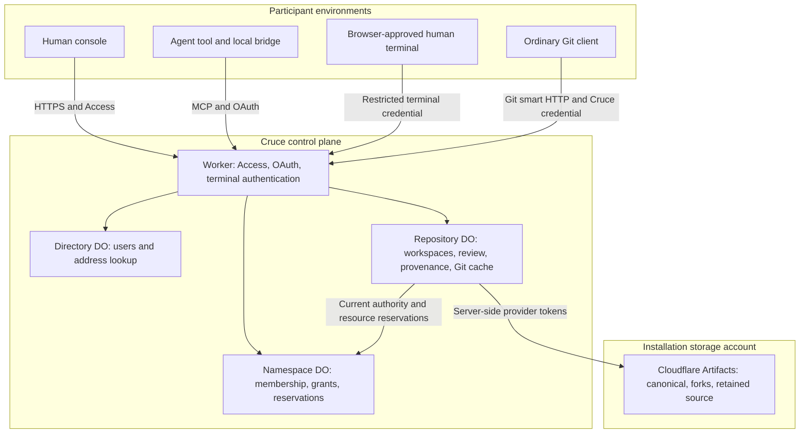
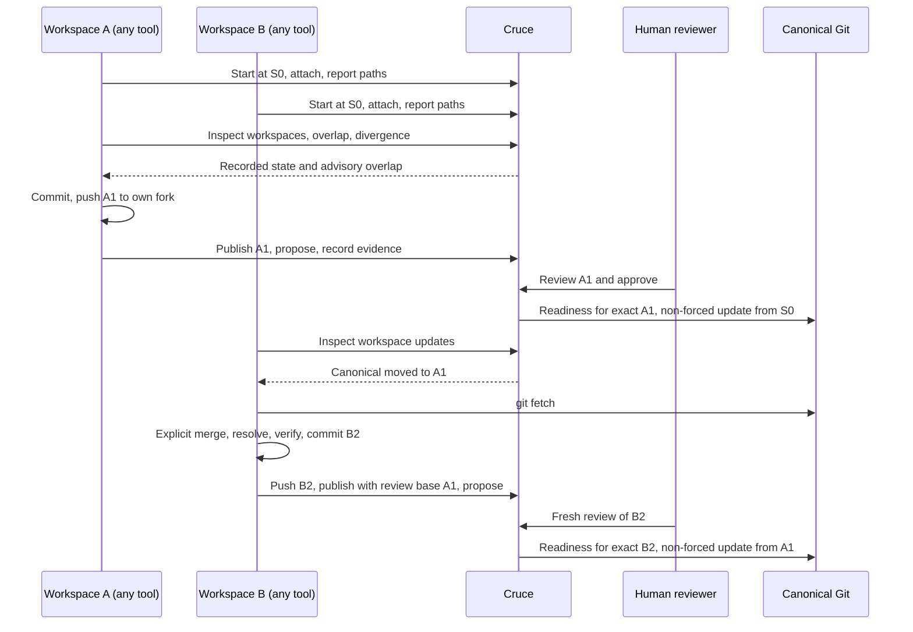
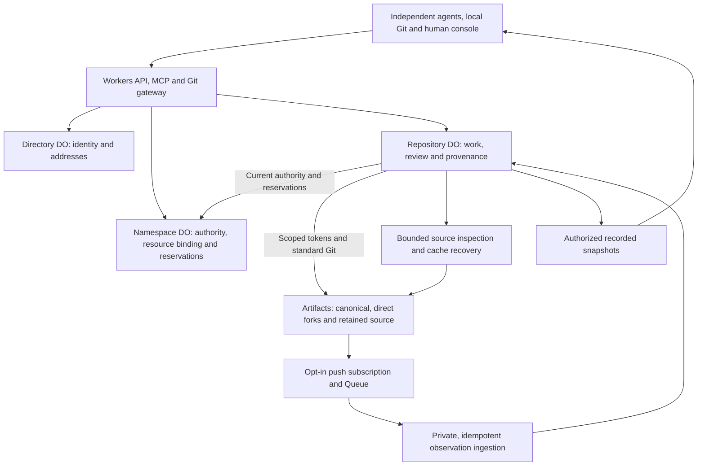

# Architecture

[Documentation map](../README.md#documentation-map) · [Product](product.md) · [Domain model](domain-model.md) · [Principles](principles.md) · [Verification status](local-verification.md)

This describes how the current implementation realizes the [domain model](domain-model.md). It does not establish live verification. Cruce maintains durable workspace state, exact-revision decisions and provenance for Git work produced by independently running humans and agents. Their execution stays outside the control plane. Remaining correctness gaps are listed in the [implementation audit](#implementation-audit); future work is in the [roadmap](../ROADMAP.md).

## Domain mapping

The [domain model](domain-model.md) owns the concepts. This table maps them to contracts in [src/shared/platform.ts](../src/shared/platform.ts).

| Concept | Contract | Notes |
| --- | --- | --- |
| Namespace | `Namespace`, `NamespaceState` | Membership, teams, invitations, repositories, resource policy, reservations |
| Repository / canonical | `Repository`, `RepositoryState.canonical`, `sourceHead` | `sourceHead` is the canonical revision Cruce recorded through provisioning or promotion |
| Actor | `Actor` | Humans: user ID. Agents: `agent-<connectionId>`; `name` is a client label |
| Workspace | `Workspace` | `ownerId` (user), `createdBy` (actor provenance), `title`, `description`, `baseRevision`, `fork`, `state` |
| Execution attachment | `Workspace.execution` (`ExecutionAttachment`) | Local `ExecutionContext` plus `attachedBy`, `attachedAt`; at most one |
| Reported state | `headRevision`, `changes`, `commits`, `lastReportAt` | From the attached execution only |
| Published revision / evidence | `Artifact` (`kind: "source"` / `"evidence"`), `Verification` | Product language: published revision, evidence |
| Proposal (change) | `Proposal`, `Review` | Product language: change. MCP: `*_proposal` |
| Promotion | `Promotion` | Journalled prepared → attempted → confirmed |
| Provenance | `ActivityEvent`, `get_lineage` | Actor recorded on every event |

Canonical does not mean a local clone, the Git object cache, a workspace fork, retained source storage or an external remote. Publication retains source without advancing canonical; promotion advances canonical.

### Console

The console has three repository tabs: **Workspaces**, **History** and **Settings**, under a header and an attention bar that names what needs a person. Workspaces lists each workspace once with its open changes nested under it; `changes/<id>` routes open a change's review, and retired `changes` list links open Workspaces with the same filter. A change opens as a review checklist rendered from the controller's structured readiness (`Readiness.checks`: current base, required evidence, concerns, approval), so the console never parses reason strings or decides authority itself. **History** holds canonical promotions, published revisions, stored evidence and activity; records open with provenance, lineage and an exact-revision source browser. Source records remain `Artifact` with `kind: "source"` in contracts. Retired `overview`, `code`, `work`, `artifacts` and `changes` list links resolve to the new tabs with history replacement. Repository snapshots carry a read-only attention projection (`RepositorySnapshot.attention`, [src/core/attention.ts](../src/core/attention.ts)) derived from controller readiness, published ancestry and the viewer's current authority: each current change and each live workspace needing reconciliation gets its owner, exact revision and basis, one presentation group, ordered structured blockers and the viewer's eligible actions. Maintain authority never yields another user's owner actions, and agents or paired terminals never receive console decisions. The runtime derives it again after attaching reconciliation; it writes nothing and reads no source. Namespace summaries (`RepositorySummary`) reuse it: group counts, the viewer's actionable count, unavailable ancestry, and up to eight items with the viewer's first. The [design guide](design.md) owns status language and screen behaviour.

The header reflects the active scope. Home is global. Scoped namespace/repository names open anchored dropdowns. A namespace opens as one overview: repositories by attention and recent activity, with People and Teams (shared namespaces only) and today's operations beside them; settings are a separate page. The avatar menu shows identity and sign-out. Repository search is an inline header field across authorized namespaces, and Command/Ctrl K focuses it. Listing is read-only, tolerates partial failures, retries, and aborts dismissed requests so late responses cannot replace newer results.

### Repository retirement

[Pure lifecycle decisions](../src/core/repository-lifecycle.ts) derive retirement blockers and owner permission. [The lifecycle runtime](../src/worker/repository-lifecycle.ts), serialized by RepositoryRuntime, journals console archive/restore transitions and permanent deletion. Snapshots include lifecycle, blockers and original retry identities; writes and Git receive-pack are disabled for archives, and Git/source operations are blocked during deletion. Namespace snapshots project the current resource-action defaults without initializing storage.

Archive/restore persist the Repository transition before synchronizing the Namespace descriptor; an unfinished transition freezes writers and requires the original authenticated retry. Deletion freezes before effects, gates every provider operation through one `repository.delete` reservation and the installation identity, and removes only recorded provider IDs. Four identities are processed per attempt, canonical last. Confirmed absence is durable before namespace settlement; a bounded record purge and source-cache reset follow. Alarms retry submitted intent under current owner authority/policy. Errors and progress remain inspectable, with no stored token. No-resource registrations skip storage initialization.

Deleted descriptors leave the namespace live state for indexed ID tombstones; old IDs remain unavailable, while new IDs can reuse the name and live capacity. The Repository retains only an empty-state tombstone and deletion receipt; namespace reservations remain durable. Local checkouts and external upstreams are untouched. [ADR 0010](decisions/0010-repository-archive-and-permanent-deletion.md) records the retention exception. Hosted Artifacts deletion is not established by the local tests.

### Namespace deletion

[Pure decisions](../src/core/namespace-lifecycle.ts) derive namespace deletion blockers from each repository's lifecycle view, and the [namespace controller](../src/core/ownership.ts) freezes membership, repositories, renames and reservations other than `repository.delete` while refusing everyone but the console Owner. [The deletion runtime](../src/worker/namespace-deletion.ts) in the Namespace object journals the intent with the freeze, then starts or resumes up to four repository deletions per attempt through each Control Tower's `delete_repository`, rotating across repositories, with its own alarm. Repository runtimes refuse other mutations while their Authority carries `namespaceDeleting`. With no live repository left, the Directory retires the namespace (handle freed, member discovery removed, ID tombstone kept) and the Namespace object keeps a tombstone, its receipt and the reservation ledger. [ADR 0012](decisions/0012-namespace-permanent-deletion.md) records the decision. Storage readiness reaches both lifecycle views read-only: restorable unavailability is a deletion blocker, while legacy connected-account storage sets `forgetStorage`, and a deletion confirmed with `forgetStorage` skips provider calls and storage binding, keeping the left-behind inventory in its receipt ([ADR 0013](decisions/0013-forgetting-unreachable-legacy-storage.md)).

### Workspace map presentation

The lane map derives connection presence from the snapshot's active execution attachment and observes changed head/publication values between snapshots for finite highlights. It performs no source or agent operations. Its time axis and replay use only timestamps already in the snapshot (workspace starts, `changes_reported` activity, source artifacts, proposals, approvals and completed promotions), so reported revisions older than the retained activity window appear at their publication or report time. Detached lanes and rows use explicit disclosures, disconnected work stays visible, and a bounded scroll canvas pages twelve lanes at a time. Motion has pause, visibility and reduced-motion controls. See [visual rules](design.md#workspace-map-motion-and-scale).

### Workspace durability

```text
Agent session ends / process exits ≠ workspace loss or loss of ownership
Heartbeat expiry                   ≠ detachment, loss of checkout ownership or cleanup
Detach                             ≠ loss of fork, revisions or provenance
Worktree removal                   ≠ erasure of pushed or published work
Workspace completion               ≠ source acceptance or cleanup
```

## Components and trust boundaries



The installation configures the control plane and an Artifacts Workers binding in its Cloudflare account once. Application namespaces inherit that binding and own permissions, resource policy and a durable account/physical-namespace identity recorded on first resource reservation. The binding host prefixes physical repository names with stable application namespace IDs. Reads inspect recorded state and configuration without provider calls or writes. Existing connected-account state blocks resource access until an explicit administrator transition; no source is moved or rebound ([ADR 0003](decisions/0003-deployment-managed-storage.md)).

All authenticated entry points use the stable Directory object named `namespace-directory`. The retired development model's `directory` object is left untouched, with no compatibility reader or migration. Future deployments must preserve the current object name and its stable IDs.

| Implementation boundary | Responsibility |
| --- | --- |
| [src/core/ownership.ts](../src/core/ownership.ts) | Pure Directory/Namespace decisions: identity, membership, grants and reservations |
| [src/core/platform.ts](../src/core/platform.ts), [capabilities.ts](../src/core/capabilities.ts) | Pure repository decisions: workspace ownership and attachment, presence, overlap, divergence, review readiness |
| [src/worker](../src/worker) | Authentication, Durable Object persistence, Git/provider I/O |
| [src/worker/git](../src/worker/git) | Git object cache in SQLite and exact source inspection/transport; not a competing canonical remote |
| [src/shared/tools.ts](../src/shared/tools.ts), [src/shared/platform.ts](../src/shared/platform.ts) | Single MCP catalog and shared contracts |
| [runner](../runner) | OAuth, local Git observation, checkout locks, worktree isolation and continuation, Git credential helper |
| [src/ui](../src/ui) | Console rendering of controller-derived decisions |
| [test/browser](../test/browser) | Separate fixed-clock console fixture with simulated identity and provider behavior |

Core controllers receive state, time and IDs; adapters persist results and perform external work. The Directory DO serializes identity and address decisions. The Namespace DO serializes resource reservations across repositories. Each Repository DO ("Control Tower" in code) owns its workspaces, changes and artifacts.

### Safe errors and operation diagnostics

[Public error text](../src/core/public-errors.ts) is an explicit status/message allowlist shared by HTTP and MCP through [one mapper](../src/core/errors.ts). Serialized Durable Object names preserve status only when the message is registered for that status. Unknown internal/provider text is generic; actual Zod validation errors name only known schema fields and omit raw issues, keys and values. Promotion errors select an approved readiness reason or a fixed checklist instruction instead of interpolating policy labels; cleanup errors never echo fork refs. The MCP dispatcher validates inside this boundary, retains discovery schemas and scope filtering, and preserves SDK result projection.

[Diagnostics](../src/worker/diagnostics.ts) use asynchronous context local to each repository command, Git request or export. Fixed events record operation start/completion/failure, saved-result replay, reservations/settlement, promotion journal phases and provider failures. Namespace, repository, workspace, proposal, promotion, revision, operation and reservation IDs are typed SHA-256 digests (`cruce-diagnostics-v1:<field>:<value>`). The same actor/operation key and durable reservation correlate retries across restarts; exact proposal/artifact records supply omitted workspace/revision IDs. IDs and arbitrary operation keys are never logged verbatim. Operators can derive a correlation digest from a known stable ID with `diagnosticId`; it is pseudonymous correlation, not encryption or new authority.

Log records allow only known tool/action/phase/provider enums, HTTP status and duration. No request URL, provider path/account/body, error name/message/stack, fingerprint, source, OAuth payload or credential is serialized. Namespace reservations remain the resource authority; diagnostics create no durable records or infrastructure calls. [F5 evidence](local-verification.md#diagnosable-operations-and-safe-errors-f5) covers actual MCP dispatch, concurrent isolation, provider failures, evidence retry and interrupted native Git promotion. Hosted log/trace acceptance remains unverified. These logs diagnose the existing operation semantics; publication receipt/settlement recovery is journalled as described below.

### Coordination read boundary

HTTP, MCP and terminal coordination reads resolve an existing user through `Directory.resolve`, then recheck Namespace authority. They never call `Directory.login`, initialize a namespace/repository, save refreshed metadata, reserve resources, repair the Git cache or contact Artifacts. `ControlTower.open` constructs adapters only. `sqlStore` and `SqlFs` discover existing tables with SELECTs; opening a cold or empty object creates no schema, rows or filesystem root. In-memory Git caches and derived presence/readiness may change during inspection, but durable records and Git bytes remain unchanged.

Initialization belongs to explicit operations. `/auth/login` and OAuth `/authorize` idempotently register/update the user and initialize the personal Namespace before issuing access. Shared-namespace creation initializes its Namespace; repeating the same creation request repairs an interrupted initialization. Repository creation registers a descriptor, then `provision_repository` initializes Repository state under the serialized command and current human-maintainer authority. `retry_repository_setup` can perform the same initialization and replay the original provisioning intent/reservation. Missing mutation keys or unauthorized setup requests initialize nothing.

A repository registered before setup was interrupted remains inspectable: reads derive an empty, unsaved snapshot with controller-derived canonical setup/retry readiness. Only explicit setup persists it; other mutations refuse missing repository state. Current name, grants and policy are projected from the authoritative Namespace descriptor for each command without persisting a refreshed copy during reads. Mutations save that descriptor with their resulting state. Invitation acceptance uses the currently verified email rather than updating Directory metadata as a routing side effect.

Unknown identities fail with a sign-in instruction rather than being registered by a read. Missing Git objects remain unavailable without schema creation or provider repair. Explicit `inspect_source` / `recover_source` resource operations provide the separate provider boundary described below. Native Git transport explicitly contacts Artifacts and is separate from coordination inspection. Authentication still validates Access and may refresh its signing certificates. [F3 verification](local-verification.md#pure-coordination-read-verification-f3) covers the actual SQL adapters and HTTP/MCP wrappers locally; hosted acceptance is unverified.

## Identity and authorization

Access verifies issuer, subject, audience, signature and expiry. Explicit sign-in/authorization idempotently creates a user, a human actor identity and a personal namespace; coordination routing only resolves the established issuer/subject identity. Authentication is separate from namespace membership. Shared invitations are expiring links bound to the currently verified email.

Only the console session is bound to an Access JWT. Agent OAuth grants and paired-terminal authorizations store the issuer, subject and email, never the approving browser's Access token. Each request checks that the connection's issuer is the installation's configured issuer and resolves the established user; membership, repository grants, the connection's repository approval and scopes are then re-evaluated as for any request. A connection therefore lasts for its OAuth grant (30-day refresh lifetime by default) or 30-minute terminal authorization, and ends earlier when the grant is revoked or authority is removed. Removing a person from the Access policy stops new browser sign-in but does not by itself end their existing agent connections.

Consent asks for a repository approval ([ADR 0011](decisions/0011-account-level-connections-and-local-setup.md)): **all repositories you can access** (the default) or a chosen list. POST requires an explicit choice, and rejects an empty list or a repository the person can no longer access before creating a grant. The grant's sealed props hold `"all"` or the chosen IDs; anything else approves nothing. "All" follows current membership and grants, including repositories created later. The CLI keeps one OAuth file per server and connection (`git` for `cruce login`, the tool name for `cruce connect`) and sends a plain random state nonce. Existing grants keep the lists they recorded.

Each signed-in person can list and revoke their own agent connections in the console (`GET /api/connections`, `DELETE /api/connections/:id`). Both routes are console-only: agent and terminal credentials are refused before the OAuth provider is called. Listing and revocation are keyed by the person's own subject, so another person's grant cannot appear or be revoked. Approval records the connection ID, reported client name and either `"all"` or the chosen repository labels in plain grant metadata, which holds no credential; grants approved earlier fall back to the registered client name. Revocation deletes the grant and its tokens; a request already in flight may finish before KV propagation reaches it.

The public document and static assets render a logged-out homepage or the authenticated console. The homepage's Sign in links directly to `/auth/login`; signed-out private links and expired console sessions navigate there automatically, without an intermediate Cruce form. Saved `/sign-in` links also hand off directly. `GET /auth/session` returns only a no-store authentication boolean after unsealing the Cruce cookie and revalidating its Access JWT and bound identity. It provisions nothing. The startup surface matches the public paper background from first paint, and fast checks do not show transient loading content; checks taking more than 300 ms show a status, and failures remain retryable. Login reuses Access to issue the sealed cookie. Logout expires it and redirects to the fixed same-origin `/cdn-cgi/access/logout`, a full Access sign-out across the team's applications. Invalid sessions are signed out; certificate-service outages remain retryable. Before explicit sign-in, same-origin repository or invitation destinations are kept in tab-local storage and restored afterwards. Hosted exposure requires the reviewed [public-homepage Access configuration](../tools/access-public-homepage.json).

Personal namespaces have one owner. In shared namespaces, Owner and Maintainer have repository Maintain authority. Developer and Viewer access comes from direct or team grants, capped at Write and Read. Agent authority intersects the user's current membership, repository grants, the OAuth repository approval and capability scopes, and is re-evaluated on every request and retry before saved results are returned. Browser-approved human terminal credentials are bound to one workspace and cannot exercise console promotion authority. The [domain model](domain-model.md#authority-model) lists who may perform each operation.

Workspace authority belongs to the **owner** (`Workspace.ownerId`), not to the connection that created the workspace. `RepositoryController.owned` checks the owner and the lifecycle; scopes are checked separately by `authorizeMachine`. This lets a workspace started by one tool be continued by another tool, a new connection or the owner's console session ([ADR 0002](decisions/0002-workspace-ownership-and-execution-attachment.md)).

## Git and workspace lifecycle

`start_workspace` registers a workspace at an exact baseline (`preparing`). `attach_workspace` records the execution attachment. For the first attachment it checks known source and provisions a direct canonical fork through the namespace gate. Artifacts forks inherit refs at fork time and have no exact-commit selector, so Cruce pins the baseline in metadata and a `cruce-base` fork ref, and the local bridge creates the checkout at that exact commit. There is no extra baseline repository. See the [Artifacts fork API](https://developers.cloudflare.com/artifacts/api/rest-api/).

Agent writers must attach a Cruce-owned worktree or isolated clone; humans may attach existing checkouts. A server reservation prevents another active workspace from claiming the same checkout, and the bridge holds a persistent local writer lock. `heartbeat` and `report_change` must name the attached execution context. The MCP bridge keeps workspace state independently addressable through a local registry in the common Git directory. Workspace tools retain `workspaceId` in their local schemas; each local operation resolves that ID and reloads its state under a persistent update lock. Starting another workspace preserves earlier attachments and retry journals. Local `attach_workspace` materializes or reuses the worktree and shares the same state with CLI continuation; local paths do not select credentials or grant authority. A bridge tracks presence and reports for the workspaces it starts, attaches or uses locally. The MCP bridge or `cruce watch` reports every 30 seconds. After 90 seconds without activity the workspace is *displayed* as disconnected while its attachment and reservation remain.

```text
preparing ──attach──▶ active ──detach──▶ detached ──attach elsewhere──▶ active
     │                  │                   │
     └──────────── end ─┴──────── end ──────┴──▶ completed | cancelled
```

`detach_workspace` explicitly releases the attachment and reservation and keeps the fork, baseline, revisions and provenance. Attaching a different execution while one is attached is rejected. To continue elsewhere, `cruce resume --workspace ID` creates a Cruce-owned worktree at the baseline, configures the fork remote and fast-forwards to the workspace branch's pushed head. Unpushed work stays on the machine that has it. Ending participation releases the lock and attachment without merging, deleting source or cleaning up. A failed first attachment stays `preparing` and can be retried.

The console build also ships `/downloads/cruce-client.tgz`, installed with npm. It contains the local bridge and Git credential helper with declared runtime dependencies, so users need no source checkout. `cruce login` authorizes OAuth once per machine and writes helper configuration for that Cruce server only; normal Git handles cloning and fetching. Client distribution is a static build asset and performs no coordination or provider operations. See [client distribution](releases.md#local-client-distribution).

The Git gateway serves ordinary smart HTTP at `/mcp/git/<namespace-id>/<repository-id>/<canonical-or-workspace-id>.git` (`info/refs`, `git-upload-pack`, `git-receive-pack`). Canonical is read-only through this path. Fork writes require the workspace owner, an unended workspace, a ready fork, and for agents the `workspace:write` and `revision:publish` scopes. See [setup](native-setup.md) for credentials and transfer limits.

Cloudflare credentials stay server-side. Creation and fork tokens are revoked after use, and Git operations use 60-second scoped tokens revoked after use. The gateway validates destinations, rejects redirects and does not forward client cookies or authorization to Artifacts. Push retries replay the Git protocol against current refs; a cached success never substitutes for a remote ref check.

### Durable provider identity

The Namespace DO pins the installation account and physical Artifacts namespace. The Repository DO separately journals provider repository IDs under `provider-repository:<logical-name>` before creation/fork token cleanup or Git access; command receipts and namespace settlement cannot erase these records. Existing canonical/fork IDs and `Artifact.storage.providerId` provide recorded identity as well, and contradictory records fail closed.

The binding adapter requires this journal, validates account, physical namespace, address and stable ID on each repository handle before token issuance, cleanup or forking, and checks canonical identity even when replaying an existing fork. Publication checks the fork on every attempt, including attempts that skip a checkpoint fetch, and preflights existing retained-source identity before fetching the fork. Promotion checks retained-source and canonical identity on recovery. Confirmed fork deletion leaves its identity recorded. Coordination reads inspect recorded/cache state without new provider checks or journal writes.

A missing recorded repository cannot be recreated automatically. An existing name without a recorded ID cannot be adopted using its description, parent path or remote URL. If the creation response was lost before its ID could be recorded, recovery requires administrator reconciliation; retained storage missing identity also fails closed. No automatic migration or repair endpoint is introduced. Restoring the original binding and provider identities keeps provenance and charged reservations and permits retries under the original operation identity. These checks do not turn provider metadata validation into an atomic transaction with name-addressed remote Git or deletion. See [F2 verification](local-verification.md#durable-provider-identity-verification-f2).

## Concurrency and reconciliation

This sequence shows the implemented protocol and each participant's responsibilities. Cruce does not deliver notifications to agents or control their execution.



Revision references are kept distinct:

- `Workspace.baseRevision` is the immutable baseline (S0).
- `Workspace.integratedRevision` is the review base of the latest publication. A fetch alone never advances it.
- `Artifact.baseRevision` pins that publication's review base (A1 for B2). Later publications cannot change it.

A new publication must descend from the baseline and from the previous publication. Merge upstream explicitly; rebasing away published history fails the ancestry check.

`inspect_overlap` compares paths reported by present writers, including both rename endpoints, deletions and binary files. `get_workspace_updates` compares accepted canonical source with the workspace's publication baseline using available cached objects; missing objects produce an *unavailable* comparison, never a provider fetch during a read. Overlap freshness uses `lastReportAt`, separately from heartbeat/presence activity. Historical report times remain unknown; stale reports are labelled without releasing ownership. Disconnected writers are excluded from active overlap. Neither a heartbeat nor an empty overlap result proves complete knowledge of concurrent work.

Workspace `title` and `description` are free text. Cruce records no structured intent, dependency or acknowledgement protocol and will not add one ([ADR 0001](decisions/0001-product-boundary-reset.md)). Explicitly enabled push observation inspects current fork refs independently from publication; see [ADR 0007](decisions/0007-observed-refs-and-reconciliation.md).

## Publication, review and retention

Publication fetches the named pushed fork ref and verifies it equals the requested commit. It checks ancestry and protected-path policy, pins the review base, and retains the exact source under a unique ref in a separate per-repository Artifacts repository. Workspace forks remain mutable. Retained refs and Cruce records are not exposed as agent-writable remotes. Immutability is an application and storage-access invariant, not a property of Git refs.

Publication stores the original actor/time, fingerprint, exact revision/base, retained repository ID/ref and result metadata before the retention push. An attempted write reconciles the exact retained tip; a mismatching tip fails closed, and an absent tip may be retried only while the workspace remains unfinished. Confirmed retention can be recorded after workspace completion or cache loss. The artifact, activity and receipt are saved atomically before settlement. Pending publications reserve artifact capacity; recovery of an older result never regresses a newer workspace head. Setup and attachment also persist their result before settlement, and the console exposes unfinished setup settlement without describing canonical as missing.

Git review compares leaf object IDs, modes and types, including executable bits, symlink conversions and submodule pointers. Protected-path enforcement covers every changed leaf. The controller stamps promotion-qualifying approvals with human-maintainer authority; unmarked open approvals require fresh review ([ADR 0006](decisions/0006-qualified-approval-and-publication-recovery.md)). Effective review/evidence IDs drive console attribution.

Every artifact identifies namespace, repository, workspace, producing actor, source revision, SHA-256 content hash, storage (including the stable provider repository ID) and trust. Evidence content is stored separately from source. **Publication proves which source was retained, not that it is correct.**

| Knowledge or state | What it establishes |
| --- | --- |
| Reported (`reported`) | A participant supplied a claim; a reported test pass or local head is not independently verified |
| Human-attested (`human_attested`) | An authorized human attests an outcome; Cruce did not run the check |
| Retained | Exact source remains stored and reachable; this implies neither approval nor correctness |
| Published | A publication identifies retained source for review |
| Approved | An authenticated human approved the exact revision; readiness and explicit promotion are still required |
| Accepted / canonical | Source in canonical history through provisioning or a completed promotion |

Changes bind an artifact, base and head. Controller readiness requires a current base, human approval of the exact revision, reasoned resolution of concerns, and policy-required trusted passing evidence without unresolved failures. Promotion persists its exact inputs, operation identity and namespace reservation before Git I/O. It checks retained-source and canonical provider identities and full source availability, and rechecks current human authority. The installed `isomorphic-git` pre-push hook compares the advertised old revision and the candidate with the approved pair, and the non-forced receive-pack update compares the same old OID under the remote ref lock. A moved base fails closed and requires reconciliation and a new proposal with fresh review. The review base is never rewritten.

The promotion journal moves through prepared, attempted and confirmed phases. An attempted operation is never pushed again. A retry under the original identity independently reads remote refs, and only the exact candidate reconciles its effect. A definitive Git rejection fails the operation. Installation/provider identity mismatches preserve uncertainty and approval rather than rejecting the reviewed change; restoring the recorded storage permits explicit recovery. Lost responses remain uncertain until reconciled and block other promotions. Completed provenance, proposal state, accepted source and the receipt are saved atomically in the Repository DO before namespace settlement. A retry repairs interrupted settlement without provider I/O. This is explicit reconciliation, not a cross-system transaction. Agents can publish, review, disagree, supply evidence and request promotion, but cannot supply human authority.

Repository creation registers the repository, then explicitly initializes Repository state and provisions canonical storage through the namespace gate. The Repository DO records the provisioning command before any provider call. If provisioning fails, the repository remains registered without canonical storage, and its reservation stays charged as uncertain. If registration was interrupted before initialization, reads project its empty state without saving it. The snapshot's controller-derived `canonicalSetup` tells the console to explain this, and offers authenticated human maintainers `retry_repository_setup`. That initializes missing state and replays the recorded command with its original operation identity, so it reuses the reservation and the provider's idempotent `ensure` instead of creating a second repository or charge. Repositories registered before this intent was recorded fall back to the stable key `provision-<repository-id>`. Once canonical exists and its original reservation is settled, the retry is refused. An unfinished settlement remains explicitly retryable from its durable receipt.

Hosted fork cleanup requires an ended workspace. The runtime checks every fork ref against retained canonical and artifact history; unretained commits, annotated tags and non-commit refs block deletion. Deletion intent is persisted, and asynchronous provider absence is reconciled on retry. Workspace records, artifacts and lineage survive. Local cleanup separately requires Cruce ownership, clean files and a published or retained-baseline head.

## Resources and the canonical Git boundary

Namespace reservations serialize resource operations across repositories. Mutation IDs and exact input fingerprints prevent accidental identity reuse. Unknown provider outcomes keep their reservation until reconciled. Coordination reads perform no durable mutation, initialization or Artifacts call ([F3 evidence](local-verification.md#pure-coordination-read-verification-f3)). Explicit stored-source inspection/recovery reserves `source.read`; authorized mutation recovery uses that mutation’s existing reservation. Ordinary Git reads contact the provider and have provider costs. Reservations record operation identity under resource policy; they neither limit daily activity nor meter every provider call ([ADR 0008](decisions/0008-remove-daily-operation-budget.md)).

Cruce's responsibility ends at reviewed reconciliation into canonical Git. No deployment environments, preview or rollback refs, build observers or runtime checks belong to repository state. Downstream provenance for CI/release systems is [roadmap E4](../ROADMAP.md#ecosystem). See [Cloudflare setup](cloudflare-setup.md) for provider configuration and limits.

## Implementation audit

Audit date: **2026-10-06**, against committed baseline `e57ee33498f06c29937522214d18f449bb7bde24`, updated for exact-base promotion (F1), durable provider identity (F2), pure coordination reads (F3) and the [product boundary reset](decisions/0001-product-boundary-reset.md), which changed workspace ownership and attachment and removed observer workspaces, `report_ref` and `get_context`. The reset's product-level keep/change/remove/defer analysis lives in [ADR 0001](decisions/0001-product-boundary-reset.md#keep--change--remove--defer-phase-6). This section tracks implementation evidence and correctness gaps. [Verification](local-verification.md#architecture-audit-validation) records checks; earlier local, provider and deployed results keep their original scope.

**IMPLEMENTED** means a traced code path exists, not that production behavior or product value is proved. **PARTIAL** means a useful mechanism exists but the named capability has a concrete gap. **NOT IMPLEMENTED** means the inspected contracts/routes/configuration contain no implementation. **CONTRADICTS TARGET** identifies a specific broken invariant. **UNCLEAR / NEEDS INVESTIGATION** identifies a guarantee that code, tests or provider documentation do not establish. Priorities refer to [roadmap item IDs](../ROADMAP.md), not deadlines. “Keep” means preserve an existing capability rather than invent a roadmap task.

### Capability gap table

| Capability | State | Evidence | Gap | Cloudflare leverage | Priority |
| --- | --- | --- | --- | --- | --- |
| Canonical creation | IMPLEMENTED | [Runtime][runtime] `provision_repository`; [router][router] repository POST; [provider][provider] `ensure` | New README baseline, not import; deployed provisioning evidence is narrower than full convergence | Artifacts create and normal Git | Keep; D2 validation |
| Namespace/repository identity mapping | IMPLEMENTED, locally tested | [Ownership][ownership] IDs; [provider identity][provider-identity] journal; [types][types] canonical/fork and retained IDs | Hosted recreation/restoration acceptance remains unverified | Artifacts IDs + Namespace/Repository DOs | Keep; D2 validation |
| Direct reusable writer forks | IMPLEMENTED | [Runtime][runtime] `attach_workspace` calls `host.fork(canonical, ...)`; [runtime tests][runtime-tests] direct/distinct fork cases | Replay validates recorded target and canonical IDs, description and direct-parent address; hosted acceptance remains | Artifacts fork | Keep; D2 validation |
| Exact immutable starting revision | IMPLEMENTED | [Controller][controller] `start_workspace`; [runtime][runtime] baseline ref; [execution][execution] `createExecution`; [core tests][core-tests] | Fork API selects refs, not a historical commit; Cruce pins base separately | Git commit IDs and fork base ref | Keep |
| Latest pushed revision | IMPLEMENTED; hosted acceptance separate | [Observation](../src/worker/observation.ts); [types][types] `RefObservation` | Current identity-checked refs are separate from reports, publication and accepted source | Artifacts push events and ref inspection | C1 |
| Standard Git protocol | IMPLEMENTED | [Router][router] Git route; [provider][provider] `gitRequest`; [runtime tests][runtime-tests] native clone/push/fetch | Gateway buffers transfers and serializes them with commands; 32 MiB bound, checked for declared and chunked bodies; duplicate request buffering avoided | Artifacts smart HTTP | F6 locally measured; hosted memory acceptance remains |
| Scoped read/write Git tokens | IMPLEMENTED | [Provider][provider] `withToken`, `gitRequest`; [provider tests][provider-tests] | Agent writes confined to owned active fork; installation binding authority remains server-side | Repo-scoped tokens | Keep |
| Token TTL/revocation | IMPLEMENTED | [Provider][provider] `ttl: 60`, `finally` revoke, creation-token reconciliation; [provider tests][provider-tests] | Revocation failure makes outcome uncertain; later single-writer verification separately exercised provider-token and OAuth-grant revocation, not in-flight cancellation | Artifacts token lifecycle | Keep; D2 validation |
| Workers binding | IMPLEMENTED, locally tested | [Config][config]; [provider][provider] `ArtifactsBindingHost` | Hosted binding publication/promotion remains unverified; REST is retained only for the explicit provider-test harness | Deployment binding | Keep; hosted validation |
| File/object/history inspection | IMPLEMENTED, locally tested | [Source inspection][source-inspection], [provider][provider], [cache tests][cache-tests] | Explicit provider listings/files/evidence and labelled first-parent history; cached coordination reads remain pure; hosted acceptance unverified | Native REST/binding commit/tree/file/history APIs | F4 done; hosted validation |
| Event subscriptions and ingestion | IMPLEMENTED; hosted acceptance separate | [Config][config]; `observation.ts`, `observation-queue.ts`, `observation-subscriptions.ts` | Opt-in subscriptions, private idempotent ingestion, bounded ref checks and gap recovery | Artifacts events + Queues | C1 |
| Event ordering, deduplication, recovery | IMPLEMENTED; hosted acceptance separate | Same configuration and handlers | Durable transport receipts, coalesced checks, cursors and current-state backfill; no assumption of event ordering or historical replay | Queues + DO observation state | C1 |
| Import | NOT IMPLEMENTED | [Provider][provider] interface; [router][router] create route; [catalog][catalog] | No existing public/private repository onboarding | Artifacts public HTTPS import; private transport needs validation | E1 |
| Provider limits and errors | PARTIAL | [Provider][provider] `cloudflare`, `boundedBody`; [GitWorkspace][git] `exportPack`; [runner Git][local-git] | No general retry/backoff strategy; bounded full reachable-pack hashing still adds cost; Worker peak-memory measurement remains | Native errors/limits, Logs | F5/F6 |
| Workers API/auth/MCP boundary | IMPLEMENTED | [Worker][worker], [router][router], [auth][auth], [MCP][mcp], [catalog][catalog]; [route tests][route-tests] | Single authorized test-writer flow is recorded in verification; second writer, membership/in-flight revocation and real coding tools remain pending | Access, OAuth, Workers | D2 validation |
| Directory and Namespace authority | IMPLEMENTED | [Directory][directory], [Namespace][namespace], [ownership][ownership]; [core tests][core-tests] | Cross-object copies of display metadata need refresh discipline; no second membership authority | SQLite DOs | Keep |
| Repository coordination serialization | IMPLEMENTED | [ControlTower][tower] keyed by repo ID; [runtime][runtime] `Serial.run`; [store][store] | One in-memory queue per instance, including Git I/O; not a transaction with remote Git; durable pending promotion intent prevents a second update during recovery | Repository DO | Keep; F6 |
| Metadata ownership | IMPLEMENTED | [Types][types], [store][store], [namespace][namespace], [runtime][runtime] | Bounded hot-state JSON; indexed receipts, activity, reservations, Directory lookup/candidates and byte/count counters; no automatic pruning | DO SQLite | F6 done locally; supported pilot envelope |
| D1 | NOT IMPLEMENTED | [Config][config], storage adapters | No demonstrated query need justifies adding another authority | D1 only as future rebuildable index | Do not add now |
| WebSockets and alarms | ALARMS IMPLEMENTED locally; WebSockets not implemented | [ControlTower][tower] `alarm`; [runtime][runtime] `recoverCleanup`; [runtime tests][runtime-tests] | Bounded recovery of submitted cleanup intents; no expiry cleanup; UI still polls; hosted alarms unverified | DO alarms | F6 done locally; E5 separate |
| Workflows | NOT IMPLEMENTED | [Config][config], [runtime][runtime] synchronous operation branches | Some phases persist retry markers; no autonomous multi-step runner | Infrastructure choice if a concrete operation needs it | Not a product item |
| Queues/retry/DLQ | IMPLEMENTED; hosted acceptance separate | [Config][config], [Worker][worker] | Installation queue and dead-letter consumer retry private ingestion; events cannot approve or promote | Queues | C1 |
| Operational logs/traces | DONE locally | [Diagnostics](../src/worker/diagnostics.ts), [public error allowlist](../src/core/public-errors.ts); HTTP/MCP boundaries and resource/promotion phases | Redacted correlation and safe dispatch are locally verified; hosted log/trace acceptance remains unverified | Workers Logs/Traces | F5 |
| Product analytics | NOT IMPLEMENTED | [Config][config], domain activity records | Activity history is not an outcome-measurement pipeline | — | Not planned |
| Workspace versus execution context | IMPLEMENTED | [Types][types] `ownerId`, `ExecutionAttachment`; [controller][controller] `owned`, `attach_workspace`, `detach_workspace`; [execution][execution] `continueExecution`; [core tests][core-tests], [runner tests][runner-tests] | Owner-held workspace survives sessions; one replaceable attachment; reports bound to it. Fork pushes are not tied to the current attachment; hand-off between users is not supported | DO state + local Git | Keep; M2 |
| Writer locks, reservations, lifecycle | IMPLEMENTED | [Execution][execution] persistent lock; [controller][controller] checkout reservation, TTL, detach, end; [runner tests][runner-tests] | Trusted cooperative clients report execution metadata; the server cannot inspect local filesystems | Repository state; local exclusive files | Keep |
| Activity/path overlap | PARTIAL | [Controller][controller] `live`, `overlaps`; [execution][execution] `observeChanges`; [core tests][core-tests] | Renames and binary paths supported; disconnected writers excluded; report freshness has its own timestamp; historical times stay unknown | Existing DO | C3 |
| Intent, dependency and acknowledgement protocol | REMOVED FROM SCOPE | [ADR 0001](decisions/0001-product-boundary-reset.md) | Messaging and acknowledgement belong to agent frameworks; Cruce exposes recorded state | — | Not planned |
| Symbols/modules/dependency surfaces | NOT IMPLEMENTED | Babel structural index and `get_context` removed by [ADR 0001](decisions/0001-product-boundary-reset.md) | Path overlap only; relationship hints wait for measured misses | Bounded source inspection | C4 (later) |
| Canonical movement/stale base | IMPLEMENTED; hosted acceptance separate | [Controller][controller] `readiness`; [reconciliation](../src/worker/reconciliation.ts); [runtime][runtime] `get_reconciliation` | Observed movement/deletion blocks new promotion without accepting source; complete published ancestry or unknown | Artifacts observations + DO | C1/C2 |
| Candidate and ancestry validation | IMPLEMENTED | [Runtime][runtime] publication merge-base checks; [GitWorkspace][git]; [convergence test][convergence-test] | Preserves starting/previous published ancestry; no structured multi-workspace reconciliation-input record beyond Git ancestry/provenance | Standard Git | Keep; R2 |
| Exact review/approval/evidence | IMPLEMENTED | [Controller][controller] `review_proposal`, `readiness`, `record_verification`; [core tests][core-tests] | Approval records human-maintainer authority at review time; unmarked open reviews need fresh approval; qualified approvals remain historical and the current promoter must be authorized | Existing DO | Keep; document policy before change |
| Non-forced promotion / exact candidate | IMPLEMENTED | [Runtime][runtime] `promote`; [GitWorkspace][git] `onPrePush`; [runtime tests][runtime-tests] native ref races/restart | Exact advertised old/new plus remote ref comparison; hosted validation pending | Git receive-pack | Keep; D2 validation |
| Expected-base race exclusion | IMPLEMENTED | Installed `onPrePush` validates exact old/new; native Git race tests at advertisement and update | Locally verified; new hosted/provider fault checks pending | Expected-old validation + Git atomic ref update | F1 done; D2 validation |
| Publication and promotion recovery | PARTIAL | [Runtime][runtime] promotion journal and receipts; [runtime tests][runtime-tests] response/persistence/settlement failures | Promotion reconciles exact remote outcomes without re-pushing; transient history remains uncertain; publication records exact intent and confirmation and saves its result before settlement | DO operation state | F1 done; R3; D2 validation |
| Provider identity on resource operations | IMPLEMENTED, locally tested | [Provider][provider] checked handles; [provider identity][provider-identity] durable journal; [runtime][runtime] publication/promotion preflights; [identity recovery tests][provider-identity-tests] | Unknown or identity-less storage needs explicit administrator reconciliation; no atomic provider compare-and-use transaction | Stable Artifacts ID binding | Keep; D2 hosted validation |
| Installation storage identity | IMPLEMENTED, locally tested | [Namespace][namespace] `reserve`; [provider][provider] `ResourceBoundary.bind` | Pinned account/physical namespace rejects configuration changes and legacy source rebinding; explicit transition remains administrator work | Durable binding identity | Keep; D2 hosted validation |
| Per-request authority | IMPLEMENTED | [Auth][auth], [ownership][ownership] `authority`, [runtime][runtime] receipt checks; [identity tests][identity-tests], [runtime tests][runtime-tests] | Checks are at request/reservation boundaries, not continuous cancellation; mid-flight revocation needs explicit tests/policy | Access/OAuth + Namespace DO | Keep; M1 |
| Secret isolation | PARTIAL | [Sealing][sealing], [provider][provider], [credential helper][credential]; [provider tests][provider-tests] | No intentional provider-token output; raw exception text is not a proven redaction boundary; key rotation unspecified | Worker secret + AES-GCM + scoped tokens | F5 |
| GitHub installation/selection/fetch/publish/PR/webhooks | NOT IMPLEMENTED | [Types][types], [router][router], [catalog][catalog], [config][config] | No provider mapping or private credential flow; Cruce's release workflow is unrelated infrastructure | Artifacts import; GitHub App; optional Workflows | E1 |
| Retention, explicit fork deletion | IMPLEMENTED | [Runtime][runtime] recorded retention inspection and authorization/deletion/confirmation journal; [execution][execution] dirty/ownership checks; [runtime tests][runtime-tests] | Retained repos/provenance survive; current authority/policy and stable IDs gate recovery; no general repository/source deletion API; out-of-band writers can still race metadata/ref checks | Artifacts retained refs + DO alarm | F6 locally verified; hosted acceptance remains |
| Cache loss/restart recovery | IMPLEMENTED, locally tested | [SqlFs][sqlfs], [source inspection][source-inspection], [cache tests][cache-tests], [runtime tests][runtime-tests] | Bounded whole-generation eviction; identity/ref-checked staging recovers all parents after complete/partial loss; hosted acceptance unverified | Artifacts retained refs remain source authority | F4 done; hosted validation |
| Read-only coordination contract | IMPLEMENTED, locally tested | [Router][router] resolves identity; [runtime][runtime] projects current descriptors; [SQL-backed read tests][read-tests] reject writes and provider calls through HTTP/MCP, including restarts | Explicit sign-in/setup initialization; missing source is unavailable; hosted acceptance unverified | Read-only DO inspection, lazy SQL schema | F3 done; preserve invariant |
| UI and client interoperability | PARTIAL | [UI][ui], [change UI][change-ui], [client setup][client-setup], [browser tests][browser-tests] | Server readiness and exact evidence rendered; configuration writers do not prove real client context consumption | Existing Worker/DO snapshot | D2/E5 |
| Hosted event delivery | ACCEPTANCE REQUIRED | [Config][config]; [verification](local-verification.md#coordination-observation-and-reconciliation-c1c3) | Subscription permission and real push latency need deployed evidence | Installation subscription API + Queues | C1 |

### State authority and the Git cache

| State | Authority | Derived/cached representations |
| --- | --- | --- |
| Commits, trees, blobs and remote refs | Artifacts repositories | Repository DO `gitfs`; local worktrees/clones |
| User/namespace IDs and mutable address directory | Directory DO | Namespace metadata and authorized UI projections |
| Membership, repository registration/grants, resource binding and reservations | Namespace DO | Repository descriptor refreshed for commands; pinned storage identity passed internally |
| Workspace identity/base, reports, artifacts, proposals, reviews, evidence records, promotions | Repository DO | UI snapshots and lineage views |
| Accepted revision recorded by Cruce | Repository DO `sourceHead`, justified by initial provisioning/completed promotion | Not proof of the current remote ref after out-of-band writes; observed canonical state remains separate and cannot complete promotion |
| OAuth/pairing state | OAuth provider/KV | Client credentials scoped to Cruce, not Artifacts |
| Source and evidence retention | Artifacts retained repositories plus repository-DO provenance | Cache is not the sole retention copy |

There is no D1/DO dual authority and no external Git canonical implemented. Namespace/repository display metadata is copied, but authorization re-reads Namespace state. Directory identity/address lookup is indexed; namespace discovery reads at most 128 per-user candidate addresses and rechecks their authoritative Namespace state. Installation identity remains in one Directory DO; higher discovery capacity requires measurement rather than copying membership into another service.

`ControlTower` constructs one `GitWorkspace(new SqlFs(...), "/repository.git")`. Ordinary metadata/cached-source reads create no temporary clone and contact no provider. The bounded cache supports full ancestry, diffs, retention pushes, evidence commits and pack hashing/export; it is never canonical or the sole retained copy. Public pack export remains cache-only and needs a demonstrated consumer before expansion.

### Bounded coordination state and retention recovery

[ADR 0005](decisions/0005-bounded-state-and-authorized-cleanup-recovery.md) records this supported envelope, as amended by [ADR 0009](decisions/0009-replaceable-observations-and-archived-finished-work.md). The [limits contract](../src/shared/limits.ts) is executable. The current repository/namespace JSON state remains finite; lifetime histories and receipts no longer inflate it. `records` uses its primary-key index for exact lookup and cursor ranges. A transactionally maintained byte/record counter avoids scanning retained history for every admission. Byte counts include UTF-8 keys and JSON values, excluding SQLite page/index overhead and the separate Git cache.

| Bound | Supported limit |
| --- | --- |
| One coordination record | 1 MiB, below the platform's SQL row ceiling |
| Hot repository/namespace state | 768 KiB; new repository work is admitted below 640 KiB, reserving room for pending outcomes and existing workspace updates |
| Indexed coordination retention, per DO | 128 MiB / 200,000 records; new operations leave 2 MiB / 100 records for recovery |
| Namespace discovery, people lookup and layout conversion | 128 candidate namespaces per user / 1,000 requested user IDs / 4,096 converted index records per explicit sign-in; candidates are never membership authority |
| Namespace state | 64 repositories, 1,000 members, 100 teams, 1,000 invitations; byte bound also applies |
| Repository live metadata | 256 workspaces, 1,024 artifacts, 512 proposals, 2,048 verifications, 512 promotions in hot state; finished work moves to archive bundles and stops counting. The 16 newest complete promotions stay hot. Byte bound may be reached first |
| Observation records | One replaceable heartbeat and one report record per workspace, each with one reply record; `changes_reported` at most once per workspace per 15 minutes |
| Archive pages | 20 bundles per `get_archive` page, newest first |
| Activity/reservation pages and recent activity window | 100 records; cursor queries use one lookahead; complete history remains retained |
| Control-plane Git advertisements / retention inventory | 128 KiB before parsing; 256 exact refs, at most 256 UTF-8 bytes per ref name; oversized/incomplete inventory blocks cleanup |
| Cleanup recovery | Four due intents per alarm; retry delay 30 seconds through one hour; authorization/policy/identity/retention/capacity blockers stop attempts |
| Gateway / JSON command input | 32 MiB per Git request/response; 2 MiB per JSON request; streaming counters include chunked bodies and reject declared oversize before reading |

Receipts retain immutable results/fingerprint identity under individual keys; old retries cannot become new effects. Heartbeat and report are latest-wins observations instead: each workspace keeps one replaceable record per tool with the latest operation identity, fingerprint and timestamps, and one reply record. The latest identity replays exactly; a missing reply blocks replay; an older or unknown identity runs as a new observation under current authority. Steady presence rewrites fixed records and needs no new capacity. Activity is archived with state/receipt updates atomically and projected as a recent window; `get_activity` pages the complete archive from oldest to newest. Namespace reservations are indexed separately. Retry and settlement find the exact original reservation; uncertain operations stay charged. Namespace maintainers inspect reservation pages at `GET /api/namespaces/:id/reservations`, and repository snapshots/Settings expose state and retained-record capacity.

`get_retention` reads recorded lifecycle, inspection and recovery status. Explicit `inspect_retention` consumes a `source.read` reservation and checks fork identity and refs against canonical/retained all-parent source. Its result names exact unretained refs, check time and inventory completeness. No incomplete inventory proves retention. `cleanup_workspace` performs a fresh check before its durable `deleting` phase, rather than trusting a saved inspection. Gateway writes to a deleting fork are refused.

Cleanup saves original command, actor/continuation proof and fingerprint before provider I/O. It arms a wakeup before accepting intent, then atomically saves the deleting phase before a provider request and confirmed deletion/provenance/receipt before settlement. A lost confirmation is reconciled against the same provider ID; a lost settlement resumes without deletion. Alarms use the repository's command serializer, recheck current Namespace authority/policy and the same reservation, and process only submitted intents. OAuth proof binds the token's original encrypted repository approval to the current grant and intersects its current scopes; missing/expired/changed/revoked grants block recovery. No bearer token, Access JWT or provider credential enters that journal or the public status. Console approval remains an authenticated historical decision, subject to current membership/grants. The original actor can retry the recorded command to renew approval proof. Other actors see status rather than a retry command.

Schema/counter creation and same-domain record conversion happen on explicit writes. Existing Directory IDs are indexed atomically at sign-in; reads of the old bounded record remain pure until then. Existing repository receipts/activity and namespace reservations are archived on mutation. This preserves current IDs and operation semantics without reading retired domain models or changing provider authority. Capacity exhaustion rejects new work; it never removes a workspace, invitation, receipt, event, charged reservation or retained source.

An ended workspace whose fork is gone leaves hot state as one immutable archive bundle with its closed changes, publications, evidence and settled promotions. The bundle is written in the same transaction as the transition that finished it, with `archived:<id>` and `archived-revision:<revision>` indexes and its provider identities recorded. Archival waits while a publication may settle. It keeps evidence another change names, never uses the recovery reserve, and is skipped rather than blocking when storage is full. Hot state stays referentially closed. Reads naming archived records see them without writing. Mutations on them are refused, except a retry of the operation that finished the work, which replays its receipt. Change numbers come from a persistent counter. Activity remains the one lifetime-growing record type; an activity retention policy needs separate measured work.

`pnpm verify:limits` writes ignored `dist/state-verification/measurements.json`. Its declared workload is ten attached workspaces sending a heartbeat and a report every 30 seconds for a day with worst-case churn: 57,600 commands, no receipt growth, 40 observation records, 960 activity records per day, about 34 KB of hot state and a projected 207 days to the record ceiling. It then archives 1,000 finished workspaces, keeps ten live and pages all 1,000 back in 50 pages. This establishes local byte/query behavior, not Worker CPU/memory or provider throughput. [F6 verification](local-verification.md#bounded-state-and-authorized-retention-recovery-f6) names the fault tests and hosted acceptance still required. F6 adds no WebSocket or Workflow dependency; C1 separately adds Queues for observation. Presence/grant/invitation expiry never creates deletion authority.

### Bounded source inspection and recovery

[ADR 0004](decisions/0004-bounded-source-inspection-and-cache.md) records the resource/read boundary. `inspect_source` and `recover_source` require Read authority, agent `cruce:read`, an idempotency key and a `source.read` namespace reservation before provider access. Policy and current authority apply on every retry, including a previously completed reservation. Exact intent fingerprints prevent operation-key reuse; source responses are not saved as receipts. The console offers these operations with cloud-cost disclosure, retry identity and late-response protection.

Provider inspection validates recorded repository IDs and retained refs. File listing uses commit/tree APIs and returns paths without eagerly reading blobs; selecting a path uses `readFile` at the exact commit. Evidence uses its separate recorded storage revision/ref/path. History uses `log`, is explicitly labelled `first-parent`, and reports truncation. Ancestor authorization walks every commit parent with `readCommit`; display history never proves ancestry. These views do not populate Git objects. Diff inspection recovers bounded full Git data when required.

| Bound | Limit / behavior |
| --- | --- |
| Inspection | 1,024 counted source/metadata calls; 5,000 tree entries; 256,000 bytes per inline file; 1,000,000 bytes per metadata/output response |
| Provider history | First 30 commits, with one lookahead to report truncation; first-parent only |
| Git I/O and export | 32 MiB per request/response or exported pack |
| Complete source graph | 20,000 unique objects, including every parent/tree/blob; 64 MiB expanded wrapped bytes; SHA-1 object checksums verified |
| SQLite Git cache | 64 MiB paths + data and 20,000 rows during writes; whole-generation eviction above 48 MiB or at 10,000 rows at explicit mutation boundaries |
| Decoded Git objects | Cleared at mutation boundaries; coordination reads never persist cache access timestamps or trigger eviction |

Binary/non-UTF-8 and oversized provider files return an unavailable reason. Listing/call/response limits fail explicitly rather than returning a seemingly complete partial tree. Inline diff statistics become incomplete when content inspection reaches its byte budget. Bounds constrain supported operations and retained data; they do not measure peak Git decompression memory or SQLite page overhead. Larger source is handled with external ordinary Git or individual provider file reads.

Recovery first validates recorded provider identity and the exact retained ref, then fetches into clean staging without old negotiation refs/shallow markers. Complete all-parent traversal and checksum validation precede pack import. Missing/corrupt local data is replaceable; incomplete remote graphs, moved refs and replaced storage fail closed. Cache refs, shallow state, packs and indexes are evicted together. Repository metadata, provider IDs, approvals, reservations and remote retention are untouched. Recovery needs retained source/canonical storage, not the workspace fork.

Attachment and publication recover necessary baseline/previous/canonical source within their existing reservation; cleanup can prove retained ancestry through native object APIs without importing packs. Promotion restores its exact retained candidate before validating ancestry and performing the approved update. An attempted promotion retry only reconciles the remote outcome, even after cache loss. Initial/evidence authors and timestamps are journalled for exact commit reconstruction if a cache disappears before retention. Publication saves its exact result before reservation settlement ([ADR 0006](decisions/0006-qualified-approval-and-publication-recovery.md)). [F4 verification](local-verification.md#bounded-source-inspection-and-cache-recovery-f4) records local SQL/native Git and binding fixture evidence; hosted acceptance is unverified.

### Architecture contradictions and correctness gaps

1. **Expected-base promotion race corrected locally (F1).** The pre-push hook pins the advertised old/new pair and native receive-pack rejects movement before the locked update, including an ancestor or the candidate. The durable operation journal reconciles interruptions without replaying attempted pushes. See [verification](local-verification.md#exact-base-promotion-verification); these tests do not establish new hosted/provider or deployed behavior.
2. **Provider identity enforcement is locally verified (F2).** Canonical, fork and retention IDs are journalled before later source effects. Binding resource operations, publication checkpoints and promotion recovery compare recorded IDs. Fork replay verifies canonical identity and parent address. Name recreation and missing/unrecorded identities fail closed; hosted acceptance and administrator reconciliation remain explicit work.
3. **Installation identity is pinned.** The namespace account connection/disconnection routes are removed. First resource use records the deployment account and physical Artifacts namespace. Later mismatch or legacy connected-account state fails closed before provider access. Repository-ID checks and restoration are covered by F2 local fault tests; hosted acceptance remains separate.
4. **Remote success and metadata completion are separate.** Promotion now persists prepared/attempted/confirmed intent and completed provenance/receipt before settlement. Explicit retries reconcile the exact remote candidate or refuse changed/unavailable outcomes; uncertainty stays charged rather than adopting unrelated history. Publication now journals exact retention intent and confirmation, and saves its artifact/activity/receipt before settlement. Saved results repair settlement without provider I/O; attempted writes reconcile their exact retained ref under current authority. Neither flow can reconstruct transient remote history after external movement or claim a Git/metadata transaction. Autonomous publication recovery remains outside this change; hosted failure acceptance remains separate work.
5. **Coordination read purity is locally verified (F3).** Routing resolves established identity without login writes; opening Durable Objects and SQLite adapters creates no schema or metadata. Explicit sign-in and canonical setup/retry own initialization. SQL-backed tests reject every write and provider call through all catalog reads, actual MCP requests and console inspection, before and after restart. Interrupted registration stays inspectable, and current Namespace metadata/authority is projected without persistence. This is local evidence, not hosted acceptance or cache-recovery verification.
6. **Report freshness is separate from presence.** Overlap timestamps use explicit report time; heartbeats cannot make an old report appear fresh, and missing historical times remain unknown. The bridge usually follows heartbeat with a report, but that report can fail and direct MCP clients need not report. No overlap is not evidence of no in-flight work, especially for disconnected writers.
7. **Bounded source inspection and cache recovery are locally verified (F4).** Native provider file/history APIs handle equivalent explicit inspection; bounded Git generations serve full ancestry, diffs and retention. Clean staging recovers retained all-parent source after complete/partial cache loss and preserves interrupted promotion semantics. Hosted binding acceptance and peak-memory measurements remain unverified.

No forced canonical update, mutable starting-base setter, second GitHub canonical, agent launcher, repository CI/CD execution or deployment domain was found in the inspected current surface. The installation binding supplies runtime storage authority; normal Git receives narrow 60-second tokens. The REST test harness uses separately authorized test credentials. Hosted log redaction, mid-flight revocation, token-cleanup failure, remote ref changes during cleanup and hosted cache recovery remain areas needing stronger failure evidence. These limitations do not erase the narrower successful provider checks.

### Artifacts capabilities and account boundaries

Primary docs reviewed on 2026-10-06: [Artifacts index](https://developers.cloudflare.com/artifacts/llms.txt), [cf index](https://developers.cloudflare.com/cf/llms.txt), [REST](https://developers.cloudflare.com/artifacts/api/rest-api/) and [Workers binding](https://developers.cloudflare.com/artifacts/api/workers-binding/). Artifacts supplies lifecycle operations, forks, scoped tokens and direct commit/tree/blob/file/history inspection. Binding `get()` returns a disposable capability; `log()` follows first-parent history. Explicit inspection uses these native APIs; all-parent traversal and actual Git objects remain necessary for complete ancestry and retained packs.

Cruce now uses the deployment Artifacts binding for production source resources. Its physical namespace is installation configuration; stable application namespace IDs prefix repository names. Namespace policy gates still precede provider calls. The REST host is used only by the separately authorized real-provider verification harness. Configuration remains `cf`/`cloudflare.config.ts`; provider examples using Wrangler do not change that convention.

[Native import documentation](https://developers.cloudflare.com/artifacts/guides/import-repositories/) specifies public HTTPS repositories and warns that import may still be in progress after the response. Private native import is not established by that guide. A future private GitHub path should validate installation-scoped Git transport and record stable external identity, without putting tokens into persistent remotes. [GitHub App installation authentication](https://docs.github.com/en/apps/creating-github-apps/authenticating-with-a-github-app/authenticating-as-a-github-app-installation) documents HTTP Git access using an installation token and Contents permission. No such flow exists in Cruce today.

### Bridge delivery of coordination state

The stdio bridge appends fresh controller-derived reconciliation context to tool results and exposes a subscribable repository coordination resource ([implementation](../runner/coordination.ts)). Context names exact revisions and only actions the current caller may perform; missing ancestry remains explicit. It includes bounded advisory overlap with participant owners, reported/published revisions and report freshness, canonical update hints, and durable workspace continuation identifiers. `cruce watch --coordination` exposes the same projection as changed-state JSON lines for external hosts without sending presence/reports. Post-tool reads queue behind earlier polls so a pre-mutation response cannot substitute for fresh state. Coordination failures return unavailable context without replaying cached authority or changing the outcome of an already completed mutation. Subscribed connections poll the existing cache-only `get_repository` read every 30 seconds and send resource update notifications when the projected context changes; unsubscribed connections perform no periodic coordination reads. Notification failures leave the previous fingerprint for a retry. Subscription state and fingerprints are ephemeral, and no new durable records or infrastructure are created.

This adapter exposes repository state to clients rather than launching, messaging or scheduling agents. Resource consumption and model continuation remain host behavior; bridge presence is not proof of active agent execution. Hosted MCP subscription delivery and actual installed-client reaction are not established by local transport tests. See [MCP participation](mcp.md#live-bridge-coordination-updates) for the contract and limitations.

### Explicit local reconciliation preview

The shared MCP catalog marks `preview_reconciliation` as bridge-only; hosted discovery/dispatch and machine authorization reject it. The bridge reloads the selected local workspace and reads current repository authority before allowing its owner with Write access to preview committed local HEAD against accepted `sourceHead`. No namespace infrastructure reservation is needed: this operation reads existing local source and creates only temporary local objects. Native Git runs in a disposable bare repository with local object alternates, Git defaults and disabled hooks/global/system configuration/replacement objects ([implementation](../runner/merge-preview.ts)). Missing source is unavailable, never an implicit fetch. Conflict paths/types use NUL-separated Git output and exit status, including conflicts without individual path entries. A preview is neither correctness evidence nor approval and never applies a merge or changes refs, the index, or working files. Canonical movement requires another exact-pair check; real reconciliation and verification remain external execution.

### Event observation and repository reconciliation

[ADR 0007](decisions/0007-observed-refs-and-reconciliation.md) defines the implemented boundary. Human maintainers opt repositories into observation with an explicit recurring-cost disclosure. Installation-owned queues deliver repository push signals through a private Worker handler and durable Directory subscription routing to the Repository DO. The configured `CF_EVENTS_API_TOKEN` manages subscriptions only; Artifacts bindings retain exclusive production Git storage authority.

The Repository runtime serializes observation with publication, promotion and cleanup. Subscription journals, Queue receipts, target/provider/ref identities, exact observations and current inventories are stored separately from accepted source. Current authority and `observation.read` reservations gate provider work and every retry. Four targets per alarm and bounded ref/subscription inventories support 15-minute reconciliation. Confirmed rewinds/deletions are observations, not accepted provenance. Missing subscriptions are repaired; disabled/mismatched subscriptions, revocation, policy denial, capacity and incomplete provider results produce visible degraded state. Neither event time nor payload commits establish order or ancestry. Backfill reconstructs current refs and available bounded ancestry, not unavailable intermediate pushes.

`get_reconciliation` and repository snapshots project the same cache-only all-parent Git ancestry of each latest publication, using an explicitly labelled immutable baseline before first publication. Continuing workspaces show counts and bounded exact examples of incorporated, missing or unknown accepted promotion revisions. All open proposals retain controller-derived blockers, including observed canonical divergence from accepted `sourceHead`. Reports older than or equal to 90 seconds are stale independently of presence. Missing source is unknown; the read never repairs it. Hosted subscription permissions, delivery latency and authenticated review/promotion remain separate acceptance evidence.

Current UI polling reads snapshots every 15 seconds with one request per resource, aborts forced refreshes and clears authorization-denied scope; bridge heartbeats/local reports run every 30 seconds. This is not evidence of a repeated provider Git poll to remove. Events fill missing pushed-state observation, while UI notification is a separate delivery question. Hibernating WebSockets can distribute authorized version changes if latency/fan-out measurements justify them; they do not ensure an agent reads or acts. [Cloudflare WebSocket guidance](https://developers.cloudflare.com/durable-objects/best-practices/websockets/) supports the mechanism, not Cruce client compatibility.

### Cloudflare capability fit

| Responsibility | Current solution | Cloudflare option | Decision | Rationale |
| --- | --- | --- | --- | --- |
| Git storage and retained source | Canonical, source and evidence Artifacts repos | Artifacts | KEEP CURRENT | Exact Git source remains outside authoritative coordination metadata |
| Writer isolation | Direct workspace fork plus local worktree | Artifacts forks | KEEP CURRENT | Hosted durability and local writer isolation solve different problems |
| Git credentials | Installation binding; scoped short-lived repo tokens | Artifacts tokens + Worker secret | KEEP CURRENT | Correct authority shape; fix identity/rebinding gaps, not token exposure to agents |
| Lightweight source inspection | Explicit native APIs; bounded Git for diffs/ancestry | Artifacts REST/binding | IMPLEMENTED selectively | Equivalent file/history views avoid packs; cache-only coordination reads and exact retained recovery remain separate |
| Git activity observation | Opt-in identity-checked ref inspection and bounded gap recovery | Artifacts subscriptions + Queues | IMPLEMENTED; hosted acceptance separate | Events invalidate observations and never accept source |
| Repository coordination | Serialized repository DO | SQLite Durable Objects | KEEP CURRENT | Already the appropriate consistency boundary; no new coordination service needed |
| Identity, memberships and resource policy | Directory/Namespace DOs | DO SQLite | KEEP CURRENT | Stable authority and atomic reservations; fix account-binding lifecycle |
| Real-time UI | 15-second snapshot polls | DO hibernating WebSockets | EXPLORE within E5 | Select on measured latency/fan-out, keep snapshot recovery and auth |
| Async secondary analysis | Request-path inspection | Queues | EXPLORE | Event delivery justifies one queue; extra fan-out only for measured heavy work |
| Durable operation recovery | Indexed receipts, promotion journal and authorized cleanup journal/alarm | DO journal/alarm | IMPLEMENTED locally for cleanup | Current authority, original reservation and recorded confirmation govern retries; publication now has exact journals and receipt-before-settlement ordering; hosted acceptance remains separate |
| Global queries | Directory enumeration and Namespace snapshots | D1 projections | DO NOT USE now | No measured query requirement; never duplicate mutable authorization authority |
| Operational diagnosis | Workers observability plus redacted domain/operation phases | Workers Logs/Traces | IMPLEMENTED locally | Hosted acceptance remains separate; no custom logging infrastructure |
| Business analytics | Activity records and pilot evidence | Analytics Engine | DO NOT USE now | Validate useful measures first; never part of review/promotion correctness |
| Secret management | `CRUCE_SECRET`, AES-GCM sealing | Worker secrets; separate secret service if needed | KEEP CURRENT | No demonstrated need for another store; rotation/recovery must be designed |
| External-provider integration | None | Artifacts import; Workflows for long imports | EXPLORE through E1 | GitHub-first only when adoption evidence justifies it; one canonical authority |
| Authorized cleanup recovery | Explicit end, fresh retention proof and durable operation | DO alarm | IMPLEMENTED locally | Recover the submitted deletion, never infer deletion authority from inactivity |
| Builds, deployment and agent execution | External to coordinated repository | Builds, Previews, Sandboxes, runtime orchestration | DO NOT USE in core | These would expand product scope; Cruce's own release workflow is infrastructure |

[Workflows guidance](https://developers.cloudflare.com/workflows/build/rules-of-workflows/) requires idempotent side effects even across durable steps. Long-running imports and selected interrupted-operation recovery are concrete candidates; routine reads, heartbeats and simple coordination commands are not. [Workers Logs](https://developers.cloudflare.com/workers/observability/logs/) receive allowlisted, redacted namespace/repository/workspace, proposal/promotion, operation/reservation and revision correlation, phases, outcome and latency from application diagnostics. Source, credentials and OAuth payloads stay excluded. Hosted acceptance and [Traces](https://developers.cloudflare.com/workers/observability/traces/) span propagation remain unverified; Queue receipts and target-operation reservations remain bounded and private. Queue bindings now support observation; no D1, Workflow or Analytics Engine binding exists.

### Recommended target architecture

Solid edges describe implemented boundaries; hosted acceptance of observation remains separate. Optional GitHub, Workflows, WebSockets, D1 projections and analytics are deliberately absent from the minimum diagram until their product/feasibility gates pass.



**Recommendation: CONTINUE WITH ARCHITECTURAL CORRECTIONS.** Keep Workers, the existing DO ownership split, OAuth KV and Artifacts; validate the corrected promotion path live, validate provider identity hardening (F2) through the deployed binding, complete multi-tool, multi-session participation proof (D2), and verify observed pushes (C1) in the configured test environment. Artifacts is already a foundational advantage for programmable isolation, credential scoping and source retention, not merely interchangeable Git storage. The new observation path still needs hosted delivery and recovery evidence, followed by measured value at the scale the product targets.

[controller]: ../src/core/platform.ts
[ownership]: ../src/core/ownership.ts
[types]: ../src/shared/platform.ts
[catalog]: ../src/shared/tools.ts
[runtime]: ../src/worker/repository-runtime.ts
[provider]: ../src/worker/artifacts.ts
[provider-identity]: ../src/worker/provider-identity.ts
[provider-identity-tests]: ../test/worker/provider-identity.test.ts
[router]: ../src/worker/platform-router.ts
[worker]: ../src/worker/index.ts
[auth]: ../src/worker/auth.ts
[mcp]: ../src/worker/mcp.ts
[directory]: ../src/worker/directory.ts
[namespace]: ../src/worker/namespace-runtime.ts
[tower]: ../src/worker/control-tower.ts
[store]: ../src/worker/store.ts
[sealing]: ../src/worker/sealing.ts
[git]: ../src/worker/git/workspace.ts
[sqlfs]: ../src/worker/git/sql-fs.ts
[execution]: ../runner/execution.ts
[local-git]: ../runner/local-git.ts
[credential]: ../runner/git-credential.ts
[client-setup]: ../runner/client-config.ts
[ui]: ../src/ui/App.tsx
[change-ui]: ../src/ui/change.tsx
[config]: ../cloudflare.config.ts
[core-tests]: ../test/core/foundation.test.ts
[runtime-tests]: ../test/worker/repository-runtime.test.ts
[provider-tests]: ../test/worker/artifacts.test.ts
[identity-tests]: ../test/worker/identity.test.ts
[route-tests]: ../test/worker/routes.test.ts
[read-tests]: ../test/worker/read-purity.test.ts
[runner-tests]: ../test/runner/execution.test.ts
[convergence-test]: ../test/worker/convergence.test.ts
[browser-tests]: ../test/browser/console.browser.mjs

[source-inspection]: ../src/worker/source-inspection.ts
[cache-tests]: ../test/worker/source-inspection.test.ts
