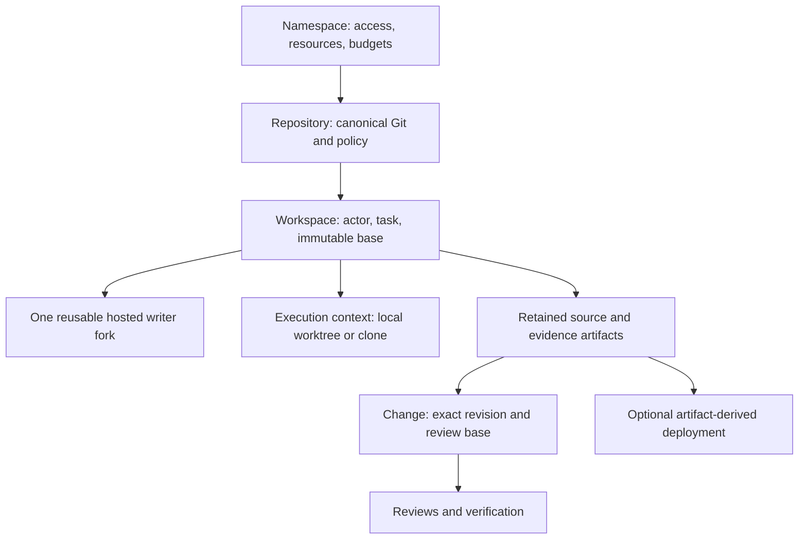
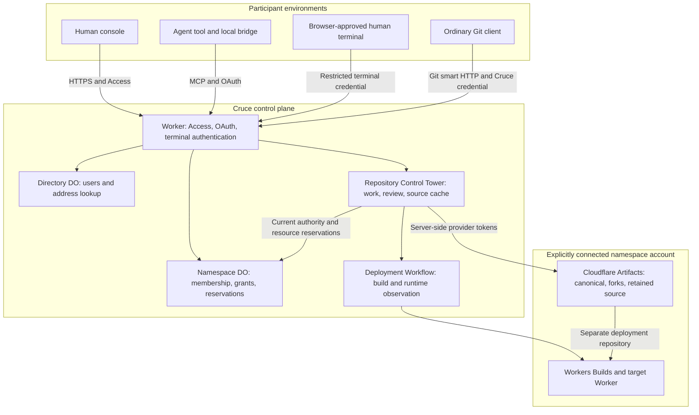
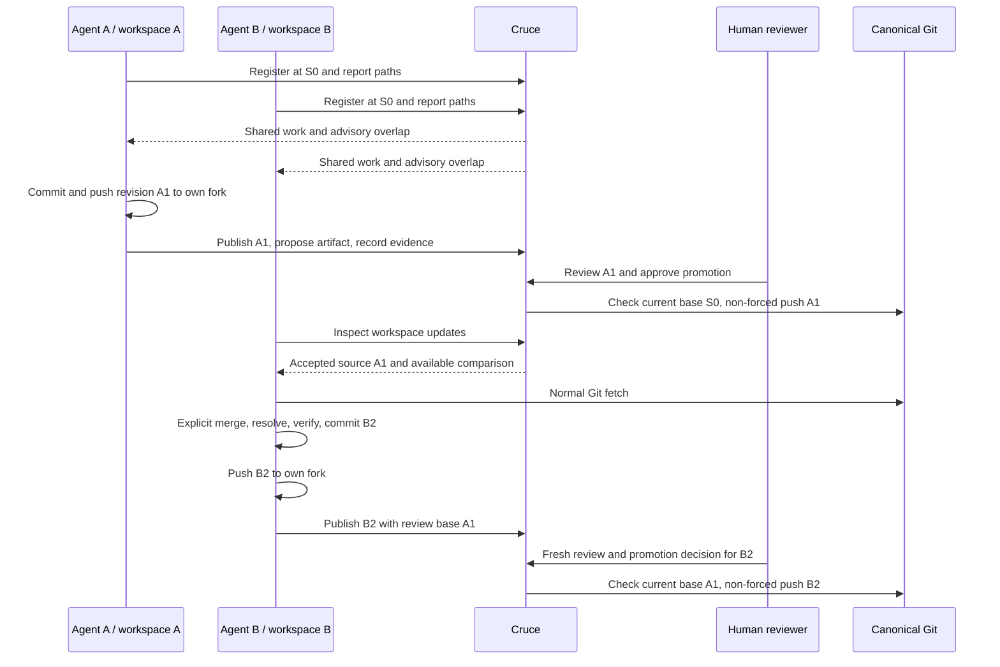

# Architecture

[Documentation map](../README.md#documentation-map) · [Principles](principles.md) · [Verification status](local-verification.md)

This describes the current Namespace → Repository → Workspace design. It is not a deployment claim. Cruce maintains shared repository state and exact-revision decisions across independently running agents; their execution remains outside the control plane.

## Domain vocabulary and ownership

| Term | Meaning and boundary |
| --- | --- |
| Namespace | Owns repositories, membership, teams, connected Cloudflare credentials, resource policy and atomic shared budgets; personal or shared |
| Repository | Stable code identity, configured default branch and mandatory canonical Artifacts storage; names and URLs are mutable addresses |
| Actor | Human or agent identity derived from authentication; an agent belongs to an authorized user and connection |
| Workspace | One actor's bounded repository work: title/context, immutable starting revision, presence, reported changes and writer fork |
| Execution context | Local materialization with checkout/machine identity, ownership and branch; not the durable task or hosted storage owner |
| Fork | Mutable Artifacts Git repository isolated for one writer workspace; read-only observers need no fork |
| Source artifact | Retained exact source revision plus its pinned review base, provenance, content hash and storage reference |
| Change | Proposal of a source artifact for exact-revision review; the code type and MCP names use `Proposal`/`*_proposal` |
| Deployment | Attempt to deploy an artifact's exact revision into a configured environment, with build/runtime observations and predecessor |

A workspace is neither a namespace nor a temporary process session. Multiple workspaces from one tool remain independent. Directory identities and provider repository IDs prevent mutable addresses from becoming proof of ownership. Full contracts are in [src/shared/platform.ts](../src/shared/platform.ts).

## Components and trust boundaries

The operator's account hosts the control plane. Each namespace explicitly connects the account used for its source and deployment resources. The two may happen to be the same account, but configuration for one never authorizes the other.

| Implementation boundary | Responsibility |
| --- | --- |
| [src/core/ownership.ts](../src/core/ownership.ts) | Pure Directory/Namespace decisions: identity, membership, grants and reservations |
| [src/core/platform.ts](../src/core/platform.ts), [capabilities.ts](../src/core/capabilities.ts) | Pure repository decisions, permissions, workspace presence, overlap, review readiness and deployment eligibility |
| [src/worker](../src/worker) | Authentication, Durable Object persistence, serialization, Git/provider I/O and deployment observation |
| [src/worker/git](../src/worker/git) | Git object cache in SQLite and exact source inspection/transport; not a competing canonical remote |
| [src/shared/tools.ts](../src/shared/tools.ts), [src/shared/platform.ts](../src/shared/platform.ts) | Single MCP catalog and shared contracts |
| [runner](../runner) | OAuth, local observation, checkout locks, worktree isolation and Git credential helper |
| [src/ui](../src/ui) | Console rendering of controller-derived decisions; navigation, retries and protection against late responses |
| [src/intelligence](../src/intelligence) | Babel source structure at pinned revisions; contextual analysis, never authority |
| [test/browser](../test/browser) | Separate fixed-clock console fixture; simulated identity/provider behavior |

Core controllers receive state, time and IDs. Adapters persist their results and perform external work. Directory DO serializes identity/address decisions; Namespace DO serializes shared budgets across repositories; each Repository Control Tower owns its workspaces, changes, artifacts and deployments.

## Identity and authorization

Access verifies issuer, subject, audience, signature and expiry. Directory first-login provisioning idempotently creates a user, human actor identity and personal namespace. Authentication admission is separate from namespace membership. Shared invitations are expiring links bound to verified email.

Personal namespaces have one owner. In shared namespaces, Owner and Maintainer have repository Maintain authority. Developer and Viewer access comes from direct/team grants, capped at Write and Read respectively. Repository roles are Read, Write and Maintain.

Agent authority intersects the user's current membership, repository grants, OAuth-approved repositories and capability scopes. It is re-evaluated on requests and retries before saved mutation results are returned. A client label or Git author cannot assert identity. Browser-approved human terminal credentials bind participation to one workspace and cannot exercise console promotion or production authority.

## Git and workspace lifecycle

The bridge registers a workspace at an exact local commit. Writer attachment checks known retained source, reserves the checkout and provisions a direct canonical fork. Artifacts forks inherit refs at fork time; the API has no exact-commit selector. Cruce pins the workspace base in metadata and a `cruce-base` fork ref, and creates the local checkout at that exact commit. There is no extra baseline repository. See the [Artifacts fork API](https://developers.cloudflare.com/artifacts/api/rest-api/).

Agent writers get Cruce-owned worktrees; adapters may also supply isolated clones. Humans can attach existing checkouts. Local locks use real checkout/worktree identity and persist across process exits; server reservations prevent another workspace claiming the same context. MCP or `watch` renews presence every 30 seconds. After 90 seconds without activity, active presence becomes disconnected, while the writer reservation remains.

Writer state progresses from `preparing` to `active`, then `completed` or `cancelled`. Disconnected is derived from freshness and can recover on heartbeat. A failed attachment remains retryable. Ending participation releases the bridge lock and server participation without merging, deleting source or automatically cleaning up.

The Git gateway serves ordinary smart HTTP at `/mcp/git/<namespace-id>/<repository-id>/<canonical-or-workspace-id>.git`. It supports `info/refs`, `git-upload-pack` and `git-receive-pack`. Canonical is read-only through this path. Fork writes require the owning active writer and, for agents, read, workspace-write and revision-publication scopes. See [setup](native-setup.md) for credentials and transfer limits.

Cloudflare credentials stay server-side: creation/fork tokens are revoked, and Git operations use 60-second scoped tokens revoked after use. The gateway validates destinations, rejects redirects and does not forward client cookies or authorization to Artifacts. Push retries replay the Git protocol against current refs, using request content to identify budget accounting; a cached success never substitutes for a remote ref check.

## Concurrent work and convergence

These are three different revision references:

- `Workspace.baseRevision` is the immutable starting point, S0 in the example.
- `Workspace.integratedRevision` records the review base of its latest publication; local fetch alone does not advance it.
- `Artifact.baseRevision` pins that artifact's review base, A1 for B2 above. Later publications cannot change it.

A new source publication must descend from the workspace base and its previous publication. Merge upstream explicitly when needed; rewriting already published history by rebase can make later publication fail ancestry checks. Local Git can manipulate unpublished work, but publication must preserve retained ancestry.

`inspect_overlap` compares paths reported by currently present writers, including both sides of reported renames, deleted paths and binary files. `get_workspace_updates` compares accepted source against the workspace's publication baseline using available cached Git objects. A reported local ref never advances accepted source. Missing objects produce unavailable comparison, not a provider fetch during a coordination read.

## Publication, review and retention

Publication fetches the named pushed fork ref and verifies it equals the requested commit. It checks ancestry and protected-path policy, pins the review base, then retains the exact source under a unique artifact ref in a separate per-repository Artifacts repository. Workspace forks remain mutable; retained artifact refs and Cruce records are not exposed as agent-writable remotes. Immutability is an application/storage-access invariant, not a claim that ordinary Git refs are intrinsically immutable.

Every artifact identifies namespace, repository, workspace, actor, source revision, SHA-256 content hash, storage and trust. Evidence content lives separately from source. The `build` kind does not imply output capture is implemented. Reported test results remain `reported`; authenticated human attestation is `human_attested`; actual runtime checks produce `runtime_verified` evidence. Retaining source does not upgrade its correctness claims.

Changes bind an artifact, base and head. Controller readiness requires current base, human approval for the exact revision, reasoned resolution of concerns and policy-required trusted passing evidence without unresolved failures. Promotion rechecks canonical source and makes a non-forced Git push. A moved base requires reconciliation and a new proposal, not rewriting the existing review.

Hosted cleanup requires an ended workspace. The runtime checks every fork ref against retained canonical/artifact history; unretained commits, annotated tags and non-commit refs conservatively block deletion. Deletion intent is persisted and asynchronous provider absence is reconciled on retry. Workspace records, source artifacts and lineage survive. Local cleanup separately requires Cruce ownership, clean files and a published or retained-base head.

## Resources and optional deployment

Namespace reservations serialize operation budgets across repositories. Mutation IDs and exact input fingerprints prevent accidental identity reuse. Unknown provider outcomes retain their reservation and named resource identity until reconciliation. Coordination reads do not provision or mutate; explicit Git reads contact the provider and have provider costs even though Cruce's reservation model is not a meter of every request.

Deployment names a source artifact and derives its revision. A separate deployment repository feeds Workers Builds, keeping preview/rollback ref movement away from accepted source. Production requires authenticated human authority and exact-revision review/evidence. Rollback selects a prior successful deployment of the same artifact in the same environment. The durable observer correlates build and runtime results, records timeouts/failures and stops superseded attempts. Build/deploy commands remain configured in Cloudflare, not generated by an agent orchestration engine.

See [Cloudflare setup](cloudflare-setup.md) for provider configuration and limits. Events, native file/history retrieval, Git-note mirroring and ArtifactFS are optional future evaluations in the [roadmap](../ROADMAP.md); no current event subscription or agent notification-delivery capability is implied.
