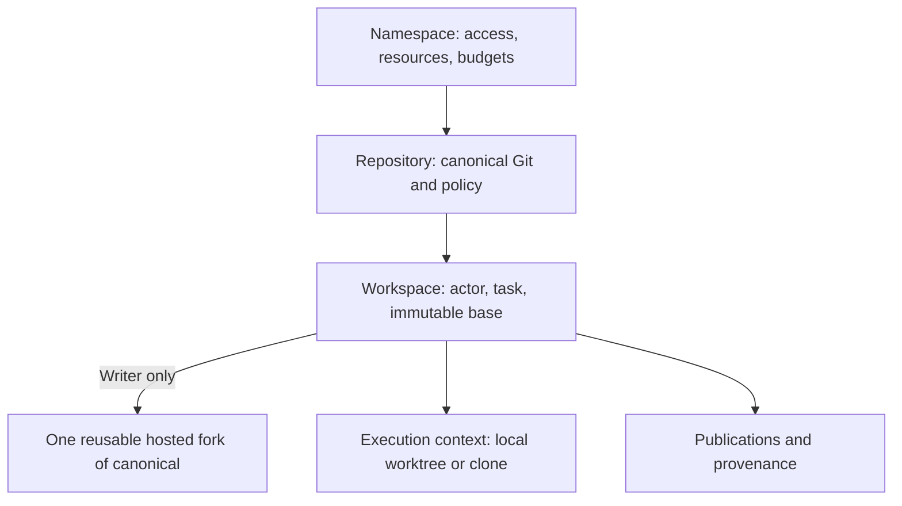
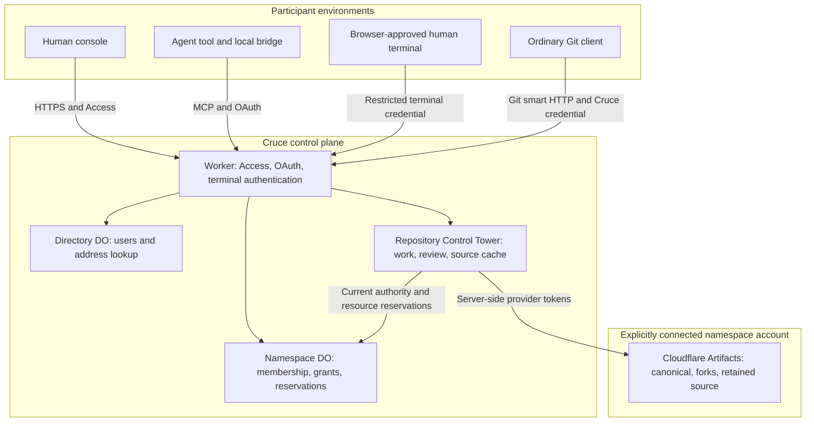
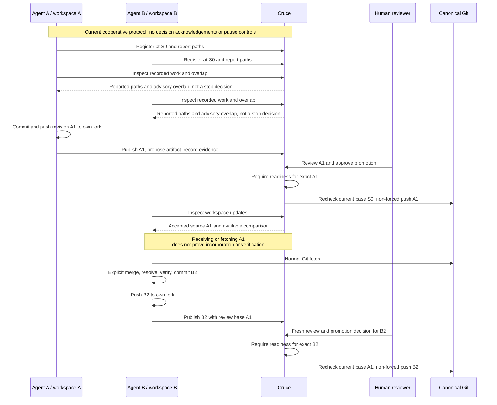
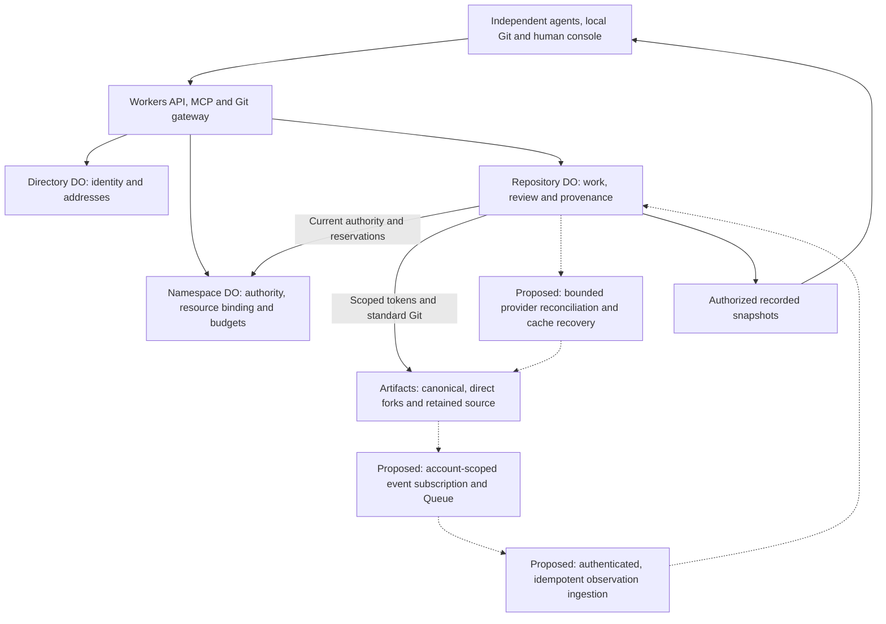

# Architecture

[Documentation map](../README.md#documentation-map) · [Principles](principles.md) · [Verification status](local-verification.md)

This describes the current Namespace → Repository → Workspace design. It does not establish live verification. Cruce maintains shared repository state and exact-revision decisions across independently running agents; their execution remains outside the control plane.

The [product goal](product-thesis.md) is a Git-native coordination and convergence layer for concurrent coding agents. The current architecture supplies isolation, cooperative observations and controlled convergence, with remaining correctness gaps documented in the [implementation audit](#implementation-audit). Timely remote observations and explainable exact-revision convergence lead the [roadmap](../ROADMAP.md#proposed-coordination-milestones); automatic sequencing and supported pause/resume are exploratory. None of these proposals establishes a current service or contract.

## Domain vocabulary and ownership



| Term | Meaning and boundary |
| --- | --- |
| Namespace | Owns repositories, membership, teams, connected Cloudflare credentials, resource policy and atomic shared budgets; personal or shared |
| Repository | Stable code identity and configured default branch; names and URLs are mutable addresses |
| Canonical repository | The authoritative Git repository for a Cruce repository, backed by Cloudflare Artifacts; its accepted source history advances through controlled promotion |
| Cloudflare Artifacts | Provider infrastructure for canonical Git storage, workspace forks, retained source/evidence storage and Git/provider operations; not a Cruce source artifact |
| Actor | Human or agent identity derived from authentication; an agent belongs to an authorized user and connection |
| Workspace | Durable coordination identity for one actor's repository work: task, immutable starting revision, writer fork, publications, provenance and lifecycle state |
| Execution context | Local materialization with checkout/machine identity, ownership and branch; not the durable task or hosted storage owner |
| Writer fork | One mutable Cloudflare Artifacts Git repository forked directly from canonical, owned by one writer workspace and reused across its publications; read-only observers need no fork |
| Published revision / Source artifact | Product language uses published revision; the Cruce domain record of an exact retained source revision, pinned review base, provenance, content hash and storage identity (`Artifact` with `kind: "source"`) |
| Evidence | Revision-linked claims/results, such as reported tests or human attestation; stored evidence content (`Artifact` with `kind: "evidence"`) is separate from source. A `Verification` records an outcome for a proposal and may link an evidence artifact |
| Publication | Retention of an exact pushed workspace revision for review through `publish_revision`, producing a source artifact; `publish_artifact` stores evidence. There is no separate `Publication` contract |
| Change / Proposal | The same exact-revision review unit: a source artifact, base, head and reviews. Product language uses change; the contract and MCP use `Proposal`/`*_proposal`. `WorkspaceChange` is only a reported path change |
| Review | A permitted participant evaluates an exact revision and its evidence; only authenticated human approval satisfies the current approval requirement |
| Promotion | Human-authorized, controller-gated, non-forced canonical Git update; a `Promotion` records the transition. Local integration means reconciling with Git before publication and is not canonical acceptance |

An authorized agent may participate in many workspaces; each workspace belongs to one actor, and each attached writer workspace owns one reusable hosted fork. The vendor/tool does not own the fork. Preparing writers may not yet have a fork; explicit cleanup can later delete it without deleting the workspace. Directory identities and recorded provider IDs are intended to prevent mutable addresses from becoming proof of ownership; provider checks are incomplete on the audited publication/promotion paths. Full contracts are in [src/shared/platform.ts](../src/shared/platform.ts).

Canonical does not mean a local clone, cached Git objects, a workspace fork, retained source storage or an arbitrary external remote. Publication retains source separately without advancing accepted history; promotion advances canonical history.

The [console design guide](design.md) owns visual identity and topology semantics. Console topology is a presentation of authorized snapshots, never an inferred Git DAG or an independent readiness/authority decision. Namespace summaries expose minimal workspace and overlap membership for miniature views without provider reads.

The console has **Overview**, **Code**, **Work** and **Settings**. **Code** lists published revisions (source artifacts) and provides exact-source, history, diff and provenance inspection. **Work** presents changes, workspaces and revision evidence, including stored reports before a change exists. A change shows evidence for its exact revision from its workspace or explicitly linked by a matching verification; another workspace sharing a commit does not automatically supply evidence for that change. Focused revision/evidence details preserve producer/trust, review base, storage/hash, content and lineage inspection. Source records remain `Artifact` with `kind: "source"` and evidence remains `kind: "evidence"` in storage and MCP contracts. These internal terms do not require a mixed Artifacts collection in the UI. Saved artifact inspection links resolve by record kind to Code or Work using history replacement; the former collection link resolves to Code. This preserves navigation without adding a tab or changing stored records. Cloudflare Artifacts is named explicitly in infrastructure settings and resource disclosures.

The console header reflects the active scope. Home is global and selects no hidden namespace or repository; scoped namespace/repository names open anchored dropdowns. Namespace-level Repositories, Members, Teams and Settings remain separate from repository tabs, with Members/Teams available only in shared namespaces. The avatar exposes authenticated identity and sign-out without changing the current page. Saved account URLs resolve to Home with this menu open using history replacement. Repository search uses an inline header field and anchored results across authorized namespaces; Command/Ctrl K focuses the same field. Listing remains read-only, supports partial failures and retry, and aborts dismissed requests to protect newer results. Namespace/repository grants and authentication identity keep their existing ownership and enforcement.

### Workspace durability

A workspace is durable coordination identity. Its execution context records machine, checkout/worktree/clone, branch and local ownership; the bridge holds the persistent writer lock for that local materialization.

```text
Process exit or agent disconnect  ≠ workspace deletion or loss of ownership
Worktree removal                 ≠ erasure of published work
Heartbeat expiry                 ≠ loss of checkout ownership or cleanup
Execution context disappearance  ≠ loss of durable provenance
Workspace completion             ≠ source acceptance or cleanup
```

## Components and trust boundaries



The operator's account hosts the control plane. Each namespace explicitly connects the account used for its source resources. The two may happen to be the same account, but configuration for one never authorizes the other.

All authenticated entry points use the stable Directory object named `namespace-directory` for the current Namespace model. The retired development model used `directory` with incompatible user/address records. Its object is left untouched; there is no compatibility reader or migration. This separation is a one-time model boundary, not a deployment-specific identity reset. Future deployments must preserve the current object name and its stable user/namespace IDs.

| Implementation boundary | Responsibility |
| --- | --- |
| [src/core/ownership.ts](../src/core/ownership.ts) | Pure Directory/Namespace decisions: identity, membership, grants and reservations |
| [src/core/platform.ts](../src/core/platform.ts), [capabilities.ts](../src/core/capabilities.ts) | Pure repository decisions, permissions, workspace presence, overlap, review readiness |
| [src/worker](../src/worker) | Authentication, Durable Object persistence, serialization, Git/provider I/O |
| [src/worker/git](../src/worker/git) | Git object cache in SQLite and exact source inspection/transport; not a competing canonical remote |
| [src/shared/tools.ts](../src/shared/tools.ts), [src/shared/platform.ts](../src/shared/platform.ts) | Single MCP catalog and shared contracts |
| [runner](../runner) | OAuth, local observation, checkout locks, worktree isolation and Git credential helper |
| [src/ui](../src/ui) | Console rendering of controller-derived decisions; navigation, retries and protection against late responses |
| [src/intelligence](../src/intelligence) | Babel source structure at pinned revisions; contextual analysis, never authority |
| [test/browser](../test/browser) | Separate fixed-clock console fixture; simulated identity/provider behavior |

Core controllers receive state, time and IDs. Adapters persist their results and perform external work. Directory DO serializes identity/address decisions; Namespace DO serializes shared budgets across repositories; each Repository Control Tower owns its workspaces, changes and artifacts.

## Identity and authorization

Access verifies issuer, subject, audience, signature and expiry. Directory first-login provisioning idempotently creates a user, human actor identity and personal namespace. Authentication admission is separate from namespace membership. Shared invitations are expiring links bound to verified email.

The public document and static assets render a logged-out homepage or the authenticated console behind a browser session boundary. `GET /auth/session` returns only a no-store authentication boolean after unsealing the Cruce cookie and revalidating its Access JWT and bound identity. It does not provision directory identities or load repository state. Access identity alone does not restore a cleared Cruce browser session. Login reuses Access to issue the existing sealed cookie. Logout expires that cookie and redirects to the same-origin `/cdn-cgi/access/logout` endpoint; Cloudflare owns Access-cookie clearing and session revocation across the team's applications. It is a full Access sign-out, not a per-application logout. The fixed redirect accepts no caller-supplied return URL, and the Worker does not proxy Access credentials. Invalid or expired sessions are signed out; certificate-service outages and configuration errors remain retryable failures. The console loads lazily after confirmation, and an expired API response removes its private views. Restoring a browser history entry rechecks the session. Before explicit sign-in, same-origin repository or invitation destinations are retained in tab-local storage and restored after confirmation, including their detail/token fragments. Storage failure falls back to authenticated Home. Membership and authority continue to be checked by the existing API paths on every request.

Hosted exposure requires the separately reviewed [public-homepage Access configuration](../tools/access-public-homepage.json): the public base surface is overridden by more-specific protected API, login, consent, pairing and invitation paths. Existing OAuth/Git exceptions retain their own authentication. The custom-domain policy application and anonymous edge verification are recorded in the test environment guide; the JSON alone does not establish live policy state.

Personal namespaces have one owner. In shared namespaces, Owner and Maintainer have repository Maintain authority. Developer and Viewer access comes from direct/team grants, capped at Write and Read respectively. Repository roles are Read, Write and Maintain.

Agent authority intersects the user's current membership, repository grants, OAuth-approved repositories and capability scopes. It is re-evaluated on requests and retries before saved mutation results are returned. A client label or Git author cannot assert identity. Browser-approved human terminal credentials bind participation to one workspace and cannot exercise console promotion authority.

## Git and workspace lifecycle

The bridge registers a workspace at an exact local commit. Writer attachment checks known retained source, reserves the checkout and provisions a direct canonical fork. Artifacts forks inherit refs at fork time; the API has no exact-commit selector. Cruce pins the workspace base in metadata and a `cruce-base` fork ref, and creates the local checkout at that exact commit. There is no extra baseline repository. See the [Artifacts fork API](https://developers.cloudflare.com/artifacts/api/rest-api/).

Agent writers get Cruce-owned worktrees; adapters may also supply isolated clones. Humans can attach existing checkouts. Local locks use real checkout/worktree identity and persist across process exits; server reservations prevent another workspace claiming the same context. MCP or `watch` renews presence every 30 seconds. After 90 seconds without activity, active presence becomes disconnected, while the writer reservation remains.

Writer state progresses from `preparing` to `active`, then `completed` or `cancelled`. Disconnected is derived from freshness and can recover on heartbeat. A failed attachment remains retryable. Ending participation releases the bridge lock and server participation without merging, deleting source or automatically cleaning up.

The Git gateway serves ordinary smart HTTP at `/mcp/git/<namespace-id>/<repository-id>/<canonical-or-workspace-id>.git`. It supports `info/refs`, `git-upload-pack` and `git-receive-pack`. Canonical is read-only through this path. Fork writes require the owning active writer and, for agents, read, workspace-write and revision-publication scopes. See [setup](native-setup.md) for credentials and transfer limits.

Cloudflare credentials stay server-side: creation/fork tokens are revoked, and Git operations use 60-second scoped tokens revoked after use. The gateway validates destinations, rejects redirects and does not forward client cookies or authorization to Artifacts. Push retries replay the Git protocol against current refs, using request content to identify budget accounting; a cached success never substitutes for a remote ref check.

## Concurrent work and convergence

This sequence shows the implemented protocol and participant responsibilities. It does not imply automatic notification delivery, pause/resume or verified agent compliance.



These are three different revision references:

- `Workspace.baseRevision` is the immutable starting point, S0 in the example.
- `Workspace.integratedRevision` records the review base of its latest publication; local fetch alone does not advance it.
- `Artifact.baseRevision` pins that artifact's review base, A1 for B2 above. Later publications cannot change it.

A new source publication must descend from the workspace base and its previous publication. Merge upstream explicitly when needed; rewriting already published history by rebase can make later publication fail ancestry checks. Local Git can manipulate unpublished work, but publication must preserve retained ancestry.

`inspect_overlap` compares paths reported by currently present writers, including both sides of reported renames, deleted paths and binary files. Overlap is awareness, not a Git conflict or a reason to block local work. Absence of overlap proves neither absence of concurrent work nor semantic compatibility: edits to `auth-contract.ts` and `auth-client.ts` can be behaviorally dependent without sharing a path. Observation is not a decision; analysis is not authorization.

Workspace `title` and optional `context` describe reported work, but do not implement structured intent, dependency, progress or scope-version tracking. `report_change` records changed paths/commits, not planned edits or incompatible assumptions. The controller derives presence and overlap freshness from workspace activity; a heartbeat can refresh that activity without refreshing the content of a work report. Disconnected writers are excluded from active overlap even though their durable workspaces and checkout reservations remain. Neither a live heartbeat nor an empty overlap result establishes complete, current knowledge of concurrent work.

`get_workspace_updates` compares accepted source against the workspace's publication baseline using available cached Git objects. A reported local ref never advances accepted source. Missing objects produce unavailable comparison, not a provider fetch during a coordination read.

Continuing writers are responsible for explicitly incorporating accepted source with Git and verifying the resulting revision before fresh publication/review. `integratedRevision` records a publication's review base; it is not a receipt proving that an agent read an update or ran tests. There is no separate decision acknowledgement or incorporation-follow-through protocol today.

| Boundary | Current behavior | Proposed extension |
| --- | --- | --- |
| Advisory awareness | Participants read recorded work, reported path overlap and canonical updates | Assess meaningful interference from fresh intent and available source context; no compatibility guarantee |
| Agent response | Cooperative participation instructions; no decision delivery/acknowledgement or pause/resume protocol | Versioned, scoped decisions and explicit responses; opt-in controls only through demonstrated integrations |
| Enforced safeguards | Authorization, writer isolation/reservations, resource gates, publication and promotion checks | Coordination controls must preserve these safeguards and human authority; they cannot claim control over arbitrary local execution |

The [roadmap interaction contract](../ROADMAP.md#proposed-interaction-contract) owns the future delivery, acknowledgement, scope-change, stale-report and disconnect requirements. Ordinary coordination reads remain free of acknowledgement mutations and provider fetches. No new public API, persistence schema or client control is introduced by that proposal.

## Publication, review and retention

Publication fetches the named pushed fork ref and verifies it equals the requested commit. It checks ancestry and protected-path policy, pins the review base, then retains the exact source under a unique artifact ref in a separate per-repository Artifacts repository. Workspace forks remain mutable; retained artifact refs and Cruce records are not exposed as agent-writable remotes. Immutability is an application/storage-access invariant, not a claim that ordinary Git refs are intrinsically immutable.

Every artifact identifies namespace, repository, workspace, actor, source revision, SHA-256 content hash, storage and trust. Evidence content lives separately from source. **Publication proves which source was retained, not that it is correct.**

| Knowledge or state | What it establishes |
| --- | --- |
| Reported (`reported`) | A participant supplied a claim; a reported test pass or local ref is not an independently verified test or remote push |
| Human-attested (`human_attested`) | An authenticated authorized human attests an outcome; Cruce has not thereby run the check |
| Independently verified | A named check was independently exercised for a specific revision/environment; current `Verification` trust values are only `reported` and `human_attested`. Cruce does not execute tests |
| Retained | Exact source remains stored and reachable; retention does not imply approval or correctness |
| Published | A publication record identifies retained source for review; it does not imply approval or canonical acceptance |
| Approved | An authenticated human approved the exact revision; readiness and an explicit promotion are still required |
| Accepted / canonical | Source in authoritative canonical history, initially provisioned or advanced by completed promotion; existence of a publication is insufficient |

Publication records currently carry `reported` trust even when source retention succeeds. Source identity/retention checks and correctness claims are different facts. Missing source/provider observations remain unknown or unavailable, never inferred success.

Changes bind an artifact, base and head. Controller readiness requires current base, human approval for the exact revision, reasoned resolution of concerns and policy-required trusted passing evidence without unresolved failures. Promotion persists its exact inputs, operation identity and namespace reservation before Git I/O, checks full source availability and canonical provider identity, and rechecks current human authority. The installed `isomorphic-git` pre-push hook compares the advertised old revision and local candidate to the approved pair. Its non-forced receive-pack update then compares that same old OID under the remote ref lock. An unexpected moved base fails closed and requires reconciliation and a new proposal with fresh review; the existing review base is never rewritten.

The promotion journal transitions through prepared, attempted and confirmed phases. An attempted operation is never pushed again. An explicit retry under the original identity independently reads remote refs: only the exact candidate can reconcile its intended effect, never an ancestor, descendant or a local tracking ref. A candidate already present before an attempt is refused. A definitive Git rejection is failed, so later external movement cannot revive that operation. Lost responses remain uncertain until reconciliation; unavailable observations remain pending and block other canonical promotions. A changed observed outcome rejects the proposal and preserves the charged uncertainty without inventing accepted provenance. This establishes the intended exact source effect, not exclusive attribution of an indistinguishable external write or recovery of transient remote history.

Completed provenance, proposal state, accepted source and the receipt save atomically in the Repository DO before namespace settlement. A retry repairs interrupted settlement without provider I/O. The console exposes controller-derived recovery only to the initiating authorized human maintainer and reuses the persisted command after reload. Git, Repository DO metadata and Namespace settlement remain separate systems; this is explicit reconciliation, not a cross-system transaction. [Local fault evidence](local-verification.md#exact-base-promotion-verification) covers the new implementation; earlier live promotion evidence does not verify these changes. Agents can publish, inspect, review, disagree, supply evidence and request promotion, but cannot supply human authority. Automatic promotion would change the authority policy, not merely add an auto-merge convenience; it is outside the current model.

Hosted cleanup requires an ended workspace. The runtime checks every fork ref against retained canonical/artifact history; unretained commits, annotated tags and non-commit refs conservatively block deletion. Deletion intent is persisted and asynchronous provider absence is reconciled on retry. Workspace records, source artifacts and lineage survive. Local cleanup separately requires Cruce ownership, clean files and a published or retained-base head.

## Resources and the canonical Git boundary

Namespace reservations serialize operation budgets across repositories. Mutation IDs and exact input fingerprints prevent accidental identity reuse. Unknown provider outcomes retain their reservation and named resource identity until reconciliation. Coordination reads do not provision or fetch provider source, but initialization wrappers still write metadata; strict read purity is a correction, not an established guarantee. Explicit Git reads contact the provider and have provider costs even though Cruce's reservation model is not a meter of every request.

Cruce’s responsibility ends when isolated concurrent work is safely reviewed and reconciled into the canonical Git repository. CI, build/release orchestration, deployment, environment management, rollback and runtime operation belong to external systems. No deployment environments, preview/rollback refs, build observers or runtime checks belong to repository state. A future durable runner for Cruce's own authorized operations would not introduce repository CI/CD. Artifacts and evidence remain inputs to source review. External handoff/provenance is only a roadmap candidate.

See [Cloudflare setup](cloudflare-setup.md) for provider configuration and limits. Event-backed observations are a P0 candidate, native file/history inspection is P1, and Git-note mirroring/ArtifactFS remain exploratory in the [roadmap](../ROADMAP.md). No current event subscription or agent notification-delivery capability is implied.

## Implementation audit

Audit date: **2026-10-06**. Committed baseline: `e57ee33498f06c29937522214d18f449bb7bde24`. Inspection also included pre-existing uncommitted consent-header repair/tests, deployed-verifier work and verification notes; these are not attributed to the committed baseline or this documentation pass. Separate deployed-consent evidence added during the audit is preserved in verification. That audit changed no runtime, API, schema or bindings. The current table and findings incorporate the subsequent P0.1 correction, whose local evidence is recorded separately. [Verification](local-verification.md#architecture-audit-validation) records checks performed here; earlier local/provider/deployed results retain their original scope.

**IMPLEMENTED** means a traced code path exists, not that production behavior or product value is proved. **PARTIAL** means a useful mechanism exists but the named capability has a concrete gap. **NOT IMPLEMENTED** means the inspected contracts/routes/configuration contain no implementation. **CONTRADICTS TARGET** identifies a specific broken invariant. **UNCLEAR / NEEDS INVESTIGATION** identifies a guarantee that code, tests or provider documentation do not establish. Priorities refer to [roadmap item IDs](../ROADMAP.md), not deadlines. “Keep” means preserve an existing capability rather than invent a roadmap task.

### Capability gap table

| Capability | State | Evidence | Gap | Cloudflare leverage | Priority |
| --- | --- | --- | --- | --- | --- |
| Canonical creation | IMPLEMENTED | [Runtime][runtime] `provision_repository`; [router][router] repository POST; [provider][provider] `ensure` | New README baseline, not import; deployed provisioning evidence is narrower than full convergence | Artifacts create and normal Git | Keep; P0.3 validation |
| Namespace/repository identity mapping | PARTIAL | [Ownership][ownership] IDs; [router][router] stable storage names; [types][types] `canonical`/`fork.id` | Account binding and provider checks incomplete; findings below | Artifacts IDs + Namespace DO | P0.2 |
| Direct reusable writer forks | IMPLEMENTED | [Runtime][runtime] `attach_workspace` calls `host.fork(canonical, ...)`; [runtime tests][runtime-tests] direct/distinct fork cases | Recovery of an existing named fork trusts description rather than verified parent identity | Artifacts fork | Keep; P0.2 hardening |
| Exact immutable starting revision | IMPLEMENTED | [Controller][controller] `start_workspace`; [runtime][runtime] baseline ref; [execution][execution] `createExecution`; [core tests][core-tests] | Fork API selects refs, not a historical commit; Cruce pins base separately | Git commit IDs and fork base ref | Keep |
| Latest pushed revision | PARTIAL | [Runtime][runtime] `gitRequest`/`publish_revision`; [types][types] `headRevision` | Push forwarding does not update an observed remote-head record; reports are claims, publication is later | Artifacts push events and ref inspection | P0.4 |
| Standard Git protocol | IMPLEMENTED | [Router][router] Git route; [provider][provider] `gitRequest`; [runtime tests][runtime-tests] native clone/push/fetch | Gateway buffers transfers and serializes them with commands; 32 MiB bound | Artifacts smart HTTP | Keep; P2.2 |
| Scoped read/write Git tokens | IMPLEMENTED | [Provider][provider] `withToken`, `gitRequest`; [provider tests][provider-tests] | Agent writes confined to owned active fork; account control credential remains broader and server-side | Repo-scoped tokens | Keep |
| Token TTL/revocation | IMPLEMENTED | [Provider][provider] `ttl: 60`, `finally` revoke, creation-token reconciliation; [provider tests][provider-tests] | Revocation failure makes outcome uncertain; later single-writer verification separately exercised provider-token and OAuth-grant revocation, not in-flight cancellation | Artifacts token lifecycle | Keep; P0.3 validation |
| Workers binding | NOT IMPLEMENTED | [Config][config]; [provider][provider] `ArtifactsRestHost` | Dynamic connected-account authority must fit before replacing REST; absence alone is not a defect | Binding or REST | P1.1 |
| File/object/history inspection | PARTIAL | [Runtime][runtime] `get_source`, `get_history`, `get_diff`; [GitWorkspace][git] | Persistent local object inspection; no native provider file/history API use | REST/binding exact-source reads | P1.1 |
| Event subscriptions and ingestion | NOT IMPLEMENTED | [Config][config] empty triggers; [Worker][worker] fetch handler; [catalog][catalog] | No queue consumer, observed push lifecycle or subscription provisioning | Artifacts events + Queues | P0.4 |
| Event ordering, deduplication, recovery | NOT IMPLEMENTED | Same configuration and handlers | No inbox/checkpoint/backfill/DLQ path; provider event-ID guarantees unresolved | Queues + DO observation state | P0.4 |
| Import | NOT IMPLEMENTED | [Provider][provider] interface; [router][router] create route; [catalog][catalog] | No existing public/private repository onboarding | Artifacts public HTTPS import; private transport needs validation | P2.1 |
| Provider limits and errors | PARTIAL | [Provider][provider] `cloudflare`, `boundedBody`; [GitWorkspace][git] `exportPack`; [runner Git][local-git] | No general retry/backoff strategy; raw provider error messages can cross MCP; full reachable-pack hashing adds cost | Native errors/limits, Logs | P1.1/P1.4/P2.2 |
| Workers API/auth/MCP boundary | IMPLEMENTED | [Worker][worker], [router][router], [auth][auth], [MCP][mcp], [catalog][catalog]; [route tests][route-tests] | Single authorized test-writer flow is recorded in verification; second writer, membership/in-flight revocation and real coding tools remain pending | Access, OAuth, Workers | P0.3 validation |
| Directory and Namespace authority | IMPLEMENTED | [Directory][directory], [Namespace][namespace], [ownership][ownership]; [core tests][core-tests] | Cross-object copies of display metadata need refresh discipline; no second membership authority | SQLite DOs | Keep |
| Repository coordination serialization | IMPLEMENTED | [ControlTower][tower] keyed by repo ID; [runtime][runtime] `Serial.run`; [store][store] | One in-memory queue per instance, including Git I/O; not a transaction with remote Git; durable pending promotion intent prevents a second update during recovery | Repository DO | Keep; P0.1/P2.2 |
| Metadata ownership | IMPLEMENTED | [Types][types], [store][store], [namespace][namespace], [runtime][runtime] | Growing whole-state JSON collections/receipts; no query projections | DO SQLite | Keep; P2.2 |
| D1 | NOT IMPLEMENTED | [Config][config], storage adapters | No demonstrated query need justifies adding another authority | D1 only as future rebuildable index | Do not add now |
| WebSockets and alarms | NOT IMPLEMENTED | [ControlTower][tower], [Worker][worker], [config][config] | UI polls; deletion retries require caller; presence is derived, not alarm-driven | Hibernating sockets / DO alarms | P1.3/P2.2 |
| Workflows | NOT IMPLEMENTED | [Config][config], [runtime][runtime] synchronous operation branches | Some phases persist retry markers; no autonomous durable multi-step runner | Workflows candidate for selected long operations | Exploratory |
| Queues/retry/DLQ | NOT IMPLEMENTED | [Config][config], [Worker][worker] | Needed if using documented Artifacts event delivery; not a promotion authority | Queues | P0.4 |
| Operational logs/traces | PARTIAL | [Config][config] `observability.enabled`; [Worker][worker] `failure`; [MCP][mcp] catch | No explicit domain correlation/spans or consistent public-error redaction; enabled config is not evidence of effective production tracing | Workers Logs/Traces | P1.4 |
| Product analytics | NOT IMPLEMENTED | [Config][config], domain activity records | Activity history is not an outcome-measurement pipeline | Analytics Engine optional | Exploratory |
| Workspace versus execution context | IMPLEMENTED | [Types][types] separate records; [controller][controller]; [execution][execution]; [runner tests][runner-tests] | Durable workspace survives process loss; attached execution descriptor cannot be moved in place | DO state + local Git | Keep |
| Writer locks, reservations, lifecycle | IMPLEMENTED | [Execution][execution] persistent lock; [controller][controller] checkout reservation/TTL/end; [runner tests][runner-tests] | Trusted cooperative clients report execution metadata; server cannot independently inspect local filesystem | Namespace/repository state; local exclusive files | Keep |
| Activity/path overlap | PARTIAL | [Controller][controller] `live`, `overlaps`; [execution][execution] `observeChanges`; [core tests][core-tests] | Renames/binary paths supported; disconnected writers excluded; report content freshness shares heartbeat clock | Existing DO | P0.4 |
| Intent, dependency and coordination response | NOT IMPLEMENTED | [Types][types] title/context only; [catalog][catalog] | No structured intent/dependency, decision acknowledgement or follow-through lifecycle | Existing DO/catalog | P1.2 |
| Symbols/modules/dependency surfaces | PARTIAL | [Indexer][indexer] `buildIndex`; [runtime][runtime] `get_context`; [index tests][index-tests] | Pinned JS/TS context exists; no active cross-workspace symbol/dependency convergence engine | Bounded source inspection; queue only if needed | P1.2 |
| Canonical movement/stale base | PARTIAL | [Controller][controller] `workspaceUpdates`/`readiness`; [runtime][runtime] `get_workspace_updates`; [runtime tests][runtime-tests] | Works for recorded accepted source; arbitrary remote movement not reconciled; missing objects stay unavailable | Artifacts observations + DO | P0.4 |
| Candidate and ancestry validation | IMPLEMENTED | [Runtime][runtime] publication merge-base checks; [GitWorkspace][git]; [convergence test][convergence-test] | Preserves starting/previous published ancestry; no structured multi-workspace reconciliation-input record beyond Git ancestry/provenance | Standard Git | Keep; P1.2 |
| Exact review/approval/evidence | IMPLEMENTED | [Controller][controller] `review_proposal`, `readiness`, `record_verification`; [core tests][core-tests] | Approval is a stored historical human decision; revoked approval-author policy is not separately defined; current promoter must be authorized | Existing DO | Keep; document policy before change |
| Non-forced promotion / exact candidate | IMPLEMENTED | [Runtime][runtime] `promote`; [GitWorkspace][git] `onPrePush`; [runtime tests][runtime-tests] native ref races/restart | Exact advertised old/new plus remote ref comparison; hosted validation pending | Git receive-pack | Keep; P0.3 validation |
| Expected-base race exclusion | IMPLEMENTED | Installed `onPrePush` validates exact old/new; native Git race tests at advertisement and update | Locally verified; new hosted/provider fault checks pending | Expected-old validation + Git atomic ref update | P0.1 done; P0.3 validation |
| Publication and promotion recovery | PARTIAL | [Runtime][runtime] promotion journal and receipts; [runtime tests][runtime-tests] response/persistence/settlement failures | Promotion reconciles exact remote outcomes without re-pushing; transient history remains uncertain; publication settlement still precedes receipt save | DO operation state | P0.1 done; P0.2/P0.3 validation |
| Provider identity on every operation | CONTRADICTS TARGET | [Provider][provider] gateway/delete compare IDs; [runtime][runtime] promotion compares canonical ID; publication still only looks up names | Canonical/fork IDs not checked consistently; retained artifact storage omits provider ID | Stable Artifacts ID binding | P0.2 |
| Account identity after disconnect | CONTRADICTS TARGET | [Namespace][namespace] `account`; [provider][provider] `disconnect` | Removing account record bypasses reconnect comparison with previous account despite retained resources | Durable binding separate from sealed credential | P0.2 |
| Per-request authority | IMPLEMENTED | [Auth][auth], [ownership][ownership] `authority`, [runtime][runtime] receipt checks; [identity tests][identity-tests], [runtime tests][runtime-tests] | Checks are at request/reservation boundaries, not continuous cancellation; mid-flight revocation needs explicit tests/policy | Access/OAuth + Namespace DO | Keep; P0.3 |
| Secret isolation | PARTIAL | [Sealing][sealing], [provider][provider], [credential helper][credential]; [provider tests][provider-tests] | No intentional provider-token output; raw exception text is not a proven redaction boundary; key rotation unspecified | Worker secret + AES-GCM + scoped tokens | P1.4 |
| GitHub installation/selection/fetch/publish/PR/webhooks | NOT IMPLEMENTED | [Types][types], [router][router], [catalog][catalog], [config][config] | No provider mapping or private credential flow; Cruce's release workflow is unrelated infrastructure | Artifacts import; GitHub App; optional Workflows | P2.1 |
| Retention, explicit fork deletion | IMPLEMENTED | [Runtime][runtime] cleanup ref checks/deletion marker; [execution][execution] dirty/ownership checks; [runtime tests][runtime-tests] | Retained repos and provenance survive; no general repository deletion API; out-of-band provider writers can race a ref scan | Artifacts retained refs | Keep; P2.2 |
| Cache loss/restart recovery | PARTIAL | [SqlFs][sqlfs] persistent cache; [runtime][runtime] `known`/reads | Normal DO persistence exists; no integrated cold-cache rehydration/eviction/recovery test | Artifacts remains recoverable source authority | P1.1 |
| Read-only coordination contract | CONTRADICTS TARGET | [Router][router] calls Directory login; [tower][tower] `open` calls [runtime][runtime] `initialize` | Reads avoid provider source fetch but still persist directory/repository metadata | Separate initialization from established reads | P1.3 |
| UI and client interoperability | PARTIAL | [UI][ui], [change UI][change-ui], [client setup][client-setup], [browser tests][browser-tests] | Server readiness and exact evidence rendered; configuration writers do not prove real client context consumption | Existing Worker/DO snapshot | P0.3/P1.3 |
| Account-crossing event/binding feasibility | UNCLEAR / NEEDS INVESTIGATION | [Config][config] operator account; [Namespace][namespace] connected resource accounts; provider docs below | No documented Cruce-tested path for arbitrary connected-account subscriptions/bindings | REST, queue pull/relay or supported binding | P0.4 feasibility |

### State authority and the Git cache

| State | Authority | Derived/cached representations |
| --- | --- | --- |
| Commits, trees, blobs and remote refs | Artifacts repositories | Repository DO `gitfs`; local worktrees/clones |
| User/namespace IDs and mutable address directory | Directory DO | Namespace metadata and authorized UI projections |
| Membership, repository registration/grants, resource binding and reservations | Namespace DO | Repository descriptor refreshed for commands; sealed credential passed internally |
| Workspace identity/base, reports, artifacts, proposals, reviews, evidence records, promotions | Repository DO | UI snapshots and lineage views |
| Accepted revision recorded by Cruce | Repository DO `sourceHead`, justified by initial provisioning/completed promotion | Not proof of the current remote ref after out-of-band writes; observed canonical state is a missing separate concern |
| OAuth/pairing state | OAuth provider/KV | Client credentials scoped to Cruce, not Artifacts |
| Source and evidence retention | Artifacts retained repositories plus repository-DO provenance | Cache is not the sole retention copy |

There is no D1/DO dual authority and no external Git canonical implemented. Namespace/repository display metadata is copied, but authorization re-reads Namespace state. The single Directory DO and namespace enumeration may become scaling bottlenecks; that is a measured indexing question, not a reason to duplicate membership into D1 now.

`ControlTower` constructs one `GitWorkspace(new SqlFs(...), "/repository.git")`. Fetches reuse a persisted bare object store; there is no temporary Worker clone for each metadata request and no remote shell/sandbox. The cache supports source/diff/history/context reads, merge-base checks, retention pushes, evidence commits and full-pack hashing/export. Ordinary source reads do not contact Artifacts. `get_context` can read all files to build its structural index even when only a small context is wanted.

The cache is derived source data, not a competing canonical remote, but its size, lifetime and recovery are insufficiently bounded. `SqlFs.removeTree` is not a production eviction/recovery policy. Missing objects cannot automatically be repaired by a coordination read. The target is explicit identity-checked rehydration and bounded inspection; bulk source history should not be treated as required durable coordination state. Do not delete the cache before replacing the real ancestry/retention functions it serves. Public pack export uses standard Git objects, but its convenience endpoint still needs a demonstrated consumer before expansion.

### Architecture contradictions and correctness gaps

1. **Expected-base promotion race corrected locally (P0.1).** The pre-push hook pins the advertised old/new pair and native receive-pack rejects movement before the locked update, including an ancestor or the candidate. The durable operation journal reconciles interruptions without replaying attempted pushes. See [verification](local-verification.md#exact-base-promotion-verification); these tests do not establish new hosted/provider or deployed behavior.
2. **Provider identity enforcement is incomplete.** Gateway, delete and promotion paths compare IDs, but publication fetch still uses `info(name)` without comparing the stored fork ID. Retained storage records contain names/refs/revisions without a provider repository ID. A name recreated by an account administrator must not inherit the old identity. Retry adoption via matching description also cannot prove direct-fork parentage. Account/namespace/ID checks must cover every source and retention operation.
3. **Disconnect forgets the resource-account binding.** `NamespaceRuntime.account` prevents changing account while an old account record and charged reservations exist; `ResourceBoundary.disconnect` deletes that record. A later connect has no old account to compare. Keep immutable resource ownership separately from replaceable credentials; do not interpret disconnect as migration authorization.
4. **Remote success and metadata completion are separate.** Promotion now persists prepared/attempted/confirmed intent and completed provenance/receipt before settlement. Explicit retries reconcile the exact remote candidate or refuse changed/unavailable outcomes; uncertainty stays charged rather than adopting unrelated history. Publication still settles before saving its final receipt. Neither flow can reconstruct transient remote history after external movement or claim a Git/metadata transaction. General autonomous recovery and publication fault coverage remain separate work.
5. **“Coordination reads do not mutate” is too strong as a current implementation claim.** Pure controller inspection and provider-free reads exist, but HTTP/MCP routing calls `Directory.login`, which writes, and `ControlTower.open` initializes/saves repository metadata even for reads. Preserve the normative rule and correct these wrappers; do not hide the discrepancy behind read-only tool annotations.
6. **Presence can overstate observation freshness.** Overlap timestamps use workspace activity, which a heartbeat refreshes without new changes. The bridge usually follows heartbeat with a report, but that report can fail and direct MCP clients need not report. No overlap is not evidence of no in-flight work, especially for disconnected writers.
7. **The control plane has a source-cache dependency without a complete recovery contract.** Persisting Git blobs in DO SQLite is deliberate implementation reuse, but exceeds a metadata-only target and lacks a bounded lifecycle. Native provider reads can replace some work, not merge ancestry, remote-update correctness or the retained-source policy wholesale.

No forced canonical update, mutable starting-base setter, second GitHub canonical, agent launcher, repository CI/CD execution or deployment domain was found in the inspected current surface. Existing broad account credentials are deliberate control-plane credentials sealed server-side; normal Git receives narrow 60-second tokens. Error redaction, mid-flight revocation, token-cleanup failure, remote ref changes during cleanup and cold-cache recovery remain areas needing stronger failure evidence. These limitations do not erase the narrower successful provider checks.

### Artifacts capabilities and account boundaries

Primary docs reviewed on 2026-10-06: [Artifacts index](https://developers.cloudflare.com/artifacts/llms.txt), [cf index](https://developers.cloudflare.com/cf/llms.txt), [REST](https://developers.cloudflare.com/artifacts/api/rest-api/) and [Workers binding](https://developers.cloudflare.com/artifacts/api/workers-binding/). Artifacts supplies lifecycle operations, forks, scoped tokens and direct commit/tree/blob/file/history inspection. Binding `get()` returns a disposable capability; `log()` follows first-parent history. These APIs can simplify exact-source inspection, but cannot be substituted blindly for full merge ancestry.

Cruce uses REST because a namespace connects its own resource account, independently of the operator Worker account. The reviewed binding configuration selects a namespace; it does not establish a dynamically credentialed cross-account binding for this model. Keep REST until equivalent authority is demonstrated, using provider REST inspection where suitable. A provider binding is not worth weakening account isolation. Configuration remains `cf`/`cloudflare.config.ts`; provider examples using Wrangler do not change that convention.

[Native import documentation](https://developers.cloudflare.com/artifacts/guides/import-repositories/) specifies public HTTPS repositories and warns that import may still be in progress after the response. Private native import is not established by that guide. A future private GitHub path should validate installation-scoped Git transport and record stable external identity, without putting tokens into persistent remotes. [GitHub App installation authentication](https://docs.github.com/en/apps/creating-github-apps/authenticating-with-a-github-app/authenticating-as-a-github-app-installation) documents HTTP Git access using an installation token and Contents permission. No such flow exists in Cruce today.

### Event-driven observation target

[Artifacts events](https://developers.cloudflare.com/artifacts/guides/event-subscriptions/) currently document account lifecycle events `repo.created`, `repo.deleted`, `repo.forked`, `repo.imported`, and repository events `pushed`, `cloned`, `fetched`, `token.created`, `token.revoked`. Push examples include ref/before/after, bounded commit data and truncation indicators; metadata includes account, subscription, schema version and timestamp. The example does not establish a stable unique domain-event ID, total ordering, replay cursor or end-to-end delivery latency. Push payload examples identify repository name/namespace rather than a repository ID, so authenticated subscription registration and provider identity validation matter.

The documented delivery mechanism is [event subscriptions into Queues](https://developers.cloudflare.com/queues/event-subscriptions/), not an assumed direct webhook to Cruce. Queues provides [at-least-once delivery](https://developers.cloudflare.com/queues/reference/delivery-guarantees/) and [does not guarantee order](https://developers.cloudflare.com/queues/reference/how-queues-works/). Queue durability does not prove that every upstream provider event will arrive or that an event contains the complete Git history.

**Proposed ingestion contract:** Subscribe to relevant push/lifecycle signals; ingest through an authenticated boundary mapped to the namespace's connected account and registered provider repository. Validate schema, record a durable processing identity, and reconcile exact current refs before changing observed state. A subscription ID is not an event ID; a queue message ID alone may not deduplicate provider re-emissions. Deduplicate transport delivery and make domain observation application idempotent independently. Do not infer actor identity from commit authors or activity from clone/fetch as if it were code incorporation.

Keep observed remote state separate from human-accepted provenance. Delayed events cannot regress a newer observation or bless external canonical movement. Handle deleted/rewound refs and unknown versions explicitly. Fetch missing facts when payloads are truncated. A bounded reconciliation/backfill operation repairs gaps and reconnects, with freshness/degraded status visible to clients. A current-ref scan can recover current state, but cannot promise reconstruction of every transient or deleted ref without retained evidence. Reconciliation is explicit resource work; context reads remain on recorded state.

Configure bounded retries and a [dead-letter queue](https://developers.cloudflare.com/queues/configuration/dead-letter-queues/) with inspect/replay ownership before adoption. Account-crossing queue delivery, subscription permissions, cost attribution, event identity and provider replay guarantees remain feasibility work. The current Artifacts-only connected credential must not silently gain Queues/Worker administration permissions. No event or queue consumer may approve/promote source or start an agent.

Current UI polling reads snapshots every 15 seconds; bridge heartbeats/local reports run every 30 seconds. This is not evidence of a repeated provider Git poll to remove. Events fill missing pushed-state observation, while UI notification is a separate delivery question. Hibernating WebSockets can distribute authorized version changes if latency/fan-out measurements justify them; they do not ensure an agent reads or acts. [Cloudflare WebSocket guidance](https://developers.cloudflare.com/durable-objects/best-practices/websockets/) supports the mechanism, not Cruce client compatibility.

### Cloudflare capability fit

| Responsibility | Current solution | Cloudflare option | Decision | Rationale |
| --- | --- | --- | --- | --- |
| Git storage and retained source | Canonical, source and evidence Artifacts repos | Artifacts | KEEP CURRENT | Exact Git source remains outside authoritative coordination metadata |
| Writer isolation | Direct workspace fork plus local worktree | Artifacts forks | KEEP CURRENT | Hosted durability and local writer isolation solve different problems |
| Git credentials | Sealed namespace token; scoped short-lived repo tokens | Artifacts tokens + Worker secret | KEEP CURRENT | Correct authority shape; fix identity/rebinding gaps, not token exposure to agents |
| Lightweight source inspection | SQLite-backed Git cache | Artifacts REST/binding | REMOVE DUPLICATION selectively | Replace equivalent inspection, preserve ancestry/transport and read/resource boundaries |
| Git activity observation | Reports and publication checkpoints | Artifacts subscriptions + Queues | USE as proposed target | Native pushes should become observations; account routing/recovery must first be validated |
| Repository coordination | Serialized repository DO | SQLite Durable Objects | KEEP CURRENT | Already the appropriate consistency boundary; no new coordination service needed |
| Identity, memberships and budgets | Directory/Namespace DOs | DO SQLite | KEEP CURRENT | Stable authority and atomic reservations; fix account-binding lifecycle |
| Real-time UI | 15-second snapshot polls | DO hibernating WebSockets | EXPLORE within P1.3 | Select on measured latency/fan-out, keep snapshot recovery and auth |
| Async secondary analysis | Request-path inspection | Queues | EXPLORE | Event delivery justifies one queue; extra fan-out only for measured heavy work |
| Durable operation recovery | Receipts, selected phase markers, caller retries | DO journal/alarm or Workflows | EXPLORE | Complete operation semantics first; Workflows retries do not make external effects exactly once |
| Global queries | Directory enumeration and Namespace snapshots | D1 projections | DO NOT USE now | No measured query requirement; never duplicate mutable authorization authority |
| Operational diagnosis | Workers observability enabled | Workers Logs/Traces | USE more deliberately | Add redacted correlation and operation phases before custom infrastructure |
| Business analytics | Activity records and pilot evidence | Analytics Engine | DO NOT USE now | Validate useful measures first; never part of review/promotion correctness |
| Secret management | `CRUCE_SECRET`, AES-GCM sealing | Worker secrets; separate secret service if needed | KEEP CURRENT | No demonstrated need for another store; rotation/recovery must be designed |
| External-provider integration | None | Artifacts import; Workflows for long imports | EXPLORE through P2.1 | GitHub-first only when adoption evidence justifies it; one canonical authority |
| Scheduled cleanup | Explicit end, proof and retry | DO alarm for authorized pending operation | EXPLORE | Recover deletion/reconciliation, never infer deletion authority from inactivity |
| Builds, deployment and agent execution | External to coordinated repository | Builds, Previews, Sandboxes, runtime orchestration | DO NOT USE in core | These would expand product scope; Cruce's own release workflow is infrastructure |

[Workflows guidance](https://developers.cloudflare.com/workflows/build/rules-of-workflows/) requires idempotent side effects even across durable steps. Long-running imports and selected interrupted-operation recovery are concrete candidates; routine reads, heartbeats and simple coordination commands are not. [Workers Logs](https://developers.cloudflare.com/workers/observability/logs/) and [Traces](https://developers.cloudflare.com/workers/observability/traces/) should carry allowlisted namespace/repository/workspace, proposal/promotion, operation/reservation and revision identifiers, outcome and latency. Source, credentials and OAuth payloads stay excluded. Provider/queue correlation is proposed, not already instrumented. No unnecessary D1, Workflow, Queue or Analytics Engine binding exists today.

### Recommended target architecture

Solid edges describe existing boundaries; dashed edges are proposed observation/recovery work. Optional GitHub, Workflows, WebSockets, D1 projections and analytics are deliberately absent from the minimum diagram until their product/feasibility gates pass.



**Recommendation: CONTINUE WITH ARCHITECTURAL CORRECTIONS.** Keep Workers, the existing DO ownership split, OAuth KV and Artifacts; validate the corrected promotion path live, close identity/account-binding gaps, prove the deployed two-tool journey, then add reliable observations. Artifacts is already a foundational advantage for programmable isolation, credential scoping and source retention, not merely interchangeable Git storage. That advantage remains incomplete for in-flight coordination: event-driven observations, deliberate native inspection and measured useful cross-tool consumption are what would make it persuasive.

[controller]: ../src/core/platform.ts
[ownership]: ../src/core/ownership.ts
[types]: ../src/shared/platform.ts
[catalog]: ../src/shared/tools.ts
[runtime]: ../src/worker/repository-runtime.ts
[provider]: ../src/worker/artifacts.ts
[router]: ../src/worker/platform-router.ts
[worker]: ../src/worker/index.ts
[auth]: ../src/worker/auth.ts
[mcp]: ../src/worker/mcp.ts
[directory]: ../src/worker/directory.ts
[namespace]: ../src/worker/namespace-runtime.ts
[tower]: ../src/worker/control-tower.ts
[store]: ../src/worker/store.ts
[sealing]: ../src/worker/sealing.ts
[git]: ../src/worker/git/workspace.ts
[sqlfs]: ../src/worker/git/sql-fs.ts
[execution]: ../runner/execution.ts
[local-git]: ../runner/local-git.ts
[credential]: ../runner/git-credential.ts
[client-setup]: ../runner/client-config.ts
[indexer]: ../src/intelligence/structural-index.ts
[ui]: ../src/ui/App.tsx
[change-ui]: ../src/ui/change.tsx
[config]: ../cloudflare.config.ts
[core-tests]: ../test/core/foundation.test.ts
[runtime-tests]: ../test/worker/repository-runtime.test.ts
[provider-tests]: ../test/worker/artifacts.test.ts
[identity-tests]: ../test/worker/identity.test.ts
[route-tests]: ../test/worker/routes.test.ts
[runner-tests]: ../test/runner/execution.test.ts
[convergence-test]: ../test/worker/convergence.test.ts
[index-tests]: ../test/intelligence/structural-index.test.ts
[browser-tests]: ../test/browser/console.browser.mjs
