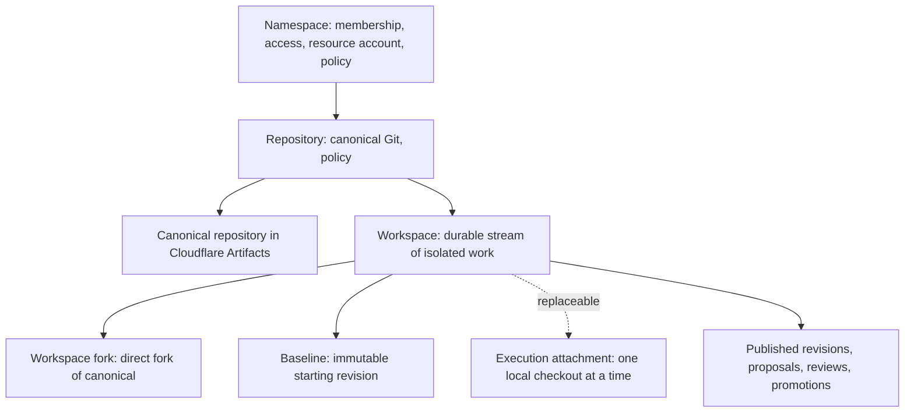
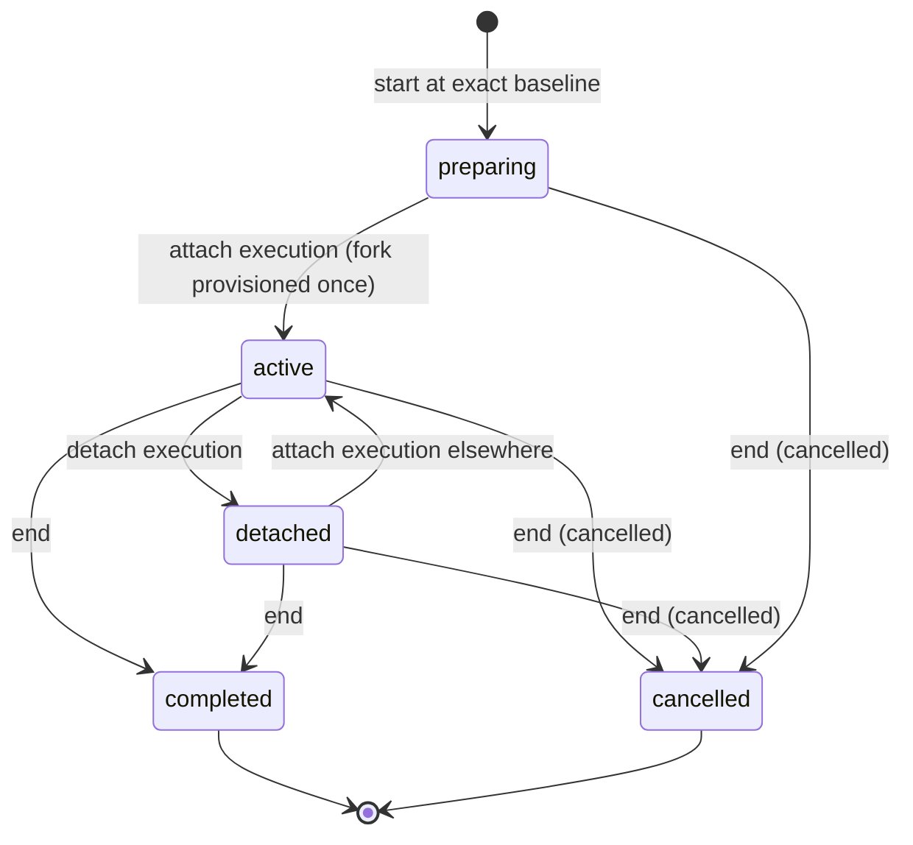

# Domain model

[Documentation map](../README.md#documentation-map) · [Product](product.md) · [Principles](principles.md) · [Architecture](architecture.md)

This document defines Cruce's durable concepts and how they relate. It is normative: code, APIs, MCP tools and the console use these terms. Exact schemas live in [src/shared/platform.ts](../src/shared/platform.ts). The [architecture](architecture.md) explains how the current implementation realizes the model and records where it still falls short.

## Hierarchy



```text
Namespace → Repository → Workspace
```

## Vocabulary

| Term | Meaning | Not to be confused with |
| --- | --- | --- |
| **Namespace** | Owns repositories, membership, teams and resource policy. Storage comes from the installation binding. Personal (one owner) or shared (Owner, Maintainer, Developer, Viewer) | A Cloudflare account; an organization on a forge |
| **Repository** | A Cruce-managed Git repository with a stable ID, default branch, grants and policy. Names are mutable addresses | A local clone; an upstream forge repository |
| **Canonical repository** | The authoritative Git repository for a Cruce repository, stored in Cloudflare Artifacts. Its default branch advances only through promotion | A workspace fork; retained source storage; `origin` on someone's laptop |
| **Upstream** | An external forge repository (GitHub, GitLab, …) that may remain the public or organizational source | A second canonical authority |
| **Actor** | An authenticated principal performing an operation: a human (console or paired terminal) or an agent (one OAuth connection of a user). Its `name` is a client label, never proof of which tool ran | A durable owner of work |
| **Workspace** | One durable stream of isolated work against one repository: owner, baseline, fork, pushed and published revisions, provenance, lifecycle and relationships to other concurrent work | An agent session, an agent invocation, a local checkout, a process or a branch name |
| **Workspace owner** | The user who owns the workspace. Any of that user's authorized connections, whichever tool it is, may act on the workspace within its scopes | The actor that happened to create it |
| **Baseline** | The exact canonical revision a workspace started from (`baseRevision`). Immutable | "Latest main" |
| **Workspace fork** | One reusable direct fork of canonical in Artifacts, owned by the workspace and reused for its whole life | A per-prompt or per-session copy |
| **Execution attachment** | The local checkout (worktree, isolated clone or attached existing checkout) on one machine through which the workspace is currently being advanced. At most one at a time. Explicitly detachable and replaceable | The workspace itself |
| **Presence** | Whether the attached execution has reported activity in the last 90 seconds. Derived; shown as *disconnected* when stale | Ownership, intent freshness or lifecycle |
| **Published revision** | A pushed workspace revision retained by Cruce for review, with its review base, content hash, storage and producing actor (`Artifact` with `kind: "source"`) | Approval; correctness |
| **Evidence** | Revision-linked claims or results such as reported test runs or a human attestation (`Artifact` with `kind: "evidence"`, `Verification`) | Cruce-executed CI |
| **Proposal** (product term: *change*) | An exact published revision offered for review against a pinned base | A pull request on a moving branch |
| **Review / approval** | A participant's reasoned evaluation of one exact revision. Only an authenticated human Maintain approval, recorded with its authority, satisfies promotion | Approval of a workspace or a branch |
| **Reconciliation** | Explicitly combining a workspace's work with accepted canonical source using Git, verifying the result, and publishing it as a new revision for fresh review | Fetching; receiving an update |
| **Promotion** | The human-authorized, controller-gated, non-forced Git update that advances canonical from the approved base to the approved revision | Approval alone; local merge |
| **Provenance / lineage** | The durable record linking workspace, owner, actors, baseline, revisions, evidence, reviews and promotions | Agent conversations or prompts |

Terms deliberately **not** used as durable domain objects: *session*, *run*, *mission*, *agent task*, *swarm*, *execution* (as work identity). A Claude, Codex or Cursor session is never a Cruce concept.

## Repository lifecycle

Repositories are active, archived, deleting or deleted. Only the authenticated console namespace Owner can archive, restore or permanently delete a repository. Archive preserves source and history and disables writes; restore enables work again. Archived repositories remain listed with an explicit label.

Archive and deletion require ended workspaces, closed changes, settled promotions/resource operations and completed push-observation subscription cleanup. A disconnected workspace still blocks retirement. Deletion requires typing the current repository name, freezes the repository before cloud effects, and cannot be cancelled after durable authorization. Cleanup confirms the recorded provider identities and absence, removes canonical last, then purges coordination history and the derived source cache. Interrupted effects reuse the same operation and namespace reservation; current authority/policy/identity remain mandatory.

Permanent deletion is the explicit exception to source and provenance retention. It leaves local checkouts and external upstream repositories untouched, retains a minimal tombstone/receipt and the namespace resource ledger, and frees the repository name and live namespace capacity for a new stable ID. Old IDs and creation keys cannot resurrect deleted work. [ADR 0010](decisions/0010-repository-archive-and-permanent-deletion.md) owns this exception and its recovery ordering.

## Workspace identity

```text
agent invocation  ≠ workspace
agent session     ≠ workspace
local checkout    ≠ workspace
machine / process ≠ workspace
workspace         = durable unit of concurrent Git work
```

A workspace belongs to one repository and one owner. Its baseline never changes. It owns exactly one fork once it has been attached, and reuses that fork across every push and publication. It does not depend on a local path, process, machine or agent session:

| Event | Effect on the workspace |
| --- | --- |
| Agent session ends, process exits, terminal closes | None. Presence becomes disconnected after 90 s; ownership and the attachment remain |
| Execution attachment is detached | The workspace, fork, history and provenance remain; it can be attached again elsewhere |
| A different tool or machine of the same owner continues it | It attaches a new execution context, starting from the workspace's pushed fork head |
| Local worktree is removed | Pushed and published work remains |
| Workspace completes or is cancelled | Its checkout reservation is released; no source is accepted or deleted; retained source and provenance remain. Cancelling withdraws its open changes |
| Fork is cleaned up | Only after proof that every fork ref is retained; the workspace record remains |

Only pushed revisions travel between execution contexts. Unpushed local commits and uncommitted files belong to the machine that has them. Git, not Cruce, is the transport.

## Revision vocabulary

Correctness depends on naming the exact revision. "Latest" is never sufficient where a decision is involved.

| Revision | Field / source | Trust |
| --- | --- | --- |
| Baseline | `Workspace.baseRevision` | Recorded at start; immutable |
| Reported head | `Workspace.headRevision`, `changes`, `commits` from the attached execution | Reported by the participant |
| Pushed revision | Workspace fork ref | Observed by identity-checked ref inspection after opt-in event ingestion or bounded reconciliation; never publication or acceptance |
| Published revision | `Artifact.revision` with pinned `Artifact.baseRevision` | Retained and hashed by Cruce; says nothing about correctness |
| Integrated revision | `Workspace.integratedRevision`: review base of the latest publication | Advances only through publication, never through a fetch |
| Proposed revision | `Proposal.revision` against `Proposal.base` | Fixed for the life of the proposal |
| Approved revision | Human `Review.revision` with outcome `approve` | Applies to that revision only |
| Observed canonical | `RepositoryState.observedCanonical` | Confirmed provider ref; movement or deletion can block promotion but cannot accept source |
| Canonical revision | `RepositoryState.sourceHead` | Advanced by initial provisioning or a completed promotion |

## Workspace lifecycle



Presence is not part of the lifecycle. An `active` workspace whose execution has gone quiet is *displayed* as disconnected. Its attachment, local lock and server checkout reservation remain until someone explicitly detaches or ends it. Elapsed time never releases ownership, never detaches and never cleans up.

Cancelling abandons the work, so its open changes are withdrawn (recorded as rejected) instead of waiting for review; a change already being promoted blocks cancellation. Completing leaves open changes reviewable. In the console, the owner's **Delete workspace** is one confirmed action: it ends the workspace (cancelled, or completed when some of its work was promoted), then deletes its fork under the normal retention proof. The workspace then leaves the live view as earlier work; its published revisions and provenance stay. A maintainer may finish deleting someone else's ended workspace. If a bridge still holds the checkout, its next `cruce end` or `cruce detach` releases it locally.

The work itself follows Git:

```text
baseline → local commits → pushed revision → published revision → proposal
        → review → reconciliation (as needed) → human approval → promotion → canonical revision
```

## Canonical repository and upstream

```text
Upstream forge (GitHub / GitLab / …)            optional, external
        │  explicit import / publication (roadmap)
        ▼
Cruce repository ── canonical Git in Cloudflare Artifacts (authoritative inside Cruce)
        ├── workspace A fork
        ├── workspace B fork
        └── retained source/evidence storage
```

- Canonical is the authoritative repository inside Cruce. Workspace forks start from it, and promotions advance it.
- A forge may stay the public or organizational source. Today, creating a Cruce repository starts a new canonical history. Explicit import from a forge, divergence inspection and publication of approved revisions back to it are [roadmap](../ROADMAP.md) items. There is never silent bidirectional sync and never two canonical authorities.
- Remote URL matching never proves repository identity. Stable Cruce and provider IDs do. Canonical, fork and retention provider IDs remain bound to the repository across interruptions and cleanup; a recreated name cannot inherit them. Published source and evidence storage name their provider repository ID. Unknown creation outcomes or retained storage without a recorded ID require administrator reconciliation before resource access.

## Local execution model

Agents and developers run on their own machines. Cruce never launches, schedules or hosts them.

```text
canonical ─▶ workspace fork ─▶ local worktree / clone / existing checkout
                                        │  Claude, Codex, Cursor, scripts, humans edit
                                        ▼
                                 local commits ─▶ git push to the workspace fork
                                        ▼
                              Cruce observes, publishes, coordinates durable state
```

- The local bridge creates a Cruce-owned worktree for agent writers at the exact baseline, or attaches a human's existing checkout. It adds a unique `cruce-<workspace>` remote and branch-scoped push destination. Existing remotes such as `origin` are never rewritten, and history is never uploaded implicitly.
- A persistent local writer lock prevents two workspaces from sharing one checkout. A server checkout reservation prevents another workspace from claiming the same context.
- Several tools may operate in the same attached checkout. That is a local choice; Cruce records which actor performed each operation.
- To continue a workspace on another machine or in another checkout, detach the old execution and attach a new one. The new checkout starts from the workspace's pushed fork head.

Change reports record `lastReportAt` independently of presence. Heartbeats never refresh report age. Historical reports without a timestamp have unknown freshness; stale reports do not release ownership or establish that changes are safe.

## Concurrency model

Workspaces relate through canonical and through the paths they touch. Cruce shows those relationships honestly:

| Relationship | Basis | Meaning |
| --- | --- | --- |
| Published revision vs canonical | Complete all-parent cached Git ancestry; labelled baseline before first publication | current / ahead / behind / diverged / unrelated; unknown when ancestry is unavailable |
| Ancestry comparison | Git ancestry over available objects | ahead / behind / diverged / unrelated, or *unavailable* when objects are missing |
| Path overlap | Changed paths reported by present writers, including both rename endpoints, deletions and binary files | Advisory: work touches the same files |
| Presence | Recent activity from the attachment | Whether the reported state is recent, not whether it is complete |

Overlap is not a Git conflict, a semantic conflict, a reason to stop, or scheduling clearance. Its absence does not prove compatibility: an API change and its caller can conflict without sharing a path. Structural or semantic hints may enrich this later, but never grant authority. See [principles](principles.md#5-be-honest-about-what-coordination-knows).

## Reconciliation model

1. A proposal binds one published revision to its pinned base.
2. Reviews and evidence refer to that exact revision. Any change to the source means a new revision, a new proposal, fresh evidence and fresh review. A stale proposal cannot be made current by rewriting its base.
3. If canonical has advanced past the proposal's base, the proposal is not ready. The workspace explicitly fetches canonical, merges with Git, verifies, pushes, publishes, and proposes the reconciled revision.
4. Readiness is derived by the controller: open proposal, base equal to current canonical, human approval of the exact revision, reasoned resolution of concerns, and required trusted evidence without failures.
5. Promotion is a non-forced Git update of canonical from the approved base to the approved revision, validated at the remote ref update. An unexpected base fails closed.
6. Receiving, acknowledging or fetching an update proves nothing about incorporation or verification. Only a new published revision and fresh review do.

## Provenance model

These facts must survive sessions, detaches, fork cleanup and machine loss:

| Record | Preserved facts |
| --- | --- |
| Workspace | ID, repository, owner, creating actor, title, description, baseline, fork identity, lifecycle timestamps |
| Activity | Actor, kind and subjects for start, attach, detach, change reports, publication, proposal, review, verification, promotion and cleanup |
| Published revision | Workspace, producing actor, revision, review base, content hash, storage repository/ref/revision, trust |
| Evidence and verification | Exact revision, kind, outcome, trust (`reported` or `human_attested`), actor, optional stored content |
| Proposal and reviews | Exact base and revision; each review's actor, outcome, reason and any human resolution |
| Promotion | Proposal, expected base, promoted revision, human actor, operation identity, phase and outcome |

Provenance never includes agent prompts, conversations or reasoning. Git authors, branch names and client labels are recorded as data, never as identity or authority.

## Authority model

Authority is derived on every request, including retries, from the authenticated actor, current namespace membership, repository grants, the connection's repository approval (every repository its user can access, or a chosen list), and capability scopes.

| Operation | Who may perform it |
| --- | --- |
| Manage namespace membership, teams and policy | Namespace Owner (Maintainer where policy allows) |
| Create a repository / provision canonical | Authenticated human with Maintain |
| Read repository state, source, provenance; clone or fetch canonical and forks | Read grant; agents need `cruce:read` |
| Explicit stored-source inspection and cache recovery | Read grant; agents need `cruce:read`; namespace/repository `source.read` policy applies, with an operation identity |
| Start a workspace | Write grant; agents need `workspace:write` |
| Attach, detach, report, heartbeat, end a workspace | The workspace owner, through any authorized connection; agents need `workspace:write`; a paired terminal is bound to one workspace |
| Push to a workspace fork | The workspace owner; agents need `workspace:write` and `revision:publish` |
| Push to canonical directly | Nobody. Canonical advances only through promotion |
| Publish revisions or evidence | The workspace owner, with the matching publish scope |
| Propose a published revision | The workspace owner |
| Review, record reported evidence, request promotion | Repository writers, humans or agents (`change:write`, `promotion:request`) |
| Approve for promotion, attest evidence, resolve concerns, reject, promote | Authenticated human with Maintain; never an agent and never a paired terminal |
| Clean up a workspace fork | The workspace owner, through any authorized connection, or a human with Maintain; only after the workspace ends and every ref is retained |

Promotion approval is stamped server-side with the human maintainer authority exercised for that exact revision. Unmarked historical reviews remain visible, but open changes require fresh qualified approval. Completed canonical promotions remain unchanged. Qualified approvals are historical decisions; the current promoter must still be authorized. See [ADR 0006](decisions/0006-qualified-approval-and-publication-recovery.md).

Effective agent authority is the intersection of its user's current authority, the connection's repository approval and the granted scopes. An approval of all repositories follows the user's current access, including repositories created later, and never widens it ([ADR 0011](decisions/0011-account-level-connections-and-local-setup.md)). Revoking any of them applies to the next request, including retries of earlier operations.

## Retention and cleanup

- Completion preserves commits, published revisions, evidence and provenance. Ending a workspace never accepts or deletes source.
- Local cleanup removes only Cruce-owned worktrees, and only when they are clean and their head is published or still at the retained baseline.
- Fork cleanup requires an ended workspace and proof that every fork ref is retained by canonical or retained storage. Unretained commits, annotated tags and unknown refs block deletion, and so does uncertainty. To discard unpublished work, delete those fork refs with Git first.
- Explicit retention inspection records exact fork refs, retained/unretained results, completeness and check time. Recorded inspection is an observation; cleanup checks again before accepting deletion.
- Cleanup authorization is durable for one exact operation and fork ID. An alarm may resume only that submitted operation, using its original reservation under current membership, repository access, scopes and resource policy. It never creates a new system actor or derives permission from age. OAuth grant removal, expiry or changed repository approval blocks recovery until a current authenticated retry. Confirmed deletion is recorded before reservation settlement.
- Source referenced by a published revision is retained. Publication pins an exact retention intent before pushing and saves its artifact, activity and receipt before settling the original resource reservation. Already-confirmed retention can be recorded after workspace completion or cache loss; recovering an older publication never regresses newer workspace state.
- The local Git cache is disposable. Eviction preserves retained source and provenance; explicit identity-checked recovery restores exact source without requiring the workspace fork. Cache-only coordination reads may show source or ancestry as unavailable. Provider first-parent history does not establish complete Git ancestry.
- Presence expiry, disconnection and detachment are never cleanup triggers. Cleanup is always an explicit, authorized operation.

Coordination capacity is finite and inspectable. A full current-state or retained-record envelope rejects new work before resource I/O while preserving records and recovery headroom. Activity windows are views over retained history; receipts and charged uncertainty never expire into permission to repeat an effect. Presence and change reports are observations: each workspace keeps only its latest heartbeat and report, and repeated change reports are coalesced in activity. Finished work (an ended workspace whose fork is gone, with every change closed and every promotion settled) moves out of the live repository view into an immutable archive bundle. It is retained and readable, never deleted by workspace cleanup or expiry, and no longer counts toward live limits. [ADR 0005](decisions/0005-bounded-state-and-authorized-cleanup-recovery.md) and [ADR 0009](decisions/0009-replaceable-observations-and-archived-finished-work.md) record this policy.
