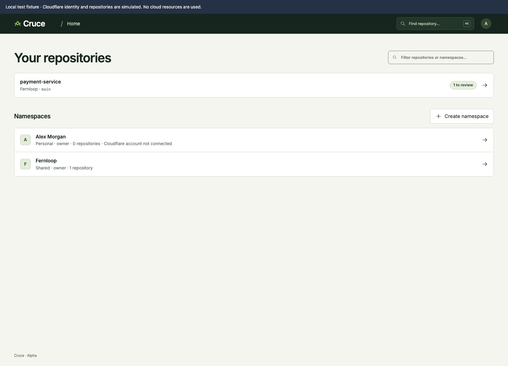
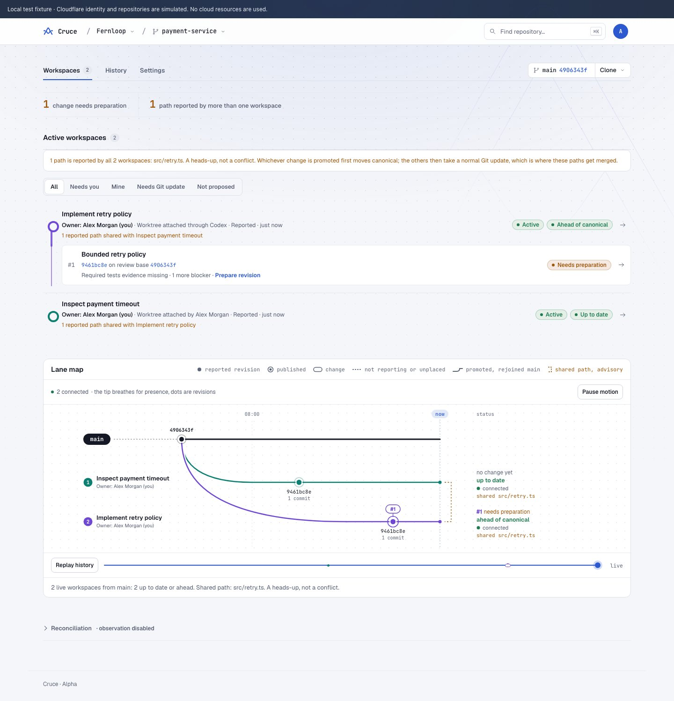
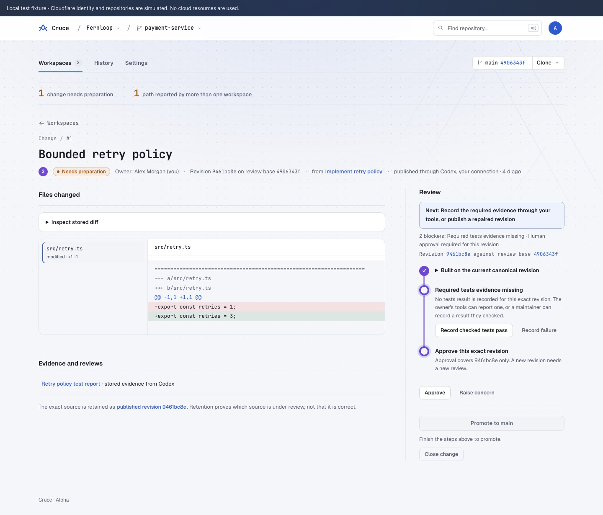
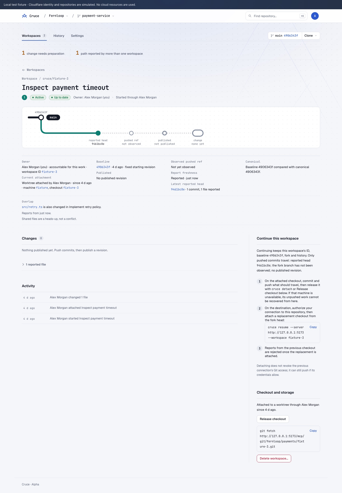
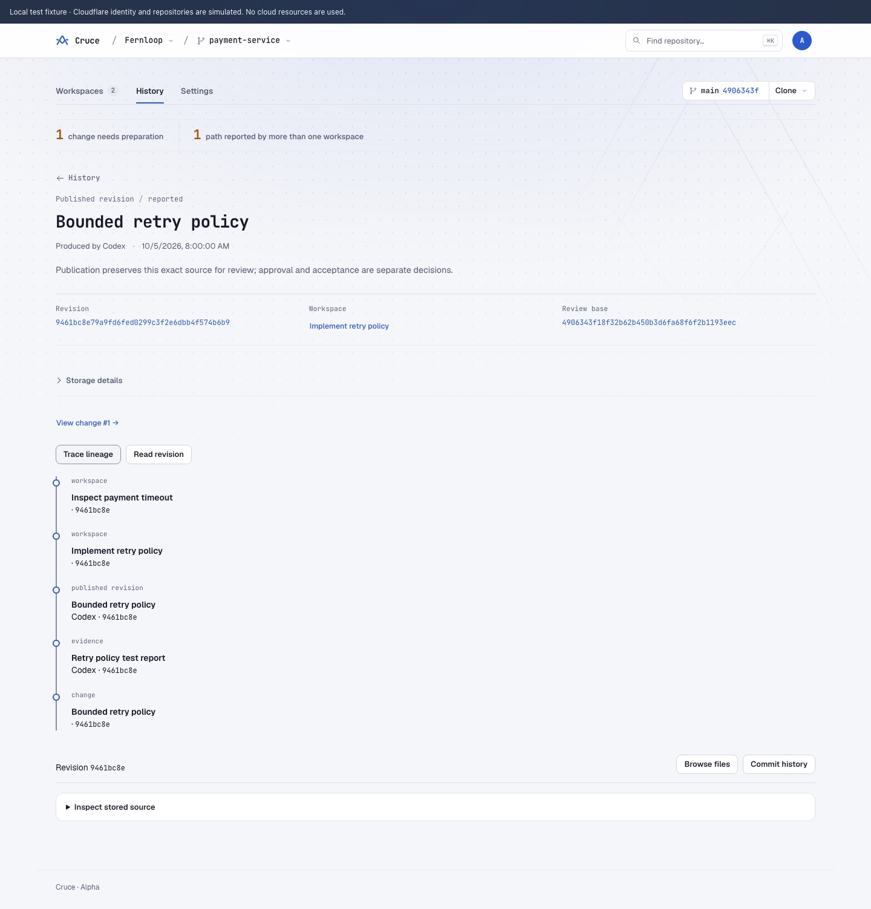
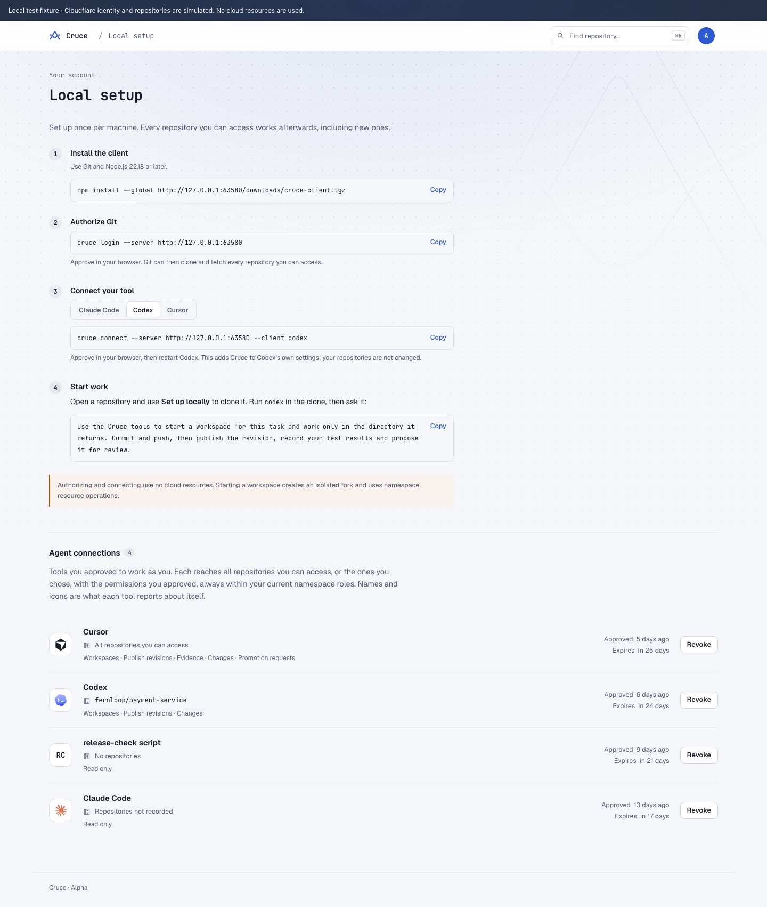
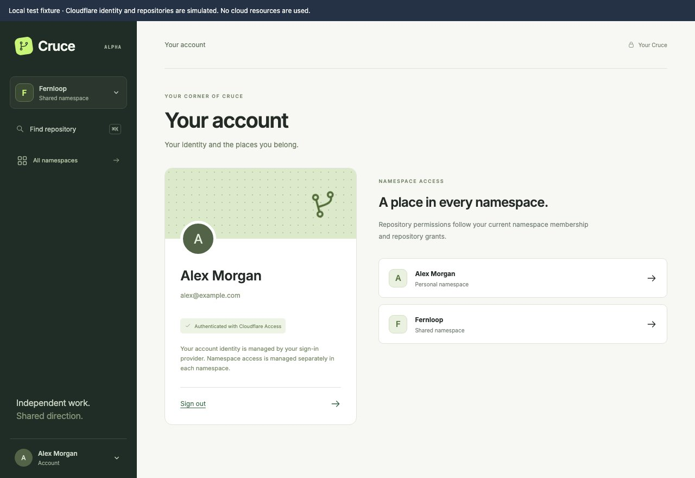

# Local console walkthrough

[Documentation map](../README.md#documentation-map) · [Contributor setup](../CONTRIBUTING.md#set-up-and-explore) · [Verification status](local-verification.md)

Use this walkthrough to explore Cruce while it is in development. The screenshots come from the local browser fixture. They illustrate the current console, not a stable UI contract or evidence of a live deployment.

The fixture runs the real console and controllers with fixed time and deterministic Git objects. All names, accounts and workspaces are sample data. Authentication and Cloudflare storage are simulated, promotion is simulated in place of the real non-forced Git update, and no cloud resources are used. Storage identifiers and content hashes are fixture placeholders.

## Start the demo

With Git, Node 22.18+ and pnpm installed, run from the repository root:

```sh
pnpm install --frozen-lockfile
pnpm dev:fixture
```

Open the loopback URL the server prints. Set `PORT` to choose a fixed port. Restarting the fixture starts a fresh sample session. For real repository participation, use [Git and bridge setup](native-setup.md).

## 1. See what needs you

**Home** lists your repositories across namespaces, most urgent first. The sample **payment-service** in the shared **Fernloop** namespace shows **1 for you** and **1 to prepare**: its one change lacks required tests evidence, and you own it. **Needs you** names that change with its owner (you), exact revision, review base and primary blocker. Below are your namespaces: your personal **Alex Morgan** namespace has no Cloudflare account connected, and Home says so. Type in **Find repository** in the header, or press Cmd/Ctrl K, to jump anywhere.



## 2. Open the repository

Click **payment-service**. The header shows canonical `main` and its exact revision. Below it, the attention bar says in plain words what needs someone: **1 change needs preparation** and **1 path reported by more than one workspace**. Each item opens its filtered list. The **Workspaces** tab lists each workspace once with its open changes under it; **Bounded retry policy #1** hangs off **Implement retry policy**, marked **Needs preparation**, with its exact revision on its review base and "Required tests evidence missing · 1 more blocker". The lane map follows the list.



## 3. Review and promote the exact revision

Open **Bounded retry policy #1**. The review is a checklist for this exact revision:

1. **Built on the current canonical revision**: already checked.
2. **Required tests evidence missing**: Codex stored a test report, but no tests result was recorded for this revision. Normally the owner's tools report one and a maintainer attests it; here, as a maintainer who checked the tests, click **Record checked tests pass**. The note is optional.
3. **Approve this exact revision**: click **Approve**. Approval covers `9461bc8e` only; a new revision needs a new review.

When every item is checked, the change shows **Ready to promote** and **Promote to main** explains exactly what it does: move canonical `main` from `4906343f` to `9461bc8e` with a non-forced Git update. Raising a concern, recording a failure or closing the change asks for a reason. The files changed and the evidence (including Codex's stored test report) are below the checklist.

Promote it. The change becomes **Promoted**, the header shows the new canonical revision, and the attention bar now reports **1 workspace needs reconciliation**: the other concurrent workspace started from the old baseline and has canonical changes to merge with Git before it publishes.



## 4. Follow concurrent workspaces

The **Workspaces** tab lists each workspace with its state, its relation to canonical and what it overlaps with. Open **Inspect payment timeout**: it shows the fixed starting revision, the reported head, whether it is up to date with canonical, and that `src/retry.ts` is also changed in **Implement retry policy**. Shared files are a heads-up, not a conflict. **Checkout and storage** shows the attached checkout (with **Release checkout**, so the workspace can continue elsewhere) and **Delete workspace**, which ends it, withdraws its open changes and deletes its fork once every fork ref is retained. Published revisions and history move to Earlier work.



## 5. Look back through history

The **History** tab shows canonical promotions as a timeline, published revisions, stored evidence and activity in plain sentences. Open the published **Bounded retry policy** revision to see its exact revision, pinned review base, producing workspace and storage details. **Trace lineage** connects it to its workspace and change; **Browse files** and **Commit history** inspect the retained revision read-only. Publication proves which source was retained, not that it is correct.



## 6. Connect an agent

**Local setup** (in the avatar menu) holds the once-per-machine commands: install the client, authorize Git with `cruce login`, connect Claude Code, Codex or Cursor with `cruce connect`, and the sentence to give your tool. Its connections list shows what each approved tool reaches. **Clone**, next to a repository's canonical revision, then only clones it or attaches an existing checkout. Cruce doesn't run agents; each tool runs on your machine and works in its own Cruce workspace. Each workspace creates a fork in the installation's Cloudflare storage and uses namespace resource operations. Namespace **Settings** shows inherited Git storage and who may run each storage operation; users do not connect Cloudflare accounts.



## 7. Account and access

Click the avatar for a compact card with your name, email and **Sign out**; the current page stays put. Sign-in identity and namespace or repository permissions are separate. **Members** and **Teams** are in shared-namespace navigation; repository access is in the repository's **Settings**.



Cruce's coordination boundary ends at reviewed reconciliation into canonical Git. External systems own builds, releases, deployments and runtime operation.

## Refresh these screenshots

Keep this walkthrough and its images together when visible console behaviour changes. `pnpm test:browser` writes fresh captures to the ignored `dist/ui-checks/`. Convert the matching captures (`home-1440`, `changes-1440`, `review`, `workspace-1440`, `revision-1440`, `connect-agent`, `account`) into the JPEG files under `docs/images/local-demo/`, for example with `sips -s format jpeg`. Use only sample identities, never capture credentials or a live account, and check every image and relative link.
