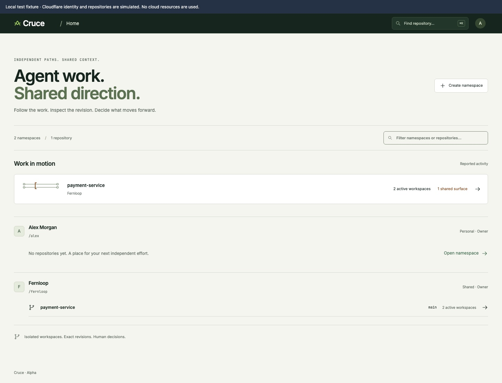
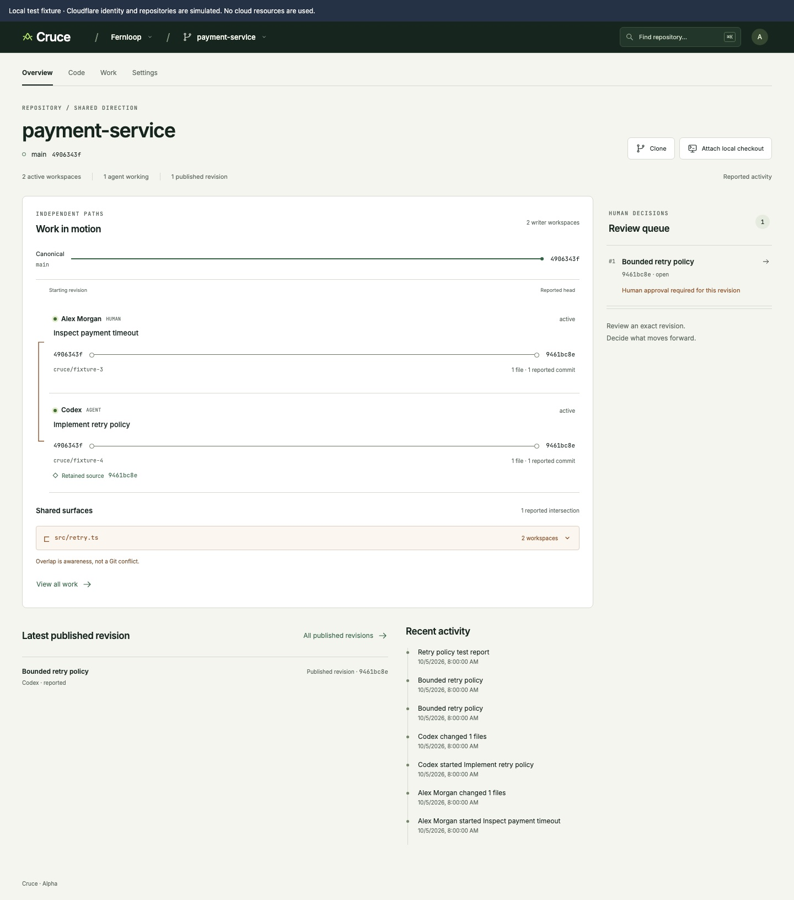
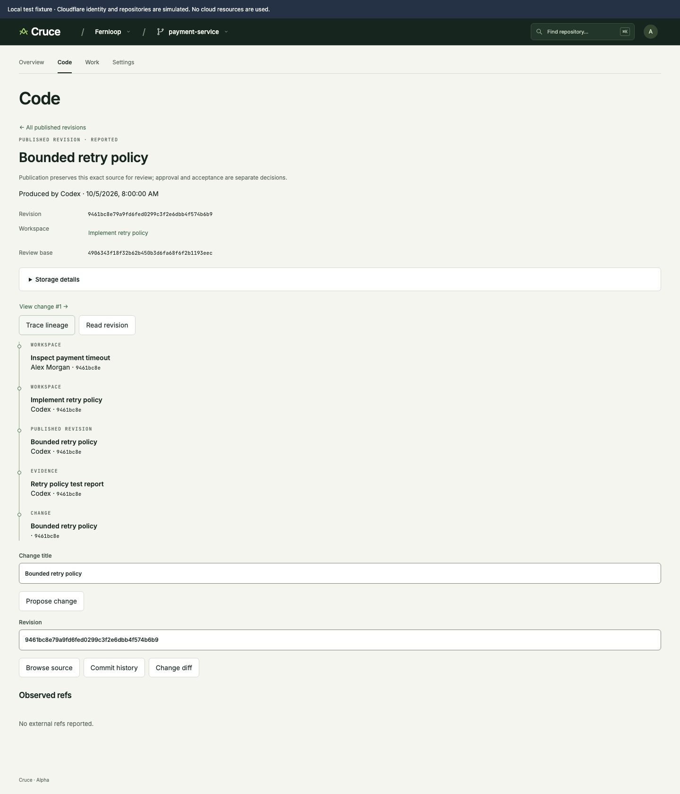

# Local console walkthrough

[Documentation map](../README.md#documentation-map) · [Contributor setup](../CONTRIBUTING.md#set-up-and-explore) · [Verification status](local-verification.md)

Use this walkthrough to explore Cruce while it is in development. Screenshots were captured on 2026-10-05 from the local browser fixture. They illustrate the current console, not a stable UI contract or evidence of a live deployment.

The fixture runs the real console and controllers with fixed time and deterministic Git objects. All names, account details and workspaces below are sample data. Authentication and Cloudflare storage are simulated; no cloud resources are used. Storage identifiers and content hashes shown in published revision and evidence details are fixture placeholders.

## Start the demo

With Git, Node 22.18+ and pnpm installed, run from the repository root:

```sh
pnpm install --frozen-lockfile
pnpm dev:fixture
```

Open the loopback URL printed by the server. The port changes between runs. Keep the server running while browsing; stop it with Ctrl+C. Restarting the fixture starts a fresh sample session. For real repository participation, use [Git and bridge setup](native-setup.md).

## 1. Find your namespace and repository

The Cruce mark always returns to this unscoped Home view. Inside a namespace or repository, use the named header dropdowns to switch scope without opening a modal. The opening view shows the personal **Alex Morgan** namespace and shared **Fernloop** namespace. Namespaces group compact repository rows. **Work in motion** shows miniature workspace paths and their reported shared surface, and provides a route into the active sample repository. Click **payment-service** to inspect it. From any page, type in **Find repository** in the header (or press Cmd/Ctrl K) to see matches underneath; on mobile, the search icon reveals a compact search panel. Search leaves the current page visible, and Escape dismisses the results.



## 2. Inspect concurrent work

The repository **Overview** shows two active workspaces: Codex is implementing a retry policy, and Alex Morgan is inspecting a payment timeout. Both report changes to `src/retry.ts`. **Shared surfaces** makes that overlap visible; it does not establish a Git conflict or semantic incompatibility.

Canonical source has its own line; writer lanes show immutable starting revisions and reported heads. A copper bracket identifies the shared surface without joining Git histories. Select the surface to see its participating workspaces.

The review queue names an exact revision, `9461bc8e`, rather than only a branch. Click **Bounded retry policy** to open its review. Click a workspace row to explore its actor, starting revision and execution details.



## 3. Read the review requirements

The focused change detail in **Work** pins base `4906343f` and head `9461bc8e`. It offers a reasoned review and verification attestation. **Promote source** is disabled in this sample state because human approval and trusted passing test evidence are still required.

Review decisions concern this exact revision. An authenticated human attestation and an agent's reported evidence have different trust. The fixture lets you explore the controls, but it does not prove hosted Git promotion works. **Inspect diff** leads to the Code view; **Code** also provides source and history controls.


## 4. Follow the published revision and evidence

Repository navigation has four tabs: **Overview**, **Code**, **Work** and **Settings**. Open **Code**, then **Bounded retry policy** under **Published revisions**. Its details identify the exact revision, pinned review base, producing workspace, storage reference and content hash. **Trace lineage** provides provenance context; **Browse source**, **Commit history** and **Change diff** inspect the retained Git revision. **Storage details** reveals the retained storage reference and content hash. Here storage and hash values are simulated placeholders, and trust is **reported**.

Open **Work**, then the change to see **Retry policy test report** alongside verification for that exact revision. **Read evidence** displays the stored fixture report; its reported results do not satisfy the trusted passing test requirement. The **Revision evidence** collection in Work also exposes reports before a change is proposed.

Cruce’s coordination boundary ends at reviewed reconciliation into canonical Git. External systems own subsequent builds, releases, deployments and runtime operation.



## 5. Keep account and namespace access distinct

Click the avatar at the top right. **Your account** opens a compact profile card with the Cruce junction motif, an initial tile, the sample name and email, and a distinct **Sign out** row. Namespace selection stays in Home and the named header dropdown. The current page stays in place; Escape closes the menu and returns focus to the avatar. In the real system, sign-in identity and namespace/repository permissions are separate. **Members** and **Teams** live in shared-namespace navigation, while repository settings live in repository navigation. Development status appears quietly in the footer.


## Refresh these screenshots

Keep the walkthrough and images together when visible console behavior changes. Start a fresh `pnpm dev:fixture` session and follow the steps above without submitting reviews or changing the seeded data. Capture full-page browser screenshots, retain the fixture banner, and replace the matching files under `docs/images/local-demo/`. Use only sample identities; never capture credentials or a live account for this guide. Update the capture date and captions, then check every image and relative link.

Automated browser checks write disposable screenshots to ignored `dist/ui-checks/`; the curated images in this guide are tracked documentation assets. See [verification](local-verification.md) for what the checks establish and which live boundaries remain unverified.
