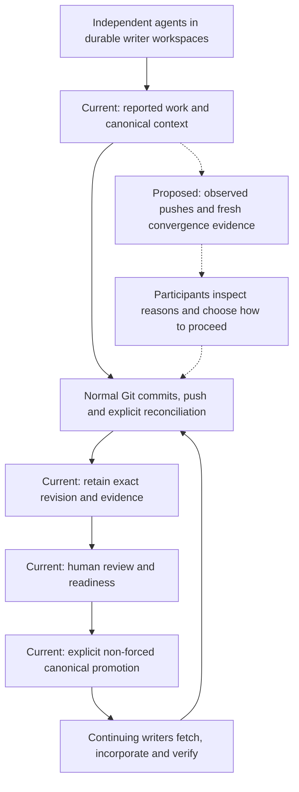

# Product thesis

[Documentation map](../README.md#documentation-map) · [Principles](principles.md) · [Architecture and audit](architecture.md)

Cruce is a **Git-native coordination and convergence layer for concurrent coding agents**.

**Git records what happened. Cruce coordinates what is happening.** This describes the intended division of responsibility, not a claim that Git lacks collaboration features or that Cruce already observes every participant.

Developers keep Claude Code, Codex, Cursor, Copilot or other Git-aware agents wherever those tools already run. Cruce gives their independent workspaces shared awareness, preserves exact Git provenance, surfaces convergence risks while work is happening, and provides a human-governed path into canonical source. Cruce never launches those agents or owns their conversations.

The first audience is one developer using Codex and Claude Code on one repository. Configuration writers exist for Codex, Claude Code and Cursor; actual heterogeneous participation and useful context consumption remain unverified. The working name remains provisional.

## The problem above isolation

Branches, worktrees and forks already isolate changes. They do not, by themselves, tell independent participants which current assumptions, uncommitted changes or intended outcomes interact. The developer can still become a relay for upstream movement, duplicated work, review evidence and reconciliation decisions.

Cruce must save more effort than participation costs. Its value is the complete lifecycle: durable workspace identity → in-flight awareness → exact source → intentional reconciliation → revision-bound review → human-approved canonical promotion → continuing writers incorporating accepted source.

Shared paths are advisory evidence. Two agents can safely edit different functions in the same file; changes to an API and its caller can be incompatible without sharing a path. A clean merge does not prove correct behavior. Deterministic Git evidence comes first; declared intent and structural context can enrich it without claiming perfect semantic detection.

## What exists today

| Capability | Current implementation | Important limit |
| --- | --- | --- |
| Durable participation | Actor-owned workspaces, immutable starting revisions, dedicated local execution contexts and reusable direct canonical forks | Process presence is separate from durable ownership; attachment is not arbitrary repository import |
| Shared awareness | Cooperative path/commit reports, active presence, path overlap and accepted-source comparison | Report freshness shares an activity clock with heartbeats; no independently observed latest-push field or event ingestion |
| Source convergence | Standard Git, exact pushed-revision retention, ancestry checks and fresh proposals after integration | Reconciliation is performed by participants; no structured multi-input reconciliation record |
| Review and promotion | Exact candidate reviews, reasoned concerns, evidence readiness and human-only promotion | Expected-base race and provider-identity gaps remain; see the [architecture findings](architecture.md#architecture-contradictions-and-correctness-gaps) |
| Provenance and retention | Workspace, source/evidence artifact, proposal and promotion lineage; guarded fork cleanup | Retention proves recoverable source, not correctness; cache recovery and complete interruption recovery need work |

The strongest implemented distinction is this combination across independently authorized participants, rather than any individual Git feature. The real-Artifacts convergence scenario demonstrates exact retention and repaired convergence with fixture authority. It does not establish deployed OAuth publication, authenticated browser approval, actual two-tool consumption or saved human effort. The [verification record](local-verification.md) distinguishes these claims, including the newer consent defect and provider-token replay evidence.

## The coordination loop

Solid arrows describe implemented mechanisms, subject to the audit's correctness and verification limits. Dashed arrows describe the next product capabilities. Neither reading nor fetching proves incorporation. A changed candidate needs fresh evidence and review; approval concerns a revision, not an entire moving workspace.

Convergence-first means timely, explainable awareness and deliberate integration are the proof of product. Structured intent and explicit responses should reduce ambiguity when useful. Automatic sequencing and opt-in pause/resume are exploratory, not prerequisites. Any later controls need meaningful interference, a supported action boundary, opt-in, safe release and a human override. Delivery, acknowledgement and observed action remain separate facts.

## Why Git/GitHub alone may be enough

Git supplies source history, transport, ancestry, diffs and integration. GitHub adds review, policy, checks and agent management. For independent tasks or a developer already satisfied with worktrees and PR review, Cruce may add more setup and reporting than value.

Cruce's hypothesis is narrower: a durable cross-tool account of in-flight work and accepted-source movement can prevent avoidable rework before integration, while preserving inspectable review provenance afterward. This must be measured against existing workflows. Heterogeneous agents alone are not a moat.

## Why Cloudflare and Artifacts

Cloudflare is the intentional primary deployment platform. Workers host authentication, API/MCP and the Git gateway. Existing SQLite Durable Objects own identity, namespace authority/budgets and repository coordination. Artifacts supplies canonical Git, direct workspace forks, scoped credentials and retained source; Cruce supplies their coordination meaning. This avoids operating a custom Git hosting service.

Artifacts is already foundational to isolation and retention, but underused for activity observation and lightweight inspection. The next advantage would be verified event-driven observations feeding explainable coordination, with recovery when delivery is incomplete. APIs/bindings can reduce unnecessary object-cache work where their semantics and connected-account authority fit. [Architecture decisions](architecture.md#cloudflare-capability-fit) explain why neither every Cloudflare service nor an immediate binding migration is justified.

Using Cloudflare or Artifacts is not exclusive differentiation. Requiring a connected resource account and a new canonical remote is an adoption cost. Cruce must earn that cost through the complete lifecycle.

## Competitive risks

Primary documentation checked on **2026-10-06**. These are documented capabilities, not hands-on comparative verification or proof that a competitor lacks an undocumented feature. The implications are Cruce's assessment.

| Alternative | Documented capability | Implication for Cruce |
| --- | --- | --- |
| Git and GitHub | [Git worktrees](https://git-scm.com/docs/git-worktree) provide separate working trees; [GitHub merge queues](https://docs.github.com/en/repositories/configuring-branches-and-merges-in-your-repository/managing-protected-branches/managing-a-merge-queue) validate changes against the latest target and queued work | Isolation, review and integration checks are a strong baseline with less hosting change |
| GitHub agents | [Third-party coding agents](https://docs.github.com/en/copilot/concepts/agents/about-third-party-coding-agents) include Claude and Codex alongside Copilot | “Multiple vendors” is already available in an established forge; independent native-tool participation must add measurable value |
| Codex | [Worktrees](https://learn.chatgpt.com/docs/environments/git-worktrees) support parallel chats on the project's computer or remote environment; [remote engineering](https://developers.openai.com/blog/mastering-codex-remote-for-engineering) includes steering and review | Native isolation and supervision already exist; Cruce must justify an additional shared repository layer |
| Cursor | [Worktrees](https://cursor.com/docs/configuration/worktrees) isolate agent tasks and support review, commits and PRs | Parallel work and its review path are not differentiation |
| Claude Code Agent Teams | [Experimental teams](https://code.claude.com/docs/en/agent-teams) support shared tasks, messaging and a coordinating lead | Coordination itself is not unique; Cruce should preserve independence from runtime ownership and show value across tools |
| Conductor | [Conductor](https://www.conductor.build/docs) runs Claude Code, Codex, Cursor and OpenCode with task workspaces and review/PR/merge flows | A particularly close substitute; workspaces plus multiple agents plus review is insufficient positioning |
| GitButler | [Parallel agents](https://docs.gitbutler.com/ai-agents/parallel-agents) organize independent branches within one shared working directory, with explicit dependency handling | Lower local setup overhead competes with Cruce's isolation cost; the shared-filesystem tradeoff differs from Cruce's writer model |
| Graphite / merge queues | [Graphite's queue](https://graphite.com/docs/graphite-merge-queue) handles stacked PR integration and validation | Cruce should focus on earlier awareness; do not duplicate integration queues or imply passing checks guarantee semantic correctness |
| MCP/file-claim tools | [MCP Agent Mail](https://github.com/Dicklesworthstone/mcp_agent_mail) documents messaging, acknowledgements, advisory path leases and optional commit guards | Lightweight cross-tool coordination already exists without moving canonical storage; a generic inbox or file claim is not a moat |

The largest risks are adoption friction, agents ignoring context, sparse/noisy observations, platform limits and incumbents bundling enough coordination. Better provenance without earlier saved work may justify a narrower product, but not the full thesis by itself.

## Boundaries

Cruce is not a Git replacement, general forge, IDE, coding chat, agent runtime/launcher, agent scheduler, CI/CD system, deployment platform or perfect semantic-conflict detector. Its responsibility ends at reviewed canonical Git. Participants and external systems run tests, builds, releases and applications. Analysis never grants authority, and ordinary editing needs no scheduling clearance.

The hierarchy remains **Namespace → Repository → Workspace**. ExecutionContext is local materialization, not workspace identity. Git authors, labels and remote URLs do not establish authority. Human approval remains required before promotion; automated acceptance is outside this target.

GitHub is a possible connected external provider, not a second canonical authority. Onboarding, external fetch, divergence inspection, reconciliation and publishing must be explicit. The roadmap gates this integration on adoption evidence and a documented authority model; it is not implemented.

## Proof before expansion

Run matched trials with one developer, one repository and real independently authorized Codex and Claude Code clients. Compare ordinary worktrees/Git review against Cruce, keeping tasks, tools and checks comparable. Include independent overlap, stale canonical, cross-file assumptions, behavioral merge failure, fresh review and retention after cleanup.

Predeclare trial counts, numerical benefit thresholds and overhead limits. Measure routine coordination time, manual relays, duplicated work, integration rework, delay, setup/reporting effort, false alarms, misses, hosting/agent cost and resulting quality. Count deliberate review separately. A manually relayed demo can test advice quality but cannot prove automated awareness or reduced intervention.

Continue only when repeated trials show net benefit. Narrow the product if value concentrates in upstream awareness or recovery; simplify if reporting or hosting costs dominate. The [roadmap](../ROADMAP.md#how-we-choose-what-to-build) owns acceptance priorities. The current recommendation is **CONTINUE WITH ARCHITECTURAL CORRECTIONS**: a credible convergence foundation, with safety gaps and an unproven in-flight value proposition.
