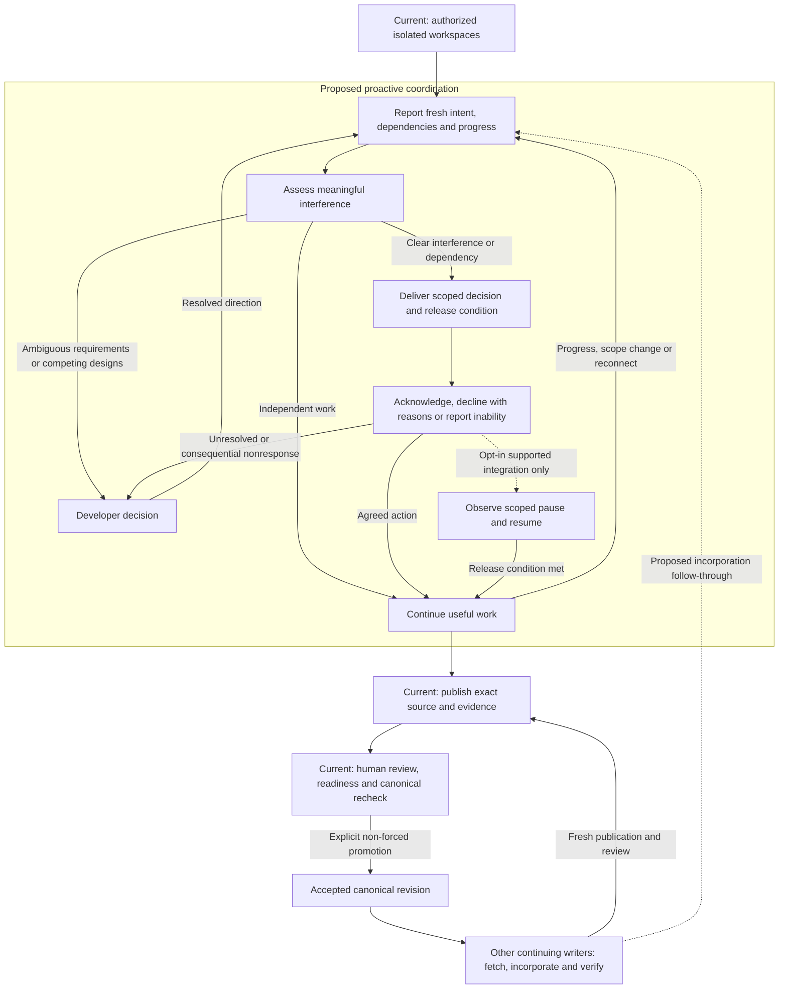

# Product thesis

[Documentation map](../README.md#documentation-map) · [Principles](principles.md) · [Architecture](architecture.md)

Cruce's product goal is to act as air traffic control for multiple coding agents from different vendors working on one repository: proactively coordinate their work to reduce avoidable conflicts, duplicated effort and routine human intervention. Agents keep using their own tools; Cruce provides shared repository context and coordination across them.

This is a direction to validate, not a claim that proactive control exists today. The implemented foundation provides isolated workspaces, cooperative observations and exact-revision review and convergence. Intent tracking, coordination decisions, acknowledgements and supported pause/resume controls are proposed in the [roadmap](../ROADMAP.md).

The initial evaluation setting is one developer, one repository and two agents: Codex and Claude Code, subject to demonstrated integration support. Cursor and other clients fit the same model. Shared namespaces and multiple repositories remain supported; neither is a prerequisite for proving the coordination benefit.

## The problem above isolation

An individual agent can use worktrees to separate its own tasks. That protects working files, but it does not establish a common record of intended outcomes, dependencies, changing assumptions or accepted source across independently authorized tools, machines and successive participants. A developer still has to discover what is happening, prevent duplicate effort, relay upstream changes, reconstruct what was tested and decide what can converge safely. Cruce is useful only if sharing this context changes agents' work early enough to save more effort than participation costs.

Cruce starts where individual-agent isolation ends. Its useful unit is concurrent repository work, independent of which agent vendor performs it. An authorized agent can participate in several workspaces; each workspace belongs to one actor, and each writer workspace owns one reusable direct fork of canonical. Local execution contexts materialize that durable work in worktrees or clones. There is no permanent fork per vendor and no privileged coordinating agent.

File overlap is only one clue. Two agents can change independent functions in the same file and both continue. Conversely, a Codex participant can change an authentication contract while a Claude Code participant updates a caller against the previous contract: the patches may share no paths and merge cleanly while behavior is wrong. Two agents can also implement the same outcome in different places, wasting effort without a textual conflict. An explicit dependency on another agent's result may justify sequencing only the dependent activity, while useful independent work continues.

Cruce currently exposes reported path overlap, accepted-source updates and exact source/evidence under review. It does not classify these examples reliably, infer every dependency or force an agent to consume context. No future classifier can guarantee prevention of every conflict or prove behavioral compatibility.

| Need | Implemented mechanism | Evidence boundary | Gap / proposed capability |
| --- | --- | --- | --- |
| Know who is working and where | Actor-bound workspaces, title/context, presence and reported paths | Local controller/bridge coverage; real heterogeneous participation remains unverified | Titles/context are not structured intent, dependency or progress tracking; heartbeat freshness does not prove report freshness |
| Recognize meaningful interference early | Advisory changed-path overlap and upstream revision inspection | Local coverage includes renames and binary paths; active overlap excludes disconnected writers | Intent, assumptions and dependency context; distinguish independent edits, duplication and incompatible work, with uncertainty |
| Keep useful work moving | Participants inspect context and choose their next action | Configuration writers exist for Codex, Claude Code and Cursor; useful context consumption is unproven | Decision delivery, acknowledgement and scoped sequencing; no current pause/resume control |
| Reconcile independent results | Normal Git fetch/merge, retained source and fresh publication | Local Git/controller checks; current hosted reconciliation and two-agent journey remain pending | Visible follow-through on incorporation and verification; receiving or fetching an update proves neither |
| Decide what lands | Exact-revision reviews, evidence, readiness and human-authorized promotion | Local checks; current live gateway/promotion remains unverified | Preserve deliberate human review while reducing routine coordination; passing checks do not guarantee correctness |
| Recover published work | Retained commits, source artifacts and provenance | Local coverage and historical provider evidence for an older implementation | Improve discovery/handoff; uncommitted files and full agent conversations are not retained |

The [verification guide](local-verification.md) owns dated evidence and limits. Implementation, local verification, historical provider checks and current live interoperability are separate claims.

## Boundaries

Cruce’s responsibility ends when isolated concurrent work is safely reviewed and reconciled into the canonical Git repository. CI, build/release orchestration, deployment, environment management, rollback and runtime operation belong to external systems.

| Cruce is not… | Consequence for the design |
| --- | --- |
| A replacement for Git or Git worktrees | Reuse Git commits, branches, history, diffs, merges and checkout isolation |
| A Claude Code worktree manager | Coordinate independent tools through a common repository model; client-specific setup is an adapter |
| A GitHub or GitLab clone | Hosting exists to support isolated work and exact source; do not expand into a general forge |
| A remote IDE or cloud coding environment | Editing and agent execution remain in participants' existing environments |
| An AI agent runtime | Do not launch agents, select their models or own their conversations |
| A generalized agent orchestration platform | Limit coordination to interacting repository work; no general task scheduler, mandatory plans, autonomous delegation or workflow engine |
| A CI/CD, deployment or runtime platform | Record revision-linked review evidence; external systems own builds, releases, environments, deployment, rollback and runtime operation |
| Another command language over Git | Use Git for source transport and manipulation; Cruce operations add coordination meaning |
| A requirement to abandon normal Git workflows | Preserve existing remotes and require explicit publication; ordinary local editing needs no Cruce clearance |

Normal Git does not mean unrestricted writes to every remote. The current architecture requires authoritative canonical Git storage backed by Cloudflare Artifacts and protects its accepted branch through human-reviewed promotion. Writers push normally into their own forks. GitHub/GitLab integrations and local-only canonical hosting are outside the current foundation. An arbitrary existing checkout is not automatically imported or identified by its remote URL.

Repository-specific sequencing recommendations and opt-in scoped pause/resume through supported integrations fit the intended boundary. They do not grant Cruce ownership of an agent runtime or require scheduling clearance for ordinary local edits. Current overlap remains advisory. Existing enforced controls concern authority, checkout isolation, resources, publication and promotion; they do not stop arbitrary agent execution. Future controls must state which client actions they can actually constrain and how that is observed. Unsupported clients remain advisory.

## The coordination loop

The intended loop builds on the current foundation; the proposed steps below are not available behavior today.

The proposed response loop does not establish enforcement by itself. Only a demonstrated, opted-in integration can constrain a specified action; unsupported clients remain advisory. Source review and promotion retain their current authority requirements.

1. **Implemented — join and isolate.** A human authorizes independent participants against a stable repository ID. Writers start from exact commits in dedicated worktrees or clones, keeping the immutable starting revision and durable workspace identity.
2. **Proposed — report intent and progress.** Participants describe intended outcomes, relevant code areas, assumptions, dependencies and useful independent work. Refresh bounded reports when scope or progress changes; ordinary editing does not require a mandatory plan or clearance.
3. **Implemented observation; proposed assessment.** Participants can inspect other work, advisory paths and upstream changes. Cruce would combine fresh intent and available source context to flag meaningful interference before avoidable work accumulates, without treating every shared file as a conflict.
4. **Proposed — decide, deliver and acknowledge.** Cruce would automatically recommend continuing, sequencing, a targeted pause or already identified independent work when the evidence and agreed policy are clear. An agent would receive decisions through a supported checkpoint/integration, acknowledge the applicable decision, decline with reasons or report inability to comply. Ambiguous requirements, competing design choices and unresolved conflicts go to the developer. Delivery, acknowledgement, reported action and observed enforcement remain distinct.
5. **Proposed — adapt while work continues.** Reassess affected advice after scope changes. Stale reports reduce confidence; a live connection alone cannot refresh intent. A missing acknowledgement or disconnect cannot be treated as compliance or permission to reuse a locked checkout. Reconnection requires refreshed context. A dependent activity may wait while independent work continues. The [roadmap interaction contract](../ROADMAP.md#proposed-interaction-contract) defines the required limits.
6. **Implemented — publish, review and promote.** Writers commit and push with Git, then publish exact retained source and revision-specific evidence. Human approval, controller readiness, checks against current canonical source and an explicit non-forced Git update are required for promotion. Cruce does not execute the reported tests or automate all review.
7. **Implemented participant responsibility; proposed follow-through tracking.** Other continuing writers explicitly fetch and incorporate accepted source with Git, resolve incompatibilities, verify the resulting revision and publish a fresh result for review. Receiving, acknowledging or fetching an update is insufficient. Preserve original workspace bases, published ancestry, earlier artifacts and reviews; a new revision requires fresh evidence and review.

The console supports understanding work and making decisions: Overview, Code, Work and Settings. Published revisions live in Code; revision evidence accompanies changes and workspaces in Work. Namespace membership and account configuration have their own scope. Coding chat, an editor and intake forms do not belong in this flow.

## What must be proven

The hypothesis is fewer routine human interventions, less duplicated work and less integration rework, without excessive delay, reporting burden or loss of quality. Deliberate review and design decisions remain valuable human work. More agents, status panels, acknowledgements or hosted forks are not evidence of value. A developer whose tasks are already independent, or whose tools already coordinate adequately, may gain little.

Compare matched tasks with Codex and Claude Code using ordinary isolated worktrees and Git review against Cruce. Include independent same-file edits, duplicated outcomes, cross-file incompatibility, explicit dependencies, scope drift, disconnect/recovery, ignored advice and canonical advancement. Measure routine intervention count/time separately from review, duplicated effort, integration rework, completion time, unnecessary waiting, report effort, setup/resource cost, missed interference, false alarms and quality.

Predeclare improvement targets and acceptable overhead before evaluating results. Agents must demonstrably consume and act on relevant context; generated configuration or successful MCP registration is insufficient. If useful coordination depends on a human relaying every notice, the automation hypothesis has not passed. If overhead outweighs saved effort, simplify, narrow the product or stop expansion. Required Cloudflare canonical setup is part of that cost, not a free prerequisite. The [roadmap evaluation criteria](../ROADMAP.md#how-we-choose-what-to-build) own the pilot requirements.

## Open questions and integration requirements

The [roadmap](../ROADMAP.md#open-questions-and-integration-requirements) owns the unresolved decisions: reliable delivery and safe checkpoints in each client, evidence of enforcement, minimum useful reporting, policy for automatic decisions and human overrides, pilot thresholds, and adoption friction from mandatory canonical hosting. These must be resolved through implementation design and actual participant evidence before claiming proactive cross-vendor control. They do not relax existing review, identity or retention requirements.
